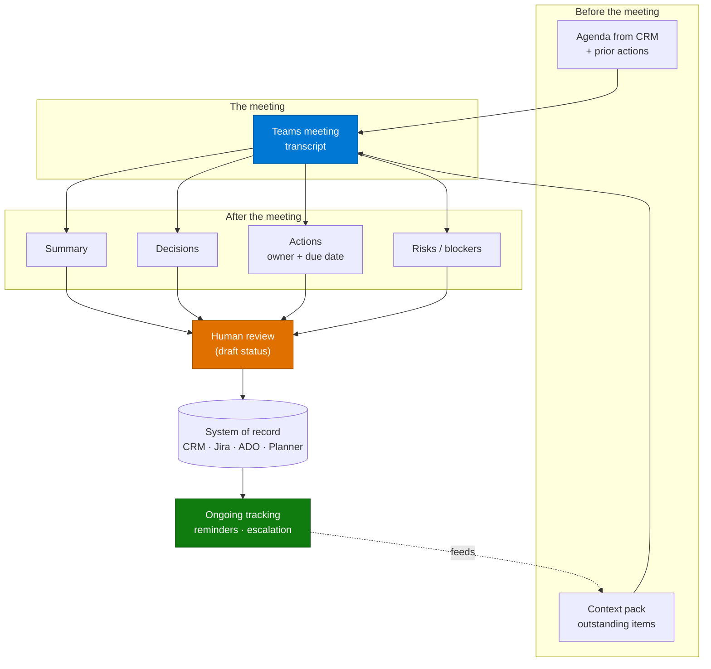

# Meeting Intelligence & Action Tracking Agent — Overview

## Scenario Overview

**Scenario Type**: Productivity / Governance of Commitments
**Agent Type**: Copilot Studio agent, often event-triggered on meeting end
**Primary Tools**: Copilot Studio, Teams, Work IQ / Teams MCP, the CRM or work tracker
**Complexity**: Intermediate
**Status**: ✅ Available

Decisions get made in meetings and then evaporate. The transcript exists, but nobody re-reads it.
Actions are noted inconsistently, owners are implied rather than assigned, and the next meeting
starts with fifteen minutes of "where did we land on this?"

This agent turns meeting content into structured, tracked commitments — summaries, decisions,
actions with owners and dates — and writes them into the system where work actually lives.

**17 distinct customers** across banking, manufacturing, software, professional services, energy,
and public audit, in a single CAF delivery portfolio.

---

## Problem Statement

- **Commitments are not tracked.** Actions live in personal notes; nobody owns the aggregate.
- **Context is lost between meetings.** Recurring meetings restart from memory.
- **Capture is inconsistent.** Quality depends on who took notes.
- **The knowledge is not searchable.** "What did we decide about X?" requires asking someone who
  was there.
- **CRM and trackers go stale.** Meeting outcomes never make it into the system of record.

One banking group scoped four separate agents for this problem alone: pre-meeting agenda,
post-meeting capture, cadence monitoring, and action tracking. That decomposition is a good signal
of where the real work is.

---

## Solution Summary

The loop is the point. Actions tracked after one meeting become the context pack for the next.

### Capability Variants Seen in the Field

| Variant | What it does |
|---|---|
| **Post-meeting capture** | Transcript → summary, decisions, actions; written to CRM or tracker |
| **Pre-meeting preparation** | Agenda assembled from CRM context and outstanding actions |
| **Action tracker** | Monitors open items, sends reminders, escalates overdue |
| **Cadence monitor** | Ensures recurring meetings actually happen; resolves conflicts |
| **Work item generation** | Transcript → epics, stories, tasks as reviewable drafts |
| **Meeting knowledge search** | Conversational Q&A over historical meeting content |
| **Call quality scoring** | Scores calls against a defined standard for coaching |

Most deliveries start with post-meeting capture. The tracker is what makes it stick.

---

## Business Outcomes

| Outcome | Description |
|---|---|
| ✅ Commitments actually tracked | Actions have owners, dates, and a system that chases them |
| ⏱️ Meeting admin removed | No one writes up notes at 6pm |
| 🧠 Institutional memory | Decisions searchable after the fact |
| 📈 CRM and trackers stay current | Outcomes land in the system of record |
| 🔁 Better recurring meetings | Each starts with context rather than recall |

---

## In Scope / Out of Scope

### ✅ In Scope
- Summary, decisions, actions, risks from transcripts
- Owner and due-date assignment from what was **said**
- Draft records in the CRM or work tracker, marked for review
- Outstanding-action tracking and reminders
- Conversational search over historical meeting content

### ❌ Out of Scope
- Attributing statements to individuals in a performance context
- Any inference about attitude, engagement, or sentiment of named people
- Actions the meeting did not agree — the agent records, it does not invent commitments
- Automatic closure of actions without human confirmation
- Recording or transcribing where consent has not been obtained

---

## Target Users

| Persona | Role |
|---|---|
| **Meeting owner / chair** | Reviews and commits the capture |
| **Action owners** | Receive assigned actions and reminders |
| **Account or project lead** | Uses the tracker to run cadence |
| **PMO / operations** | Owns aggregate commitment reporting |
| **Delivery engineer** | Builds capture, extraction, and tracking |

---

## Qualification Checklist

| Question | Why it matters |
|---|---|
| Are transcripts reliably available? | No transcript, no scenario. Check policy, licensing, and habit |
| Is transcription consented and lawful in every jurisdiction in scope? | Works councils and recording laws vary. This has blocked deployments |
| Where do actions live today, and will they live there after? | Writing to a system nobody uses changes nothing |
| Who chairs — is there an owner to review the capture? | Unreviewed capture becomes untrusted capture |
| Recurring or ad-hoc meetings? | The tracking loop only pays off for recurring cadences |
| Multilingual meetings? | Transcript quality varies significantly by language |
| Is this ever used to assess individuals? | If yes, stop and involve HR and works councils first |

---

## What Actually Goes Wrong

| Symptom | Root cause | Where handled |
|---|---|---|
| Actions invented that nobody agreed | Model asked to "identify actions" without a strict evidence rule | [3.Runbook.md](3.Runbook.md) Phase 2 |
| Owners assigned to the wrong person | Speaker attribution is unreliable in transcripts | Phase 2 |
| Capture ignored by the team | No review step, or written to a system nobody opens | [2.Architecture.md](2.Architecture.md) |
| Poor transcript, poor output | Audio quality, accents, cross-talk, second languages | Phase 3 |
| Sensitive discussion captured and distributed | No scoping of which meetings are in scope | Phase 0 |
| Duplicate actions each week | Recurring meeting re-creates the same items | Phase 2 |
| Works council or legal objection | Transcription and analysis of employees not cleared | Phase 0 |

---

## Related Patterns

- [Human-in-the-Loop Review & Approval](../../02-patterns/Human-in-the-Loop-Review-and-Approval/Human-in-the-Loop-Review-and-Approval.md)
- [MCP Server Integration](../../02-patterns/MCP-Server-Integration/MCP-Server-Integration.md) — Work IQ and Teams MCP as the meeting knowledge source
- [Agent Governance & Rollout Control Plane](../../02-patterns/Agent-Governance-and-Rollout-Control-Plane/Agent-Governance-and-Rollout-Control-Plane.md)
- Related scenario: [Client Meeting Preparation Agent](../Client-Meeting-Preparation-Agent/1.Overview.md) — prepares *for* a client meeting from the book of record; this one processes what came *out* of any meeting

---

## Next

→ [2.Architecture.md](2.Architecture.md)
