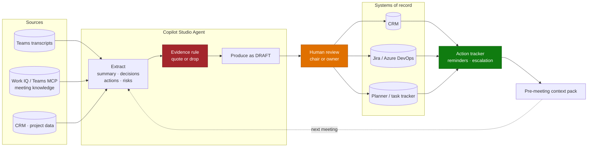

# Architecture — Meeting Intelligence & Action Tracking Agent

> **Platform**: Copilot Studio · Teams · Work IQ / Teams MCP · CRM or work tracker
> **Last Updated**: August 2026

---

## Solution Architecture

---

## The Evidence Rule — the Core Design Decision

The single greatest risk in this scenario is the agent recording a commitment nobody made. A
fabricated action with a named owner and a due date is worse than no capture at all, because people
act on it.

**The rule: every action, decision, and risk must be traceable to a quoted passage in the
transcript.** If the model cannot quote it, it does not exist.

| Element | Requirement |
|---|---|
| Action | Verbatim quote where it was agreed |
| Owner | Only if a person was **named** or clearly self-assigned. Otherwise `Owner not assigned` |
| Due date | Only if a date or timeframe was **stated**. Otherwise `No date agreed` |
| Decision | Verbatim quote |
| Risk | Verbatim quote |

This single constraint does more for trust in this scenario than any amount of prompt tuning.

---

## Speaker Attribution — Handle With Care

Transcript speaker labels are unreliable: cross-talk, shared rooms, guests dialling in, and
mis-attributed segments are all common.

| Situation | Design response |
|---|---|
| Owner named explicitly ("Sarah will do X") | Assign to Sarah |
| Self-assignment ("I'll pick that up") | Assign to the labelled speaker, **flag for confirmation** |
| Implied ownership | Do not assign. `Owner not assigned` |
| Speaker label missing or ambiguous | Do not assign |

Never assign an action on speaker attribution alone. Flag it and let the reviewer confirm.

---

## Where the Output Goes

Writing to a system the team does not open is the most common way this scenario quietly fails.

| Destination | Use when | Watch out for |
|---|---|---|
| **CRM** | Account and client meetings | Field mapping; whether the note is an activity or a record |
| **Jira / Azure DevOps** | Delivery and product meetings | Duplicate creation across recurring meetings |
| **Planner / task tracker** | General team cadence | Weak reporting for aggregate commitment tracking |
| **SharePoint / OneNote** | Minutes as a record | Searchable, but no tracking loop |
| **Dataverse** | When you need the tracker itself | Extra build, but the best aggregate reporting |

**Draft status must be visible in the destination**, not only in the chat. Downstream consumers must
be able to tell reviewed from unreviewed work — see
[Human-in-the-Loop Review & Approval](../../02-patterns/Human-in-the-Loop-Review-and-Approval/Human-in-the-Loop-Review-and-Approval.md).

---

## Recurring Meetings and Deduplication

A weekly meeting that discusses the same open action for six weeks must not create six actions.

| Mechanism | Implementation |
|---|---|
| Stable action identity | Hash of meeting series + normalised action text |
| Match before create | Check open actions for the series first |
| Update rather than duplicate | Append discussion, update status |
| Explicit closure | Only when someone said it was done — quoted |

Without this, the tracker becomes noise within a month and the team abandons it.

---

## Work IQ and Teams MCP as a Knowledge Source

For conversational search over historical meeting content, Work IQ (via MCP) provides grounded
access to meeting knowledge without building a transcript store.

Points to confirm before designing around it:

- Work IQ MCP is **read-only unless an administrator explicitly enables write operations**.
- It uses **consumptive billing** and generally requires its own spending policy.
- Availability and admin controls vary by region and tenant configuration.

For an agent that only answers "what did we decide about X?", this is a much lighter build than
maintaining your own transcript index. For an agent that must write actions into a tracker, you
still need the write path separately.

---

## Consent, Recording, and Employment Law

This is the constraint most likely to stop the project, and it is not technical.

| Question | Establish before building |
|---|---|
| Is meeting transcription enabled and lawfully consented in every jurisdiction in scope? | |
| Do works councils or employee representatives need to agree? | |
| Are external participants informed? | |
| Which meeting categories are explicitly **out** of scope (HR, disciplinary, legal, M&A)? | |
| Can output ever be used to assess an individual's performance? | |
| What is the retention period for transcripts and derived records? | |

> ⚠️ If the answer to "can this be used to assess individuals" is anything other than a firm no,
> stop and involve HR, legal, and employee representatives before writing a line of code. Analysis
> of employee communication has blocked agent deployments outright in several European
> organisations.

The call-quality-scoring variant sits squarely in this territory and needs explicit handling.

---

## Cost Model

Event-triggered per meeting, not per user session.

| Driver | Implication |
|---|---|
| Every meeting in scope triggers processing | Scope by meeting category, not "all meetings" |
| Long transcripts are large inputs | Cost scales with meeting length |
| The tracker runs on a schedule | Reminder and escalation cycles add consumption |

Scope tightly at the start — one meeting series, not the organisation's calendar.

---

## Non-Functional Considerations

| Concern | Guidance |
|---|---|
| **Transcript quality** | Test on real recordings, including poor audio and non-native speakers |
| **Language** | Validate per language; transcription quality varies more than model quality |
| **Latency** | Post-meeting processing within minutes is fine |
| **Volume spikes** | Monday and Friday cluster heavily |
| **Retention** | Derived records may inherit the transcript's retention class — confirm |
| **Access** | Meeting content is sensitive. The agent's reach must match the meeting's audience |

---

## Next

→ [3.Runbook.md](3.Runbook.md)
