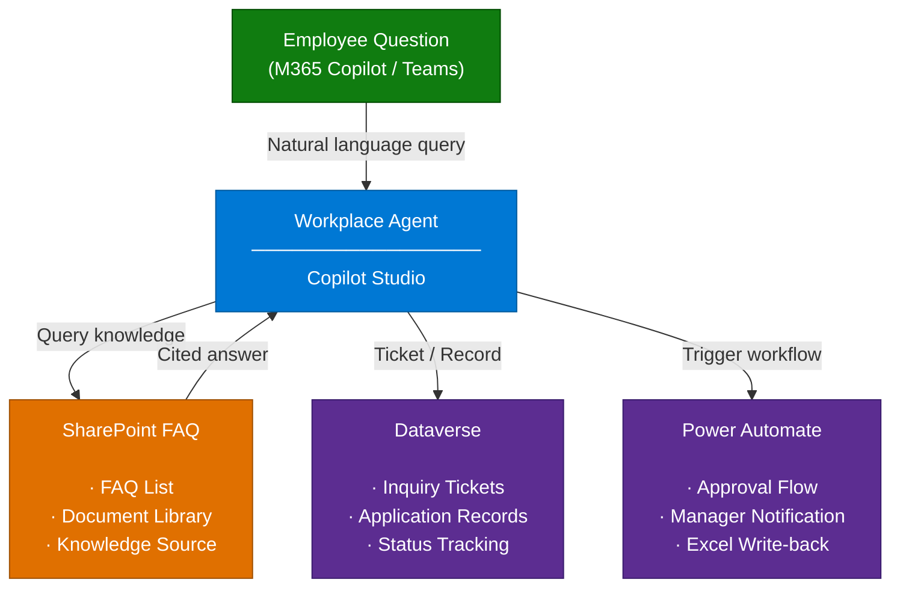

# 📋 Workplace Agent

## 📌 Scenario Overview

**Scenario Type**: Workforce Productivity / Internal Operations  
**Agent Type**: Declarative Agent (Low-code, Copilot Studio)  
**Primary Tools**: Microsoft Copilot Studio, SharePoint, Dataverse, Power Automate  
**Complexity**: Intermediate (Basic) / Advanced (with Azure Extension)  
**Status**: ✅ Available

This agent provides employees with an AI-powered interface to handle **internal inquiries** (frequently asked questions) and **internal application requests** (e.g., equipment requests, expense approvals, internal submissions). It integrates with SharePoint, Dataverse, and Power Automate to streamline helpdesk operations and application workflows across the organization.

---

## 🔍 Problem Statement

Organizations often struggle with:

- **High volume of repetitive internal inquiries** directed at IT or HR helpdesks (e.g., company policies, system usage, benefit questions), leading to slow response times and increased operational burden.
- **Manual, paper-based or email-driven application processes** that are difficult to track, slow to approve, and prone to errors — creating frustration for employees and administrators alike.
- **Lack of 24/7 availability** for employee support, resulting in productivity loss especially for remote or distributed teams.
- **No centralized system** for tracking inquiry histories, application statuses, or escalation workflows in one place.

---

## 💡 Solution Summary

The **Workplace Agent** is a Copilot Studio-powered declarative agent that serves as a single point of contact for employees to:

1. **Ask internal questions** — The agent intelligently searches an FAQ knowledge base hosted on SharePoint and returns relevant answers in natural language. If a satisfactory answer is not found, it automatically creates an inquiry ticket in Dataverse for follow-up by the support team.

2. **Submit internal requests/applications** — Employees can initiate application workflows (e.g., equipment loans, approvals, internal forms) directly through the agent. Power Automate handles approval routing, manager notifications, and record storage in Dataverse.

This ensures faster resolution, reduced helpdesk workload, and a consistent, auditable process for both inquiries and applications.

---

## ⚙️ Key Capabilities

| Capability                        | Description                                                                                   |
|-----------------------------------|-----------------------------------------------------------------------------------------------|
| 🔎 **AI-Powered FAQ Search**       | Searches SharePoint FAQ lists using Copilot Studio's generative AI to answer questions accurately. |
| 🎫 **Inquiry Ticket Creation**     | Automatically raises a support ticket in Dataverse when the FAQ does not cover the query.     |
| 📂 **Inquiry History Tracking**   | Allows users and admins to review past inquiries and their statuses stored in Dataverse.      |
| 📝 **Internal Application Filing**| Guides employees through form-based internal applications (e.g., equipment, approvals).       |
| ✅ **Approval Workflow Automation**| Triggers Power Automate flows for manager approvals, notifications, and record updates.       |
| 📊 **Excel Report Integration**   | Automatically writes application results to designated Excel templates via Power Automate.    |
| 🧪 **Agent Evaluation Support**   | Includes sample test cases (CSV) to validate agent response accuracy using Copilot Studio's evaluation feature. |
| 🔐 **Governance Ready**           | Supports managed environment policies and Power Platform DLP for enterprise-grade governance. |

---

## 🏗️ How It Works

### Flow Description

| Step | Action |
|------|--------|
| ① | Employee sends a question or application request to the agent via M365 Copilot or Teams. |
| ② | The agent searches the **SharePoint FAQ List** to find a matching answer. |
| ③ | If a match is found, the agent responds with AI-generated text grounded in the FAQ content. |
| ④ | If no match is found, the agent **creates an inquiry ticket in Dataverse** and notifies the support team. |
| ⑤ | For applications, the agent guides the user through the form, then **triggers an approval flow** via Power Automate. |
| ⑥ | The manager receives a notification and approves/rejects via Teams or Outlook. |
| ⑦ | Results are recorded in Dataverse and optionally written back to an **Excel report template**. |

---

## 📈 Business Outcomes

| Outcome | Impact |
|---------|--------|
| **Reduced Helpdesk Load** | Deflect repetitive inquiries from IT/HR support teams through self-service AI responses. |
| **Faster Resolution Time** | Employees receive instant answers 24/7 without waiting for human agents. |
| **Automated Application Processing** | Eliminate manual email-based approval workflows with structured, trackable Power Automate flows. |
| **Improved Audit & Visibility** | All inquiries and applications are logged in Dataverse for reporting and compliance. |
| **Consistent Employee Experience** | Provide a unified interface within M365 Copilot or Teams for all internal support needs. |

---

## 🚧 Scope & Limitations

**In Scope:**
- Internal FAQ-based Q&A using SharePoint knowledge sources
- Inquiry ticket creation and history tracking via Dataverse
- Internal application filing with approval notifications via Power Automate
- Deployment to Microsoft 365 Copilot (Chat) and Microsoft Teams

**Out of Scope / Limitations:**
- This is a **sample agent** — production deployment requires additional customization and testing.
- The agent uses **key-based authentication** for Azure extensions in the sample version (production should use managed identity).
- Multi-tenant deployment is not supported out of the box.
- The agent does **not** handle external customer-facing inquiries.
- SharePoint knowledge accuracy depends on the quality and structure of the FAQ list maintained by the organization.

---

## 👥 Target Users

| Persona | Role |
|---------|------|
| **End Users / Employees** | Primary users who submit inquiries and applications through the agent. |
| **IT Administrators** | Configure the Power Platform environment, manage Dataverse, and govern agent policies. |
| **AI Promotion Teams** | Deploy and customize the agent for their organization's specific workflows. |
| **Citizen Developers** | Extend and customize the agent using Copilot Studio and Power Platform. |

---

## 📋 Prerequisites

Before deploying this agent, ensure the following are in place:

| Requirement | Details |
|-------------|---------|
| **SharePoint Site** | A SharePoint site with an accessible list (FAQ) and document library (application templates). |
| **Copilot Studio License** | Copilot Studio user license for the environment where the agent will be built. |
| **System Administrator Role** | Security role required to import the solution package into the Power Platform environment. |
| **Microsoft 365 Copilot License** | Required to deploy the agent to Microsoft 365 Copilot as the target publishing surface. |
| **Power Platform Environment** | A valid Power Platform environment (Managed Environment recommended for governance). |
| **[Advanced] Azure Subscription** | Required if enabling the Azure AI Search + MCP Server extension scenario. |
| **[Advanced] Azure AI Search** | For hybrid/vector search over knowledge sources beyond SharePoint. |
| **[Advanced] Azure Functions** | Used to host the MCP server for FAQ search, ticket querying, and history retrieval. |

---

## 🔗 Related Resources

| Document | Description |
|----------|-------------|
| [2.Architecture.md](./2.Architecture.md) | Detailed architecture diagram with component descriptions and data flow. |
| [3.Runbook.md](./3.Runbook.md) | Step-by-step setup guide: SharePoint configuration, solution import, environment variables, flow setup, and agent deployment. |
| [4.Sample-Prompts.md](./4.Sample-Prompts.md) | Sample prompts for end users to get the most out of the agent (inquiries and application scenarios). |

---

