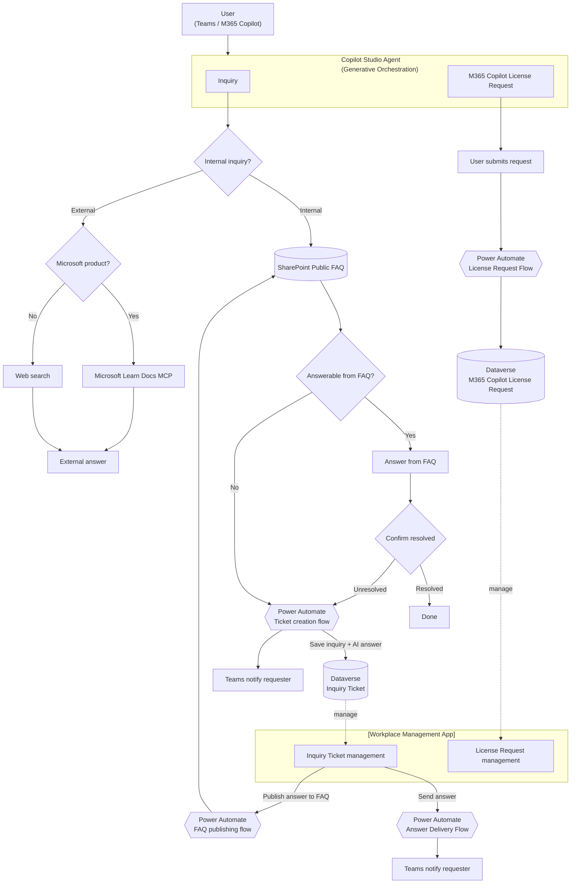

# 📋 Workplace Agent

## 📌 Scenario Overview

**Scenario Type**: Workforce Productivity / Internal Operations  
**Agent Type**: Copilot Studio Agent (Low-code)  
**Primary Tools**: Microsoft Copilot Studio, SharePoint Online, Dataverse, Power Automate, Microsoft Teams, Microsoft Learn Docs MCP, Web search  
**Complexity**: Intermediate  
**Status**: ✅ Available

The **Workplace Agent** centralizes employee inquiry handling and Microsoft 365 Copilot license requests in a single conversational experience. It first determines whether a user question is an **internal inquiry** or an **external/general inquiry**, then routes the conversation to the appropriate source or workflow.

Internal inquiries are answered only from the organization's SharePoint FAQ list. If the FAQ cannot resolve the question, or if the employee confirms that the answer did not solve the issue, the agent creates an inquiry ticket in Dataverse and notifies the requester in Microsoft Teams. External Microsoft-product questions are answered with Microsoft Learn Docs MCP, while non-Microsoft external questions use Web search. The same agent also supports Microsoft 365 Copilot license request submission through Power Automate and Dataverse.

---

## 🔍 Problem Statement

Organizations often struggle with:

- **Repetitive internal questions** across HR, Legal, IT, and general workplace topics that consume support-team time.
- **Unclear routing between internal and external questions**, causing employees to receive unsupported or inconsistent answers.
- **No consistent escalation path** when an FAQ answer is missing or insufficient.
- **Manual license-request intake** for Microsoft 365 Copilot, making requests hard to track and process.
- **Fragmented back-office management**, where inquiry tickets, answers, and FAQ updates are handled separately.

---

## 💡 Solution Summary

The **Workplace Agent** provides a structured Copilot Studio experience for four core scenarios:

1. **Internal inquiry handling** — The agent classifies an inquiry as internal, searches only the SharePoint Public FAQ, returns a grounded answer, and asks whether the issue was resolved.
2. **Ticket creation for unresolved internal inquiries** — If the FAQ cannot answer or the user says the issue remains unresolved, the agent runs a Power Automate ticket creation flow that stores the inquiry and AI-generated answer in Dataverse.
3. **External inquiry routing** — Microsoft-product questions are answered using Microsoft Learn Docs MCP; non-Microsoft questions use Web search.
4. **Microsoft 365 Copilot license request submission** — The agent collects request information and registers the request in Dataverse through a Power Automate flow.

Back-office users manage inquiry tickets and license requests in the **Workplace Management App**, a Power Apps model-driven app. From an inquiry ticket, administrators can send an answer back to the requester and publish the final answer to the SharePoint FAQ for reuse.

---

## ⚙️ Key Capabilities

| Capability | Description |
|------------|-------------|
| 🔀 **Internal / External Inquiry Routing** | Classifies each inquiry before answering and applies different source rules by inquiry type. |
| 🔎 **SharePoint FAQ Grounding** | Uses the SharePoint Public FAQ as the only source for internal inquiries. |
| 🎫 **Inquiry Ticket Creation** | Creates a Dataverse inquiry ticket when the FAQ cannot answer or the user reports that the answer was not resolved. |
| 🤖 **AI Answer Capture** | Stores the agent-generated answer in the ticket field `mskk_aianswer` for support-team context. |
| 📚 **Microsoft Learn MCP Answers** | Uses Microsoft Learn Docs MCP for external Microsoft-product questions. |
| 🌐 **Web Search Answers** | Uses Web search for external non-Microsoft questions. |
| 🪪 **M365 Copilot License Requests** | Collects user request details and registers Microsoft 365 Copilot license requests in Dataverse. |
| 🧑‍💼 **Model-driven Management App** | Lets support staff manage inquiry tickets, license requests, answer delivery, and FAQ publishing. |
| 💬 **Teams Notifications** | Sends Teams notifications to requesters when tickets are created and when answers are delivered. |
| 🔐 **Role-based Access** | Uses custom Dataverse roles for inquiry administrators and general inquirers. |

---

## 🏗️ How It Works

### Flow Description

| Step | Action |
|------|--------|
| ① | Employee sends a question or license request through Teams, Microsoft 365 Copilot, or the Copilot Studio test chat. |
| ② | The agent classifies the message as an internal inquiry, external inquiry, or license request. |
| ③ | For internal inquiries, the agent searches only the SharePoint Public FAQ and answers from that content. |
| ④ | If the FAQ cannot answer, or the employee says the answer was not resolved, the agent creates a Dataverse inquiry ticket and sends a Teams notification. |
| ⑤ | For external Microsoft-product questions, the agent uses Microsoft Learn Docs MCP. For external non-Microsoft questions, it uses Web search. |
| ⑥ | For Microsoft 365 Copilot license requests, the agent runs the License Request Flow and registers the request in Dataverse. |
| ⑦ | Administrators use the Workplace Management App to manage tickets, deliver final answers, and publish reusable FAQ entries. |

---

## 📈 Business Outcomes

| Outcome | Impact |
|---------|--------|
| **Reduced Support Load** | Deflects common HR, Legal, IT, and workplace questions with FAQ-grounded answers. |
| **Consistent Inquiry Routing** | Prevents internal inquiries from being answered by external sources and routes external questions to the right tool. |
| **Trackable Escalation** | Converts unresolved questions into Dataverse tickets with requester context and AI-generated draft answers. |
| **Faster Answer Delivery** | Lets support staff respond from the model-driven app and notify requesters through Teams. |
| **Continuous FAQ Improvement** | Enables resolved answers to be published back to the SharePoint FAQ. |
| **Controlled License Intake** | Provides a structured path for Microsoft 365 Copilot license requests. |

---

## 🚧 Scope & Limitations

**In Scope:**

- Internal FAQ-based Q&A using a SharePoint list.
- Internal inquiry escalation to Dataverse tickets.
- Ticket answer delivery to requesters through Microsoft Teams.
- Publishing resolved answers from Dataverse tickets back to the SharePoint FAQ.
- External Microsoft-product answers using Microsoft Learn Docs MCP.
- External non-Microsoft answers using Web search.
- Microsoft 365 Copilot license request registration.
- Deployment through Copilot Studio and Microsoft Teams.

---

## 👥 Target Users

| Persona | Role |
|---------|------|
| **Employees / Inquirers** | Ask workplace questions and submit Microsoft 365 Copilot license requests. |
| **Inquiry Administrators** | Manage tickets, answer unresolved inquiries, publish reusable FAQ content, and review license requests. |
| **Power Platform Administrators** | Import the solution, configure environment variables, manage connections, and assign security roles. |
| **AI / Copilot Studio Makers** | Configure the agent instructions, knowledge sources, MCP tool, Web search, and Teams publishing. |

---

## 📋 Prerequisites

Before deploying this agent, ensure the following are in place:

| Requirement | Details |
|-------------|---------|
| **Power Platform Environment** | English-language environment with Dataverse enabled. |
| **System Administrator Role** | Required to import the unmanaged solution package and assign security roles. |
| **Copilot Studio License** | Required to build, configure, publish, and test the agent. |
| **Power Apps Premium / Dataverse Licensing** | Required for premium connectors, Dataverse tables, and cloud flows. |
| **SharePoint Site** | Site where the FAQ list will be created from `FAQ_en.csv`. |
| **Solution Package** | `WorkplaceAgent_x_x_x_x.zip` or the latest provided unmanaged solution package. |
| **FAQ CSV** | `FAQ_en.csv`, used to create the SharePoint Public FAQ list. |
| **Microsoft Teams** | Used as a notification and publishing surface. |
| **Microsoft Learn Docs MCP Access** | Required for Microsoft-product external questions. |
| **Web Search Availability** | Required for non-Microsoft external questions, subject to tenant policy. |

---

## 🔗 Related Resources

| Document | Description |
|----------|-------------|
| [2.Architecture.md](./2.Architecture.md) | Logical architecture, data flows, components, security model, and deployment topology. |
| [3.Runbook.md](./3.Runbook.md) | Step-by-step deployment guide covering SharePoint setup, solution import, flow activation, roles, agent configuration, and verification. |
| [4.Sample-Prompts.md](./4.Sample-Prompts.md) | Validated sample prompts for internal inquiries, external questions, license requests, and admin validation. |

---
