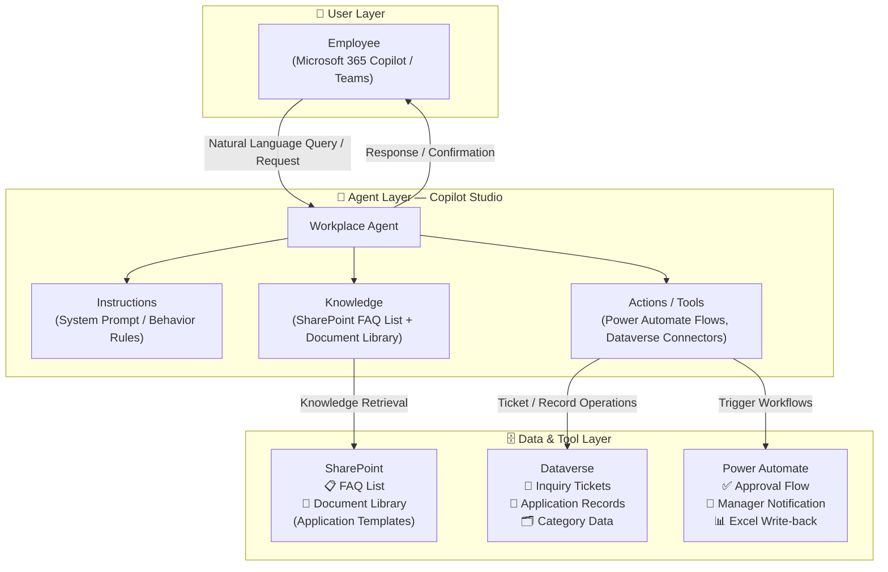
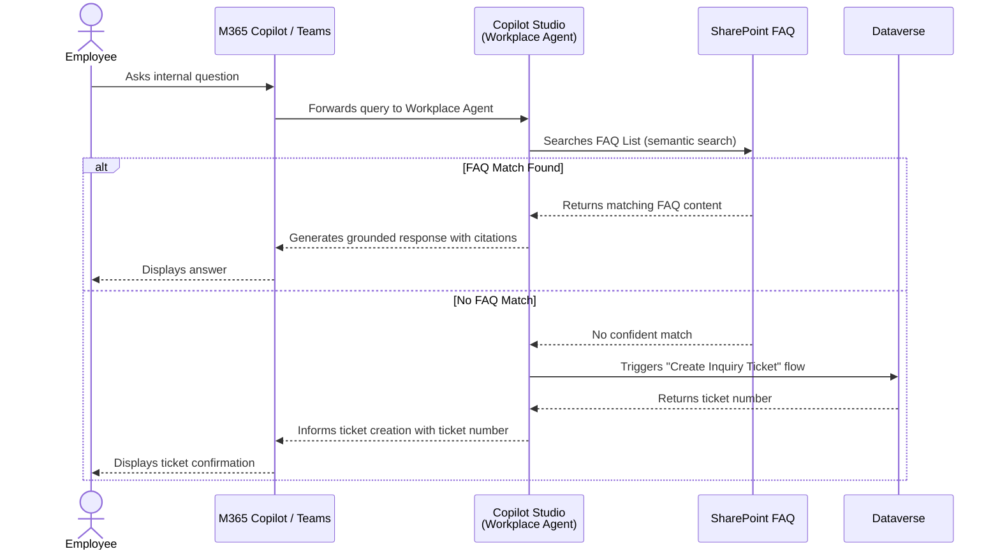
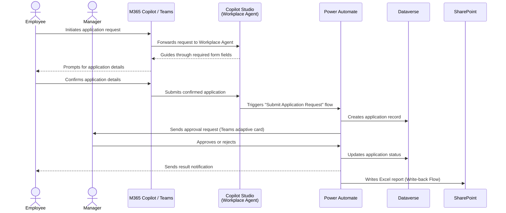
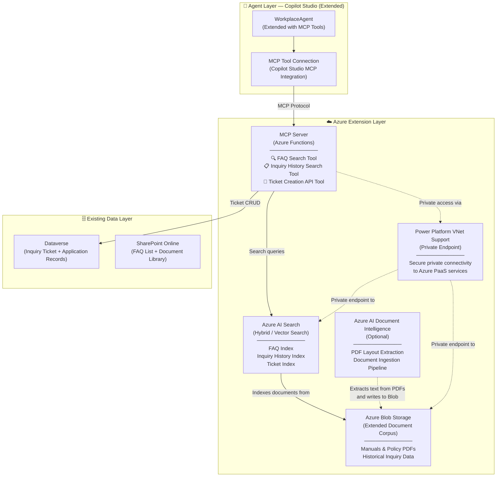

# 🏗️ Architecture — Workplace Agent

## Architecture Overview

The **Workplace Agent** is a **declarative agent** built on Microsoft Copilot Studio and published to Microsoft 365 Copilot Chat and Microsoft Teams. It follows a three-layer architecture:

- **User Layer** — Employees interact with the agent using natural language via M365 Copilot Chat or Microsoft Teams.
- **Agent Layer** — Copilot Studio orchestrates instructions, knowledge retrieval, and tool execution to handle both FAQ-based inquiries and application request workflows.
- **Data & Tool Layer** — SharePoint Online, Dataverse, and Power Automate provide the knowledge sources, transactional data store, and workflow automation backbone.

An **optional Advanced Extension** adds Azure AI Search and an MCP Server (hosted on Azure Functions) to expand knowledge retrieval beyond SharePoint with hybrid and vector search over extended document corpora and full inquiry history.

---

## Logical Architecture — Basic Configuration
    

---

## Layer Descriptions

### 👤 User Layer

Employees interact with the agent through **Microsoft 365 Copilot Chat** or **Microsoft Teams** using natural language. The agent is published as an organizational agent, discoverable under **Built for your org** within the Copilot side panel or as a Teams app. No special client-side tooling is required — the employee simply types a question or request.

### 🤖 Agent Layer — Copilot Studio

The core of the solution is a **declarative agent** (`WorkplaceAgent`) built in Microsoft Copilot Studio. The agent has three key building blocks:

| Component | Role |
|-----------|------|
| **Instructions** | System prompt that defines the agent's identity, tone, task boundaries, fallback behaviors, and escalation rules. Governs how the agent responds to both inquiry and application scenarios. |
| **Knowledge** | Two SharePoint-based knowledge sources: the **FAQ List** (structured Q&A data) and the **Document Library** (policy documents, application templates). The agent uses generative AI to retrieve and summarize relevant content. Web search is disabled to ensure responses are grounded in organizational data only. |
| **Actions / Tools** | Five Power Automate-backed tools that allow the agent to perform write operations and trigger workflows beyond knowledge retrieval (see Component Description Table). |

### 🗄️ Data & Tool Layer

All persistent data and automated workflows live in this layer:

- **SharePoint Online** provides the knowledge foundation — a structured FAQ list and a document library containing application form templates, policy references, and completed report files.
- **Dataverse** is the transactional backend — it stores inquiry tickets, application records, category master data, and non-public internal FAQ items.
- **Power Automate** handles all workflow automation — approval routing, manager notifications via Teams adaptive cards, FAQ candidate logging, and Excel report generation.
- **Microsoft 365 Copilot** acts as the publishing surface and orchestration layer that routes user queries to the agent and renders responses within the M365 experience.

---

## Component Description Table

| Component | Type | Role / Purpose | Notes |
|-----------|------|----------------|-------|
| **WorkplaceAgent** | Copilot Studio Declarative Agent | Core agent — orchestrates instructions, knowledge retrieval, and tool execution | Low-code; built and managed in Copilot Studio |
| **Instructions (System Prompt)** | Agent Configuration | Defines agent behavior, tone, task boundaries, and escalation paths | Customizable per organization; governs inquiry vs. application handling logic |
| **SharePoint FAQ List** | Knowledge Source | Primary Q&A knowledge base for internal inquiries | Structured list with columns: category, question, answer, status |
| **SharePoint Document Library** | Knowledge Source + Data Store | Stores application form templates, policy documents, and completed Excel reports | Dual role: knowledge source for agent + write target for Power Automate |
| **Create Inquiry Ticket (Flow)** | Power Automate Action | Creates a new inquiry ticket record in Dataverse when the FAQ has no matching answer | Triggered by the agent when confidence threshold is not met |
| **Get Inquiry History (Flow)** | Power Automate Action | Retrieves past inquiry tickets from Dataverse for a given employee | Enables employees to check the status of previously submitted inquiries |
| **Submit Application Request (Flow)** | Power Automate Action | Creates an application record in Dataverse and initiates the approval workflow | Triggered when the employee confirms application details via the agent |
| **Approval Flow** | Power Automate Cloud Flow | Routes application for manager approval via Teams adaptive card or Outlook; sends result notification to employee | Approval/rejection status is written back to Dataverse |
| **Excel Write-back Flow** | Power Automate Cloud Flow | Reads application result from Dataverse and writes a timestamped report to an Excel template in SharePoint | Generates one report file per approved/rejected application |
| **FAQ Recording Flow** | Power Automate Cloud Flow | Logs newly resolved inquiry tickets as candidate FAQ entries for admin review | Supports continuous improvement of the FAQ knowledge base |
| **Dataverse — Inquiry Ticket Table** (`mskk_inquiryticket`) | Data Store | Stores ticket number, category, inquiry details, AI-generated answer, and resolution status | Core transactional table for inquiry management |
| **Dataverse — Application Record Table** | Data Store | Stores application type, requestor identity, submission details, and approval status | Linked to the Approval Flow and Excel Write-back Flow |
| **Dataverse — Category Data** | Reference Data | Master category list for classifying inquiries and applications | Populated via CSV import during initial setup |
| **Dataverse — Internal FAQ Table** (`mskk_FAQ`) | Reference Data | Non-public internal FAQ records not exposed in SharePoint | Used for admin-side knowledge management and advanced filtering |
| **Microsoft 365 Copilot** | Publishing Surface | Surfaces the agent to end users within M365 Copilot Chat and Teams | Requires Microsoft 365 Copilot license per user |

---

## Data Flow

### Scenario A — Internal Inquiry (FAQ Q&A)

| Step | Actor | Action |
|------|-------|--------|
| ① | Employee | Sends a natural language question via M365 Copilot Chat or Teams |
| ② | Copilot Studio | Receives the message; agent instructions identify this as an inquiry scenario |
| ③ | Knowledge Source | Agent queries the **SharePoint FAQ List** for a matching answer using semantic search |
| ④a | Agent (Match Found) | Generates a grounded response using FAQ content and returns it to the employee |
| ④b | Agent (No Match) | Confidence threshold not met → triggers the **Create Inquiry Ticket** flow |
| ⑤ | Power Automate | Creates a new ticket record in **Dataverse (Inquiry Ticket Table)** |
| ⑥ | Agent | Informs the employee that a support ticket has been created and provides the ticket number |
| ⑦ | Support Team (Async) | Reviews and resolves the ticket; resolved answer may be promoted to FAQ via the **FAQ Recording Flow** |

### Scenario B — Internal Application Request

| Step | Actor | Action |
|------|-------|--------|
| ① | Employee | Initiates an application request via M365 Copilot Chat or Teams |
| ② | Copilot Studio | Agent instructions identify this as an application scenario; guides the employee through required form fields |
| ③ | Employee | Confirms the application details via agent conversation |
| ④ | Power Automate | **Submit Application Request** flow creates a record in **Dataverse (Application Record Table)** |
| ⑤ | Power Automate | **Approval Flow** sends an adaptive card notification to the employee's manager via Teams or Outlook |
| ⑥ | Manager | Reviews and approves or rejects the application from within Teams or Outlook |
| ⑦ | Power Automate | Updates the application record status in Dataverse; sends result notification to the employee |
| ⑧ | Power Automate | **Excel Write-back Flow** generates a timestamped report and saves it to the **SharePoint Document Library** |

---

## Authentication & Security Model

| Connection | Authentication Method | Identity | Notes |
|------------|----------------------|----------|-------|
| Employee → M365 Copilot / Teams | Azure AD / Entra ID (SSO) | End-user identity | Standard M365 authentication; no additional configuration required |
| M365 Copilot → Copilot Studio Agent | Azure AD / Entra ID | User context propagated automatically | Agent is scoped to the user's organizational tenant |
| Copilot Studio → SharePoint (Knowledge) | SharePoint Connector (OAuth) | Delegated — user identity | Agent reads FAQ list and document library on behalf of the signed-in user |
| Copilot Studio → Power Automate (Actions) | HTTP Trigger / Native Flow invocation | Service or user identity | Flows triggered by the agent; use connection references in the solution package |
| Power Automate → Dataverse | Dataverse Connector (OAuth) | Service account or user identity | Connection reference configured during solution import |
| Power Automate → SharePoint | SharePoint Connector (OAuth) | Service account | Used for Excel write-back and document library access |
| Power Automate → Teams / Outlook | Teams / Outlook Connector (OAuth) | Service account | Used for sending approval adaptive cards and result notifications |

> ⚠️ **Security Note:** For production deployments, use a dedicated **service account** with minimum required permissions for all Power Automate connections. Avoid using personal accounts as connection owners. Apply Power Platform **DLP policies** to restrict connector usage to approved connectors only. Enable **Managed Environment** features for enhanced governance and monitoring.

---

## Advanced Extension Architecture (Optional)

This optional extension adds **Azure AI Search** and an **MCP Server (Azure Functions)** to enable hybrid and vector search over extended knowledge sources beyond the built-in SharePoint knowledge capabilities of Copilot Studio.

**When to use this extension:**
- The organization has large document corpora (manuals, past inquiry histories) that exceed SharePoint knowledge limits
- Advanced semantic or vector search accuracy is required
- Network isolation requirements mandate private connectivity between Power Platform and Azure services

### Advanced Extension — Component Description

| Component | Type | Role / Purpose | Notes |
|-----------|------|----------------|-------|
| **MCP Server (Azure Functions)** | Azure Function App | Hosts MCP-compatible tools for FAQ search, inquiry history search, and ticket management | Exposes tools via MCP protocol; consumed by Copilot Studio via MCP tool connection |
| **Azure AI Search** | Azure PaaS | Hybrid and vector search over extended knowledge: FAQ, inquiry history, manuals and policy documents | Supports semantic ranking; indexes content from Azure Blob Storage |
| **Azure Blob Storage** | Azure PaaS | Stores extended document corpus (manuals, policy PDFs, historical inquiry data) | Source for the AI Search document indexing pipeline |
| **Azure AI Document Intelligence** | Azure PaaS (Optional) | Extracts structured text from PDF documents for ingestion into Azure AI Search | Required when source documents are scanned PDFs rather than structured text |
| **Power Platform VNet Support** | Network Configuration | Provides private endpoint connectivity between Power Platform and Azure PaaS services | Required for enterprise environments that prohibit public internet access to Azure services |

### Advanced Extension — Authentication

| Connection | Authentication Method | Notes |
|------------|----------------------|-------|
| Copilot Studio → MCP Server (Azure Functions) | Function Key (sample configuration) | **Recommend Managed Identity in production** |
| MCP Server → Azure AI Search | API Key (sample configuration) | **Recommend Managed Identity in production** |
| MCP Server → Dataverse | Service Principal / Managed Identity | Use app registration with Dataverse API permissions |
| Power Platform → Azure (VNet) | Power Platform Enterprise Policy | Configured via Azure Portal and Power Platform Admin Center |

---

## Deployment Topology

| Layer | Deployment Target | Components |
|-------|------------------|------------|
| **Microsoft 365 Tenant** | Copilot Studio (Power Platform) | WorkplaceAgent (declarative agent), published to M365 Copilot Chat and Microsoft Teams |
| **SharePoint Online** | Microsoft 365 Tenant | FAQ List, Document Library (application form templates, policy documents, completed Excel reports) |
| **Power Platform Environment** | Managed Environment (recommended) | Dataverse tables (`mskk_inquiryticket`, Application Record, Category, `mskk_FAQ`), Power Automate flows, Solution package (`MSKK_InquirySolution`) |
| **Azure Subscription** *(Advanced only)* | Azure Resource Group | Azure Functions (MCP Server), Azure AI Search, Azure Blob Storage, Azure AI Document Intelligence *(optional)*, VNet configuration |

> 💡 **Tip:** Use a **Managed Power Platform Environment** for production to enforce DLP policies, environment routing, and access controls. Build and publish the Copilot Studio agent from within this managed environment to ensure governance policies are applied consistently.

---

## Related Resources

| Document | Description |
|----------|-------------|
| [1.Overview.md](./1.Overview.md) | Scenario overview: problem statement, solution summary, key capabilities, and target users |
| [3.Runbook.md](./3.Runbook.md) | Step-by-step deployment guide: SharePoint setup, solution import, environment variables, flow configuration, and agent publishing |
| [4.Sample-Prompts.md](./4.Sample-Prompts.md) | Sample prompts for end users covering inquiry and application request scenarios |

---
