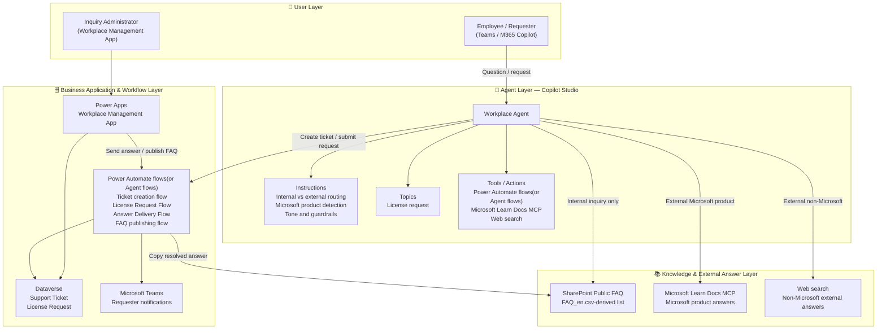
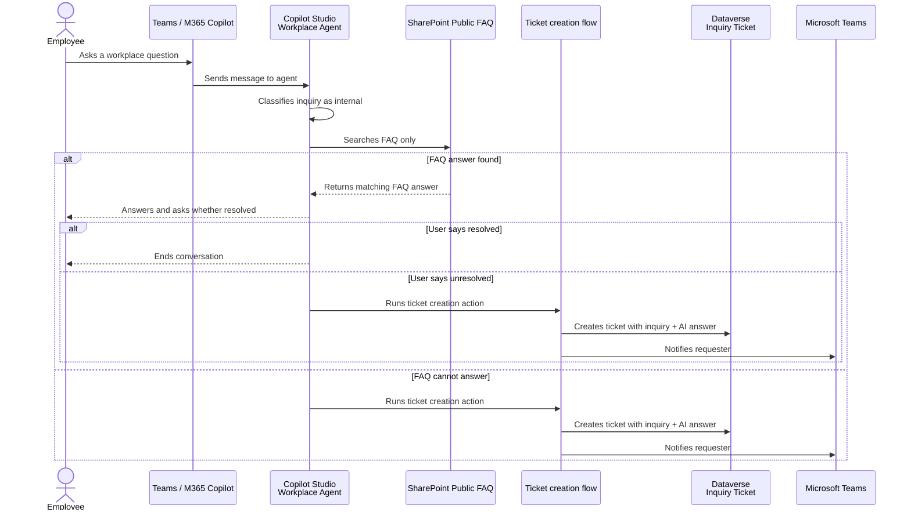
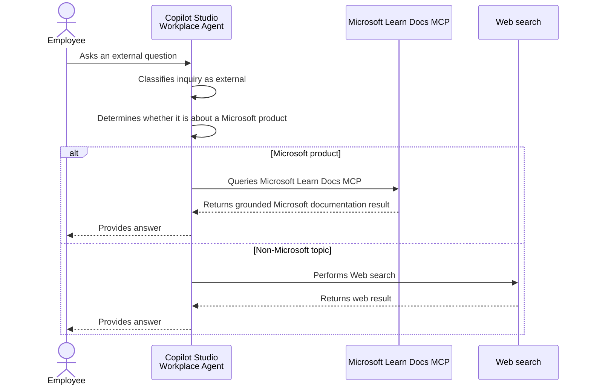
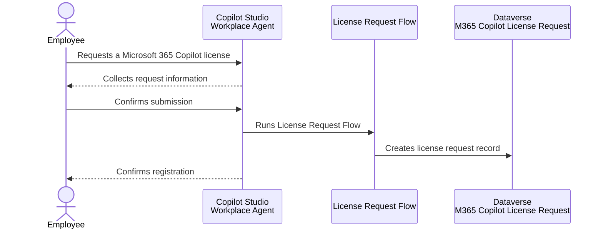

# 🏗️ Architecture — Workplace Agent

## Architecture Overview

The **Workplace Agent** is a Copilot Studio agent published to Microsoft Teams and Microsoft 365 Copilot. It provides a controlled routing pattern for workplace inquiries and Microsoft 365 Copilot license requests.

The architecture has four layers:

- **User Layer** — Employees interact with the agent through Teams, Microsoft 365 Copilot, or Copilot Studio test chat.
- **Agent Layer** — Copilot Studio performs inquiry classification, source selection, tool invocation, and response generation.
- **Knowledge & External Answer Layer** — SharePoint Public FAQ handles internal inquiries, Microsoft Learn Docs MCP handles Microsoft-product external questions, and Web search handles non-Microsoft external questions.
- **Business Application & Workflow Layer** — Dataverse, Power Automate, Power Apps, and Teams support ticketing, license request registration, answer delivery, and FAQ publishing.

---

## Logical Architecture

---

## Layer Descriptions

### 👤 User Layer

Employees use the Workplace Agent to ask internal workplace questions, external product/general questions, and Microsoft 365 Copilot license request questions. Inquiry administrators use the Workplace Management App to manage unresolved tickets and license requests.

### 🤖 Agent Layer — Copilot Studio

The agent uses instructions and topics to enforce the routing policy:

| Agent Function | Role |
|----------------|------|
| **Internal / external classification** | First decision point for all inquiries. |
| **Internal inquiry handling** | Searches only the SharePoint Public FAQ and asks the user whether the answer resolved the issue. |
| **Ticket creation** | Runs a Power Automate action when an internal inquiry is unresolved or not answerable. |
| **External Microsoft-product answering** | Uses the Microsoft Learn Docs MCP server. |
| **External non-Microsoft answering** | Uses Web search. |
| **License request handling** | Collects required information and triggers the License Request Flow. |
| **Guardrails** | Prevents guessing and prevents internal inquiries from being answered using external sources. |

### 📚 Knowledge & External Answer Layer

| Source / Tool | Used For | Notes |
|---------------|----------|-------|
| **SharePoint Public FAQ** | Internal workplace inquiries | Created from `FAQ_en.csv`; columns are `Question`, `Answer`, and `Category`. |
| **Microsoft Learn Docs MCP** | External questions about Microsoft products | Used for Microsoft 365, Azure, Teams, Power Platform, and other Microsoft-product questions. |
| **Web search** | External non-Microsoft questions | Used only when the inquiry is external and not about a Microsoft product. |

### 🗄️ Business Application & Workflow Layer

Dataverse stores operational records, Power Automate executes write operations and notifications, and the model-driven app provides a management interface for administrators.

| Component | Type | Role / Purpose |
|-----------|------|----------------|
| **Support Ticket** (`ms_supportticket`) | Dataverse table | Stores unresolved internal inquiries, ticket status, inquiry category, inquiry body, AI-generated answer, and final answer. |
| **License Request** (`ms_licenserequest`) | Dataverse table | Stores Microsoft 365 Copilot license request records. |
| **Ticket creation flow** | Agent flow | Creates an inquiry ticket and notifies the requester in Teams. |
| **License Request Flow** | Power Automate cloud flow | Registers a Microsoft 365 Copilot license request in Dataverse. |
| **Answer Delivery Flow** | Power Automate cloud flow | Sends the final support-team answer to the requester in Teams. |
| **FAQ publishing flow** | Power Automate cloud flow | Copies a resolved question and answer from Dataverse to the SharePoint Public FAQ. |
| **Workplace Management App** | Power Apps model-driven app | Lets administrators manage tickets and license requests, send answers, and publish FAQ entries. |

---

## Data Flow

### Scenario A — Internal Inquiry

| Step | Actor | Action |
|------|-------|--------|
| ① | Employee | Sends an internal inquiry. |
| ② | Agent | Classifies the inquiry as internal. |
| ③ | Agent | Searches only the SharePoint Public FAQ. |
| ④a | Agent | If answerable, responds from FAQ content and asks whether the issue was resolved. |
| ④b | Agent | If not answerable or unresolved, triggers ticket creation. |
| ⑤ | Power Automate | Creates a Dataverse inquiry ticket and stores the inquiry body and AI-generated answer. |
| ⑥ | Power Automate | Sends a Teams notification to the requester. |

### Scenario B — External Inquiry

| Step | Actor | Action |
|------|-------|--------|
| ① | Employee | Sends an external question. |
| ② | Agent | Determines whether the question is about a Microsoft product. |
| ③a | Agent | Uses Microsoft Learn Docs MCP for Microsoft-product questions. |
| ③b | Agent | Uses Web search for non-Microsoft external questions. |
| ④ | Agent | Returns the answer. External inquiries are not converted into internal tickets by default. |

### Scenario C — Microsoft 365 Copilot License Request

---

## Data Model

### Inquiry Ticket (`mskk_inquiryticket`)

| Display name | Schema name | Data type | Required | Notes |
|--------------|-------------|-----------|----------|-------|
| Ticket number | `mskk_ticketnumber` | Autonumber | Primary name | Format such as `CS-{SEQNUM:0000}`. |
| Ticket Status | `mskk_status` | Choice | Yes | New / In Progress / Waiting for Response / Resolved / Closed. |
| Inquiry category | `mskk_category` | Choice | Yes | HR / IT / Legal / Other; can support routing. |
| Response date | `mskk_responsedate` | Date only | No | Date the final answer was recorded. |
| Inquiry body | `mskk_inquirybody` | Multiline text | Yes | User's original question. |
| AI-generated answer | `mskk_aianswer` | Multiline text | No | Agent-generated answer captured at ticket creation. |
| Answer | `mskk_answer` | Multiline text | No | Final answer entered by the administrator. |
| Assignee | `mskk_assignee` | Lookup | No | User or team responsible for handling the ticket. |
| Publish status | `mskk_publishstatus` | Choice | No | Unpublished / Published. |
| Published on | `mskk_publishedon` | Date and time | No | Set after successful FAQ publishing. |

### M365 Copilot License Request (`mskk_copilotlicenserequest`)

| Display name | Schema name | Data type | Required | Notes |
|--------------|-------------|-----------|----------|-------|
| Request number | `mskk_requestnumber` | Autonumber | Primary name | Format such as `LICN-{SEQNUM:0000}`. |
| Full name | `mskk_fullname` | Single line text | Yes | Requester's full name. |
| Email | `mskk_email` | Single line text | Yes | Requester's email address. |

### SharePoint Public FAQ

| Display name | Internal name | Type | Required | Notes |
|--------------|---------------|------|----------|-------|
| Title | `Title` | Single line of text | No | Default SharePoint column. |
| Question | `mskk_question` | Multiple lines of text | No | User-facing FAQ question. |
| Answer | `mskk_answer` | Multiple lines of text | No | Approved answer. |
| Category | `mskk_category` | Choice | Yes | HR / Legal / IT / Other. |

---

## Security Roles

| Role | Assigned to | Key privileges |
|------|-------------|----------------|
| **Inquiry administrator** | Staff who manage inquiries and license requests | Use the Workplace Management App; read/create/update inquiry tickets and license requests; run answer delivery and FAQ publishing actions. |
| **Inquirer** | General users who use the agent | Use the agent; create/read own inquiry tickets and create/read own license requests. |

---

## Deployment Topology

| Layer | Deployment Target | Components |
|-------|------------------|------------|
| **Microsoft 365 Tenant** | Teams / M365 Copilot | Published Workplace Agent and Teams notifications. |
| **Power Platform Environment** | English-language Dataverse environment | Copilot Studio agent, solution package, Dataverse tables, Power Automate flows, model-driven app, security roles. |
| **SharePoint Online** | Organization SharePoint site | Public FAQ list created from `FAQ_en.csv`. |
| **External Knowledge Tools** | Tenant-approved service connections | Microsoft Learn Docs MCP and Web search. |

---

## Related Resources

| Document | Description |
|----------|-------------|
| [1.Overview.md](./1.Overview.md) | Scenario overview, problem statement, solution summary, key capabilities, and target users. |
| [3.Runbook.md](./3.Runbook.md) | Step-by-step deployment and verification guide. |
| [4.Sample-Prompts.md](./4.Sample-Prompts.md) | Sample prompts for user and administrator validation. |

---
