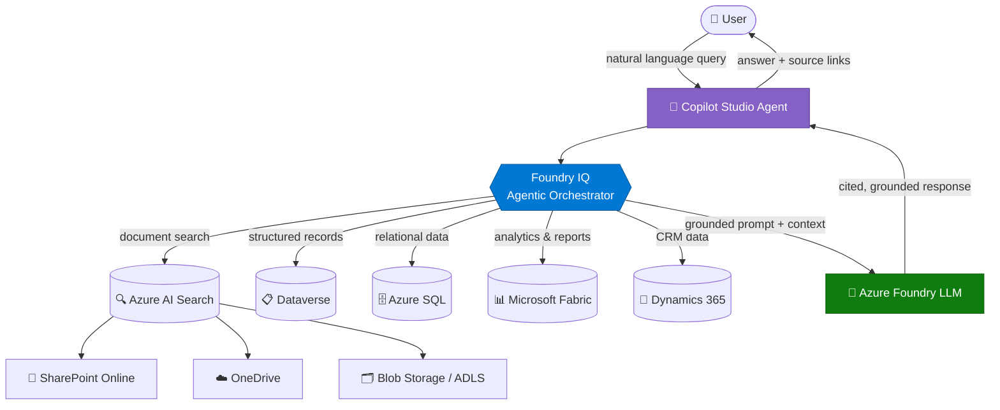
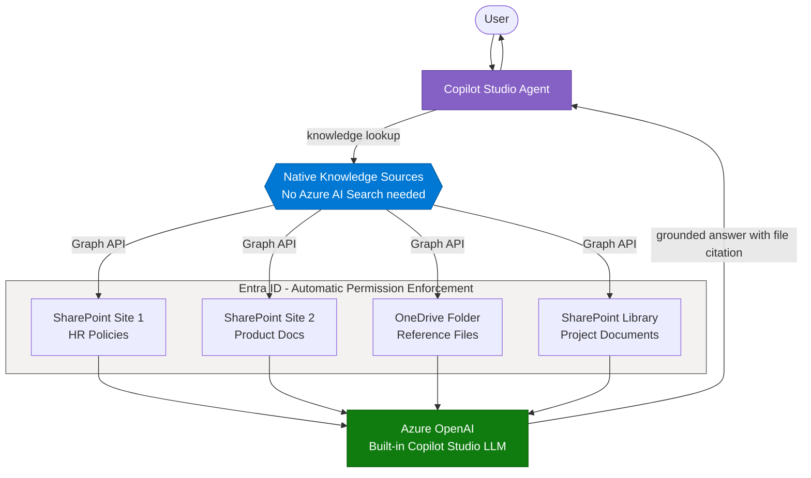
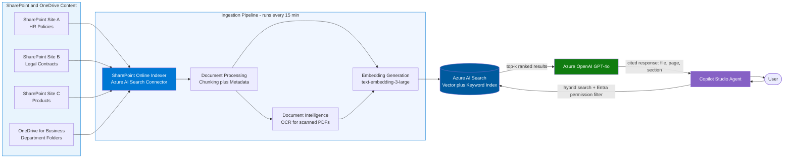
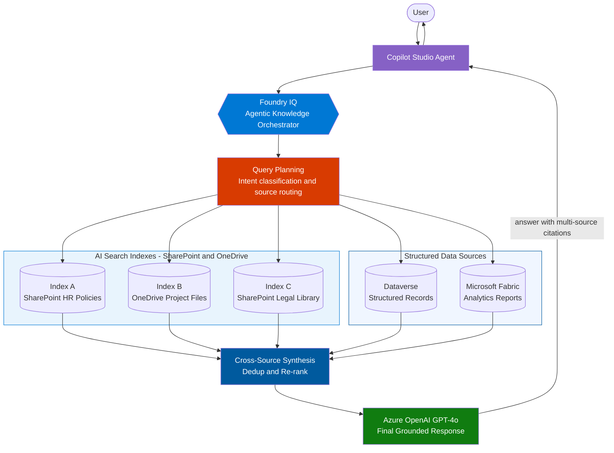
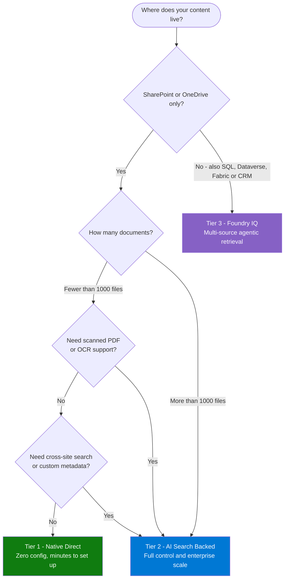

# Enterprise RAG (Multi-Source, Governed) Pattern

---

## Enterprise RAG (Multi‑Source, Governed)

> **Most widely deployed pattern.** Grounds every LLM response in real organizational
> data with document-level access control and full citation trails.

### 🏆 Why 

| Signal | Evidence |
|--------|----------|
| **Industries** | Insurance, Healthcare, Public Sector, Finance, Legal, HR, IT, Sales |
| **Data sources** | SharePoint, OneDrive, Dataverse, Azure SQL, Microsoft Fabric, Dynamics CRM |
| **Task types** | Q&A, summarization, policy interpretation, compliance checks, knowledge access |

---

### 🏗️ Architecture Diagram

---

### 🚀 How to Use This Pattern — Step by Step

**Step 1 — Inventory your knowledge sources**
List every data source that holds relevant content: SharePoint sites, SQL databases,
Dataverse tables, PDF libraries, Dynamics entities. Group them into *unstructured*
(documents) and *structured* (records/tables).

**Step 2 — Set up Azure AI Search indexes**
- Create one index per logical domain (e.g., `hr-policies`, `product-catalog`, `legal-contracts`)
- Enable semantic ranking and vector fields (`text-embedding-3-large`)
- Configure the **SharePoint Online indexer** or **blob indexer** for auto-refresh

**Step 3 — Apply permission trimming**
Enable Entra ID security trimming in AI Search so users only retrieve documents
they have permission to access. Link document ACLs to Entra group IDs.

**Step 4 — Connect to Copilot Studio**
- Use the **Azure AI Search knowledge source** in Copilot Studio (native low-code connector)
- Or, for multi-source orchestration, wire in **Foundry IQ** as an external agent

**Step 5 — Configure the response node**
Set `strictness: 4` to enforce grounding. Add a system prompt instruction:
*"Answer only using the retrieved sources. If the answer is not in the sources, say so."*

**Step 6 — Surface citations**
In your Copilot Studio response node, display `sourcefile`, `sourcepage`, and `url`
metadata as adaptive card footers so users can click through to the source document.

**Step 7 — Evaluate and iterate**
Run the Azure AI Evaluation SDK targeting **groundedness**, **relevance**, and **coherence**.
Aim for groundedness ≥ 4.0 / 5.0 before going to production.

---

### 📖 Real-World Scenarios

#### Scenario A — Insurance: Policy Q&A Agent
> An underwriter types: *"Does our commercial property policy cover flood damage in Zone AE?"*

1. Agent receives query → Foundry IQ plans search strategy
2. Searches `policy-documents` index (SharePoint PDF store) using vector + keyword hybrid
3. Retrieves matching policy clause with section reference
4. GPT-4o synthesizes answer with exact clause number cited
5. Underwriter gets a precise, auditable answer in < 5 seconds

**Result:** 70% reduction in policy look-up calls to the legal team.

---

#### Scenario B — Healthcare: Clinical Protocol Retrieval
> A nurse asks: *"What is the ICU sedation protocol for patients on CRRT?"*

1. Agent queries `clinical-protocols` index (curated PDF library, permission-trimmed by ward)
2. Foundry IQ cross-references `drug-formulary` Dataverse table
3. Response includes protocol steps + formulary dosing, with document links
4. Nurse sees cited source — can verify before acting

**Result:** Reduced protocol look-up time from 8 minutes (manual) to under 30 seconds.

---

#### Scenario C — HR: Benefits & Policy Self-Service
> An employee asks: *"How many days of parental leave am I entitled to in India?"*

1. Agent searches `hr-global-policies` SharePoint site, filtered by `region:India`
2. Returns the specific HR circular with effective date
3. If policy has changed recently, the indexer's 30-minute refresh ensures current content

**Result:** HR ticket volume for common policy questions drops by 45%.

---

#### Scenario D — Legal: Contract Clause Search
> A lawyer asks: *"Find all NDAs with a non-compete clause longer than 24 months."*

1. Agent uses AI Search with a **structured filter** on `doc_type:NDA` +
   semantic search on `"non-compete duration"`
2. Returns ranked results with clause excerpts and document links
3. Lawyer reviews 12 contracts in 3 minutes instead of 3 hours

**Result:** Contract review time reduced by 90% for standard clause searches.

---

### ⏰ When to Use / Avoid

| Use when... | Avoid when... |
|-------------|---------------|
| Large document repositories (500+ files) | Knowledge base fits in < 50 short documents |
| Access-controlled content required | All users have identical access to all data |
| Auditability and citations are required | Speed is critical and citations aren't needed |
| Multiple data sources need unified search | Data lives in a single, well-structured database |
| Hallucination risk must be minimized | Real-time computation is the primary need |

---

### 🔗 Related Labs & Accelerators

| Resource | Path |
|----------|------|
| Lab 1.4 — Azure AI Search in Copilot Studio | `/labs/lab-1.4` |
| Lab 2.1 — Advanced Azure AI Search | `/labs/lab-2.1` |
| Lab 2.3 — SharePoint AI Search Indexer | `/labs/lab-2.3` |
| Lab 2.4 — Foundry IQ Agentic Retrieval | `/labs/lab-2.4` |
| Content Flow Accelerator | `/accelerators/content-flow` |
| SharePoint Connector Accelerator | `/accelerators/sharepoint-connector` |

---

### 📂 SharePoint & OneDrive as Knowledge Sources — Integration Tiers

> Copilot Studio supports **three distinct ways** to connect SharePoint and OneDrive
> content to an agent — from zero-configuration native sources to enterprise-grade
> AI Search pipelines. Pick your tier based on scale, control, and freshness needs.

---

#### Tier Comparison at a Glance

| Capability | Tier 1 · Native Direct | Tier 2 · AI Search Backed | Tier 3 · Foundry IQ |
|------------|------------------------|--------------------------|---------------------|
| **Setup effort** | Minutes (UI only) | Hours (index + connector) | Days (full pipeline) |
| **Azure AI Search required** | No | Yes | Yes |
| **Max documents** | ~1,000 per source | Millions | Millions |
| **Custom chunking** | No (automatic) | Yes (full control) | Yes (intelligent) |
| **Permission trimming** | Entra ID (automatic) | Entra ID (configurable) | Entra ID + row-level |
| **Hybrid search** | No (semantic only) | Yes (vector + BM25) | Yes (agentic) |
| **Cross-library search** | Limited to added URLs | Yes (multi-site index) | Yes (multi-source) |
| **File type support** | Word, PDF, PPT, XLS, TXT | All + scanned OCR | All + structured data |
| **Index freshness** | Near-real-time (Graph) | Scheduled (15 min–1 hr) | Scheduled + on-demand |
| **Citations in response** | Filename + URL | Page + section + URL | Source + passage + URL |
| **Best for** | Departmental agents, PoC | Enterprise production | Multi-source, regulated |

---

#### Tier 1 — Native Direct Knowledge Source (No AI Search)

> The fastest path: add SharePoint site or OneDrive folder URLs directly inside
> Copilot Studio. Microsoft Graph handles retrieval and permission enforcement automatically.
> No Azure resources required beyond Copilot Studio itself.

**Supported file types (Tier 1 native)**

| File Type | Extension | Notes |
|-----------|-----------|-------|
| Word Document | `.docx` | Text + tables extracted |
| PDF | `.pdf` | Native text PDFs only (not scanned) |
| PowerPoint | `.pptx` | Slide text + speaker notes |
| Excel | `.xlsx` | Cell values and sheet data |
| Plain Text | `.txt`, `.md` | Full content |
| OneNote | `.one` | Section and page content |

> ⚠️ Scanned PDFs (image-only) require **Tier 2** with Azure Document Intelligence OCR.

**How to add SharePoint/OneDrive as a knowledge source — Tier 1**

1. Open your agent in **Copilot Studio** → go to **Knowledge** tab
2. Click **+ Add knowledge** → select **SharePoint** or **OneDrive**
3. Paste the SharePoint **site URL** or **document library URL**
   - Site level: `https://contoso.sharepoint.com/sites/HR`
   - Library level: `https://contoso.sharepoint.com/sites/HR/Shared Documents`
   - OneDrive folder: shared folder URL from OneDrive
4. Click **Add** — Copilot Studio indexes the site via Microsoft Graph
5. Repeat for each site or folder (up to 10 knowledge sources per agent)
6. Test with a query in the **Test** panel — citations appear as clickable file links

> **Tip:** Use **library-level URLs** rather than site-level for large SharePoint sites.
> This scopes the index to the relevant document set and improves retrieval precision.

---

#### Tier 2 — AI Search-Backed (SharePoint Indexer)

> For production-scale deployments: an Azure AI Search index is built from SharePoint
> and OneDrive content using the **SharePoint Online indexer** or the **Graph connector**.
> Full hybrid search, custom metadata, scanned-document OCR, and millions of files.

**What the SharePoint Indexer adds over Tier 1**

| Feature | Value |
|---------|-------|
| **Incremental crawl** | Detects new/modified/deleted files automatically |
| **Custom metadata fields** | Index `department`, `doc_type`, `effective_date`, `region` from SharePoint column metadata |
| **Security trimming** | Entra group-based — users only see documents their group can access |
| **Scanned PDF support** | Azure Document Intelligence OCR processes image-based PDFs |
| **Scale** | Millions of documents across multiple site collections |
| **Hybrid search** | BM25 + vector in a single query with RRF merging |
| **Field-level boosting** | Boost `title` and `summary` fields to improve precision |

**How to set up Tier 2 (SharePoint Indexer)**

1. In **Azure portal** → create an **Azure AI Search** resource (Standard S1 or above)
2. Create a **data source** → type: **SharePoint Online** → paste the site URL
3. Grant the AI Search managed identity **Site Collection App Catalog** read access in SharePoint Admin
4. Create an **index** with fields: `id`, `content`, `content_vector`, `title`, `url`,
   `last_modified`, `author`, `doc_type`, `site_name`, `permissions`
5. Create an **indexer** — set schedule to `PT15M` (every 15 minutes)
6. Enable **semantic configuration** pointing to `content` and `title` fields
7. In **Copilot Studio** → **Knowledge** → **+ Add knowledge** → **Azure AI Search**
8. Select your index, map `content` as the answer field, `url` as the citation field

---

#### Tier 3 — Foundry IQ (Multi-Source Agentic Retrieval)

> The enterprise ceiling: Foundry IQ acts as an intelligent knowledge orchestrator that
> **plans its own search strategy**, queries SharePoint, OneDrive, Dataverse, SQL, and
> Fabric simultaneously, and synthesizes a single grounded response with citations across
> all sources. Best for regulated industries where knowledge is fragmented across systems.

---

#### Tier Selection Guide

---

#### Scenarios by Tier

| Scenario | Tier | Why |
|----------|------|-----|
| Team FAQ agent over a single SharePoint site (< 500 docs) | **Tier 1** | Native direct is fast to set up, no infra cost, auto-permissions |
| Company-wide HR policy agent (5 SharePoint sites, 10,000 docs) | **Tier 2** | Needs cross-site search, metadata filters by region/country, incremental indexing |
| Sales agent over CRM + SharePoint + contract library | **Tier 3** | Queries CRM (Dataverse), contracts (SharePoint), and analytics (Fabric) in one response |
| Onboarding agent for a new department (OneDrive shared folder) | **Tier 1** | 50–200 docs, single folder, immediate go-live |
| Legal contract search with scanned documents (pre-2015 archive) | **Tier 2** | Scanned PDFs need Document Intelligence OCR before indexing |
| Regulated finance agent: policy + transactions + compliance reports | **Tier 3** | Multi-source citations required for audit; cross-system grounding mandatory |

---
### 🔗 Related Labs & Accelerators

| Resource | Path |
|----------|------|
| Lab 1.4 — Azure AI Search in Copilot Studio | `/labs/lab-1.4` |
| Lab 2.1 — Advanced Azure AI Search | `/labs/lab-2.1` |
| Lab 2.3 — SharePoint AI Search Indexer | `/labs/lab-2.3` |
| Lab 2.4 — Foundry IQ Agentic Retrieval | `/labs/lab-2.4` |
| Content Flow Accelerator | `/accelerators/content-flow` |
| SharePoint Connector Accelerator | `/accelerators/sharepoint-connector` |

---
---
