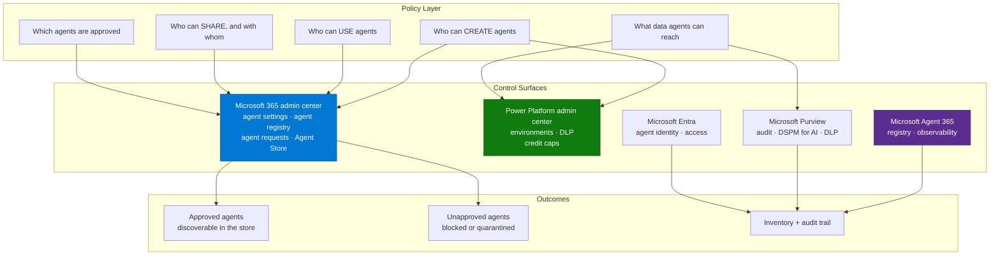

# Agent Governance & Rollout Control Plane Pattern

> **The most common blocker between a working agent and a deployed one.** Organizations do not
> stall on building agents — they stall on being unable to let people *use* agents without also
> letting everyone *create* and *share* them.

---

## Why This Pattern

| Signal | Evidence |
|---|---|
| **Industries** | Financial services, healthcare, public sector, manufacturing, professional services — anywhere with an information security review |
| **Where it appears** | Every enterprise agent rollout above a few hundred users |
| **Typical trigger** | "Security won't approve enabling agents because we can't stop users creating their own" |
| **Symptom in the field** | Rollouts paused at the last step; agents built and never published; adoption programmes blocked on a single admin setting |

This is not a nice-to-have hardening exercise. Across large enterprise engagements, the single
most frequently raised requirement is the separation of **agent creation rights** from **agent
consumption rights**, closely followed by controls on **who an agent can be shared with**. If
you are delivering an agent to more than a pilot group, this pattern is on the critical path.

---

## The Core Problem

Agent capability in Microsoft 365 arrives through several doors, each with its own controls:

| Door | Built with | Governed in |
|---|---|---|
| Agent Builder in Microsoft 365 Copilot | End users, no-code | Microsoft 365 admin center |
| SharePoint agents | End users, per site | Microsoft 365 admin center + SharePoint |
| Copilot Studio custom agents | Makers | Power Platform admin center + Microsoft 365 admin center |
| Microsoft first-party agents | Microsoft | Microsoft 365 admin center |
| Partner / third-party agents | Vendors | Microsoft 365 admin center / Agent Store |
| Pro-code agents (Agents SDK, Foundry) | Developers | Entra + Microsoft 365 admin center |

A governance design that only covers one door leaves the others open. Every conversation about
"blocking agents" needs to name which door.

---

## Architecture — The Control Plane

---

## The Five Questions

Answer these, in this order, with the customer's security and workplace teams. Every governance
conversation reduces to them.

### 1. Who can create agents?

The usual enterprise answer is "a controlled group", not "everyone" and not "nobody". Decide the
group before you touch settings, and decide it separately for each door in the table above.

### 2. Who can use agents?

Almost always broader than the creator group — frequently the whole organization. This asymmetry
is the entire point of the pattern.

### 3. Who can an agent be shared with, and by whom?

Sub-questions that come up every time:
- Can a creator share with the entire organization, or only named individuals?
- Can they share with security groups, or only people?
- Is there a cap on the audience size?
- Does sharing an agent also grant access to the underlying files?

Design the answer before rollout. Retrofitting sharing restrictions after users have shared
widely is an unpleasant conversation.

### 4. Which agents are approved for the organization?

Decide the approval route: direct sharing (fast, low control) versus submission to the
organization's Agent Store with admin review (slower, auditable, owned). For anything with a
broad audience, use the store route — it gives the agent an owner, a review record, and a
lifecycle.

### 5. What data can agents reach?

Covers connector availability, DLP policy for Power Platform connectors, web grounding, and
sensitivity label behaviour. This is where security review spends most of its time.

---

## Design Principles That Hold Up

| Principle | Why |
|---|---|
| **Name the door.** Every control decision must state which build surface it applies to | "Block agents" means five different settings across three portals |
| **Default deny for creation, default allow for consumption** | Matches how enterprises actually want to operate, and is the position most security teams will accept |
| **Approve through a store, not through a share link** | Gives every broadly used agent an owner and a review record |
| **Inventory before policy** | You cannot govern what you cannot enumerate. Establish the registry first |
| **Attach an owner to every agent** | Orphaned agents are the main source of governance debt |
| **Environment strategy is agent strategy** | For Copilot Studio, the environment is the unit of isolation, DLP, and cost |
| **Plan for the agent that must be switched off** | Have a documented, tested path to block or quarantine a single agent quickly |

---

## Real-World Scenarios

### Scenario A — Rollout blocked on creation vs consumption
A bank with tens of thousands of Copilot users could not enable agents for consumption without
also exposing the agent creation entry point to every licensed user. The rollout was paused
across several business units.

**What worked:** treat this as a phased rollout, not a binary. Enable consumption for the
approved, published agents first; keep creation restricted to a nominated maker community; use
the store approval route so every published agent has a named owner. Revisit as platform
controls evolve — this area changes frequently, so verify current capability rather than relying
on a design written six months ago.

### Scenario B — Sharing sprawl
A professional services firm found user-created agents shared organization-wide within days of
enabling Agent Builder, with no inventory of what they contained or what data they touched.

**What worked:** inventory first (registry export), then a sharing policy, then a short amnesty
during which owners either claimed and registered their agent or it was blocked. Communicating
the amnesty mattered more than the technical control.

### Scenario C — Decentralised enterprise, thousands of environments
A large manufacturer could not operate central governance across thousands of Power Platform
environments — tenant admins were the only role with meaningful control, which does not scale.

**What worked:** a tiered model. Central policy defines the guardrails (DLP, approved
connectors, credit caps per environment); environment owners operate within them. Push as much
scoped administration down as the platform supports, and document explicitly what still requires
a tenant admin.

### Scenario D — Regulated production workloads
A law firm and a central bank both required a documented, product-backed statement of agent
lifecycle behaviour before allowing agents into regulated workflows.

**What worked:** capture the platform's documented behaviour, note the gaps explicitly, and
design compensating controls (restricted publishing, mandatory human review, retained audit)
rather than claiming guarantees the platform does not make.

---

## When to Use / Avoid

| Use when... | Avoid over-engineering when... |
|---|---|
| Rolling out to more than a pilot group | A single agent, single team, closed pilot |
| Security or risk review is in the path | Proof of concept with synthetic data |
| Multiple business units will build agents | One central team builds everything |
| The organization is regulated | No regulatory or audit requirement |
| Agent sprawl has already started | Greenfield with a small maker community |

---

## Metrics Worth Tracking

| Metric | Why |
|---|---|
| Agents in the registry, by publisher type | Baseline for sprawl |
| Agents shared organization-wide | The main risk indicator |
| Agents with no identified owner | Governance debt |
| Agents in the store vs directly shared | Health of the approval route |
| Time from submission to approval | If this is slow, people route around it |
| Blocked or quarantined agents | Enforcement is actually working |

---

## Related Patterns and Scenarios

- Runbook: [Agent-Governance-and-Rollout-Control-Plane-Runbook.md](Agent-Governance-and-Rollout-Control-Plane-Runbook.md)
- [Copilot Credits & Cost Control](../Copilot-Credits-Cost-Control/Copilot-Credits-Cost-Control.md) — the financial half of the same problem
- [Agent Publishing & Channel Deployment](../Agent-Publishing-and-Channel-Deployment/Agent-Publishing-and-Channel-Deployment.md)
- [Declarative vs Custom Engine Agent](../Declarative-vs-Custom-engine-agent/Declarative-Agents-vs-Copilot-Studio-Custom-Engine-Agents.md)

---

## Reference Documentation

- [Manage agents in the Microsoft 365 admin center](https://learn.microsoft.com/en-us/microsoft-365/admin/manage/manage-copilot-agents-integrated-apps)
- [Agent management in the Microsoft 365 admin center](https://learn.microsoft.com/en-us/microsoft-365/admin/manage/agent-365-overview)
- [Agent registry](https://learn.microsoft.com/en-us/microsoft-365/admin/manage/agent-registry)
- [Agent requests](https://learn.microsoft.com/en-us/microsoft-365/admin/manage/agent-requests)
- [Agent settings](https://learn.microsoft.com/en-us/microsoft-365/admin/manage/agent-settings)
- [Microsoft Agent 365 overview](https://learn.microsoft.com/en-us/microsoft-agent-365/overview)
- [Purview for AI agents](https://learn.microsoft.com/en-us/purview/ai-agent-365)
- [Share agents with other users (Copilot Studio)](https://learn.microsoft.com/en-us/microsoft-copilot-studio/admin-share-bots)
- [Power Platform environment strategy](https://learn.microsoft.com/en-us/power-platform/guidance/adoption/environment-strategy)
