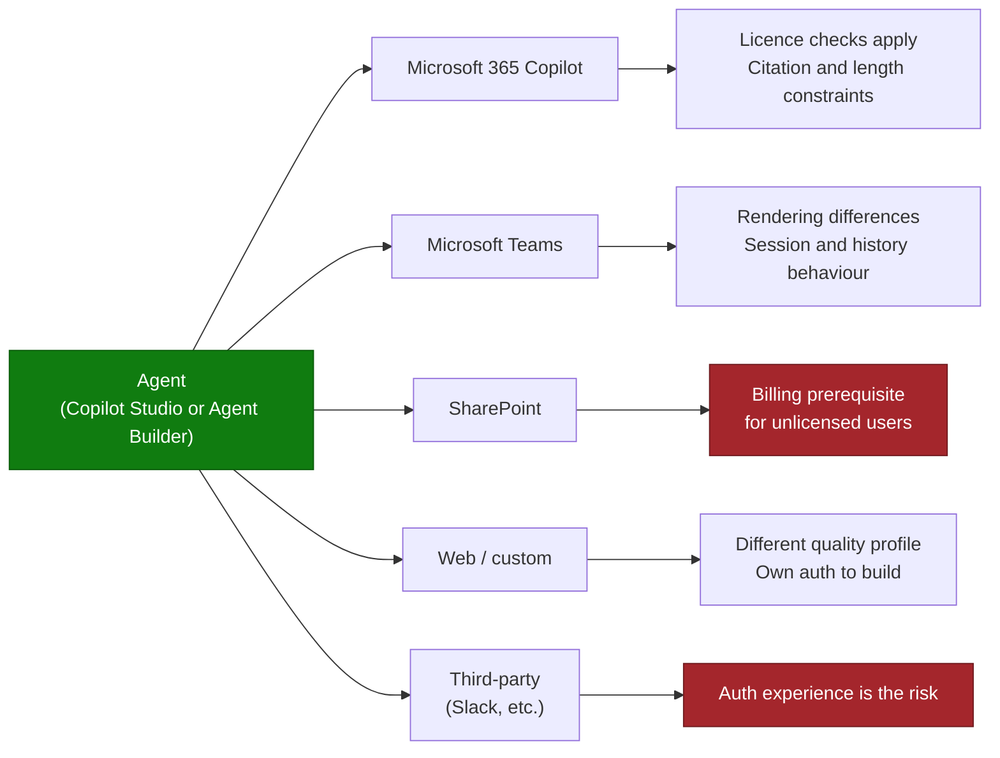

# Agent Publishing & Channel Deployment Pattern

> **The last mile, and the one most often underestimated.** An agent that works perfectly in the
> authoring test pane is not a deployed agent. Behaviour changes when it crosses a channel
> boundary.

---

## Why This Pattern

| Signal | Evidence |
|---|---|
| **Industries** | All |
| **Where it appears** | Between UAT sign-off and go-live, repeatedly |
| **Typical trigger** | "It works in Copilot Studio but not in Teams", "the answer is shorter in the Copilot channel", "we can't publish to SharePoint without enabling pay-as-you-go" |
| **Business impact** | Delays go-live after the build is complete, which is the most visible kind of delay |

Publishing failures cluster into four families: **licensing prerequisites**, **channel-specific
behaviour**, **authentication**, and **rendering**. Knowing which family you are in cuts
diagnosis time dramatically.

---

## Channel Comparison

| Channel | Main risk | Test before promising |
|---|---|---|
| Microsoft 365 Copilot | Licence enforcement at add/open time; response length and citation limits | Add the agent as a **non-maker**, unlicensed if that population is in scope |
| Microsoft Teams | Adaptive card rendering, citation limits, session lifecycle, version propagation | Full evaluation set in Teams, plus a group chat and a channel |
| SharePoint | Billing prerequisite for users without a Copilot licence | Confirm the licensing path before designing for this channel |
| Web / custom | Answer quality can differ from Microsoft channels; you own authentication | Run the evaluation set on the web channel specifically |
| Third-party (Slack and similar) | Repeated re-authentication ruins adoption | Prototype the sign-in experience before committing |

---

## The Four Failure Families

### 1. Licensing prerequisites

The most common cause of "publish succeeded but nobody can use it".

| Situation | What happens |
|---|---|
| Unlicensed user opens a shared agent | A Copilot licence check can still apply at add/open time, even with pay-as-you-go configured and a billing policy assigned |
| Agent includes people or graph-grounded knowledge by default | Introduces a licensing dependency that blocks unlicensed users |
| Publishing to SharePoint for unlicensed users | Requires either a Copilot licence or pay-as-you-go enabled plus billing configured for the agent's environment |
| Admin-center policy and Power Platform billing policy disagree | Users fall between the two and are blocked with a confusing message |

**Design action:** decide the exact audience and its licence mix **before** choosing the channel,
and validate end to end with a real user from the least-privileged group in scope. Do not accept
"it works for me" from a licensed maker as evidence.

### 2. Channel-specific behaviour

The same agent behaves differently across surfaces, and users notice.

| Behaviour | Detail |
|---|---|
| Citation limits | Teams shows a bounded number of citations, and truncates titles and snippets |
| Custom-rendered answers | If you render answers yourself through a variable or adaptive card, citations are not added automatically |
| Response depth | Multi-agent outputs in particular can lose depth when surfaced through Teams and the Copilot channel |
| Metadata | Descriptions, branding, and starter prompts do not always survive publishing intact |
| Version propagation | Updated agents can take time to reach all users, and some see an older version |
| Session lifecycle | Session and conversation-history behaviour differs by channel |

**Design action:** never assume parity. Run the evaluation set on every channel you intend to
publish to, and make channel-parity a documented acceptance criterion rather than an assumption.

### 3. Authentication

| Situation | Symptom |
|---|---|
| Agent invoked programmatically or by an external orchestrator | Interactive sign-in prompts appear where no user can respond |
| Parent–child agent chains with authenticated knowledge | Authentication context does not propagate cleanly |
| Third-party channels | Users re-authenticate on every invocation |
| Actions needing end-user identity | Actions execute under the creator's credentials, breaking source-system ACLs and audit |
| Federated identity providers in front of Entra | Additional consent friction |

**Design action:** prototype the authentication experience first, before the functional build.
Auth is a design constraint on the architecture, not a configuration step at the end. If actions
must run under the end user's identity for ACL or audit reasons, prove that end to end in a
throwaway agent before scoping the real one.

### 4. Rendering and payload

| Issue | Mitigation |
|---|---|
| Adaptive cards render differently or not at all in some channels | Test the exact card in the exact channel; keep cards simple |
| Charts and images fail to render | Verify per channel; have a text fallback |
| Token or payload size errors | Constrain response length; paginate long outputs |
| File upload and download inconsistencies | Confirm support per channel before designing a file-based flow |
| Long-running actions time out | Design for asynchronous patterns; return an acknowledgement and follow up |

---

## How to Use This Pattern — Step by Step

**Step 1 — Choose channels from the audience, not from enthusiasm**
Each channel adds testing surface and failure modes. Publish to the fewest channels that reach
the audience.

**Step 2 — Validate the licensing path for the least-privileged user in scope**
Before building, confirm that the specific combination of agent type, knowledge sources, channel,
and licence works. This is the single highest-value pre-build check in this pattern.

**Step 3 — Prototype authentication early**
Especially for external orchestrators, multi-agent chains, third-party channels, and any action
requiring end-user identity.

**Step 4 — Build channel parity into acceptance criteria**
"Works in Teams and Microsoft 365 Copilot with equivalent answer depth and citations" is a
testable criterion. "Deployed to Teams" is not.

**Step 5 — Publish to a pilot audience per channel**
Do not publish to all channels at once. Stagger, and observe.

**Step 6 — Run the evaluation set on every channel**
Same questions, same protocol, per channel. Record the differences you find; some are acceptable
and should simply be documented.

**Step 7 — Document known differences before launch**
Users forgive a documented limitation. They do not forgive discovering it themselves.

---

## Real-World Scenarios

### Scenario A — SharePoint channel blocked on billing
A pharmaceutical company wanted Copilot Studio agents embedded in SharePoint sites for
unlicensed users, but declined to enable the pay-as-you-go prerequisite because of cost-control
concerns. Makers were left with a poor workaround or a lengthy alternative route, and adoption
stalled.

**Lesson:** the SharePoint channel's licensing prerequisite is an architectural constraint.
Resolve it in design, not at publish time. Note that this is the same objection as the
[Copilot Credits & Cost Control](../Copilot-Credits-Cost-Control/Copilot-Credits-Cost-Control.md)
pattern — fix the cost-control story and this unblocks.

### Scenario B — Multi-agent output degraded in downstream channels
A central bank built a multi-agent orchestration solution that produced high-quality output in
the authoring canvas but noticeably shallower, truncated responses once published to Teams and
the Microsoft 365 Copilot channel — putting a large agent programme at risk.

**Lesson:** validate multi-agent solutions **in the target channel** from the first sprint, not
at the end. Channel constraints on aggregation, formatting, and response length are a design
input for multi-agent architectures.

### Scenario C — Repeated re-authentication in a third-party channel
A media company ran a competitive evaluation requiring an IT helpdesk agent inside Slack. The
agent worked, but users had to re-authenticate on each invocation — a materially worse experience
than the incumbent, and enough to lose the comparison on its own.

**Lesson:** in competitive situations, the authentication experience is part of the product.
Prototype it before agreeing to the evaluation criteria.

### Scenario D — Foundry agent publishing to Microsoft 365 Copilot
Several organizations building multi-agent workflows in Azure AI Foundry hit failures publishing
into Teams and Microsoft 365 Copilot, particularly with attached MCP tools, approval flows, and
multi-turn context.

**Lesson:** treat pro-code agent publishing into Microsoft 365 surfaces as its own integration
workstream with its own spike, not as a final packaging step.

---

## When to Use / Avoid

| Apply the full pattern when... | Lighter touch when... |
|---|---|
| Publishing to more than one channel | Single channel, single pilot group |
| Any part of the audience is unlicensed | Everyone holds a Microsoft 365 Copilot licence |
| Multi-agent or pro-code agents are involved | Single declarative agent in Microsoft 365 Copilot |
| Third-party channels are in scope | Microsoft surfaces only |
| Actions need end-user identity | Read-only knowledge agent |

---

## Pre-Publish Checklist

- [ ] Audience defined, including licence mix
- [ ] Licensing path validated with a real least-privileged user
- [ ] Authentication experience prototyped and accepted
- [ ] Channels chosen and justified by audience
- [ ] Evaluation set run on every target channel
- [ ] Adaptive cards and rich content tested in each channel
- [ ] Citation rendering verified per channel
- [ ] Response length and payload limits tested
- [ ] Version propagation behaviour understood and communicated
- [ ] Known channel differences documented for the launch communication
- [ ] Agent registered in the agent registry with a named owner
- [ ] Rollback path defined (how to unpublish, and how fast)

---

## Related Patterns and Scenarios

- Runbook: [Agent-Publishing-and-Channel-Deployment-Runbook.md](Agent-Publishing-and-Channel-Deployment-Runbook.md)
- [Agent Governance & Rollout Control Plane](../Agent-Governance-and-Rollout-Control-Plane/Agent-Governance-and-Rollout-Control-Plane.md)
- [Copilot Credits & Cost Control](../Copilot-Credits-Cost-Control/Copilot-Credits-Cost-Control.md)
- [Agentic Workflow Orchestration](../Agentic-Workflow-Orchestration/Agentic-Workflow-Orchestration.md)

---

## Reference Documentation

- [Publish an agent to Microsoft Teams](https://learn.microsoft.com/en-us/microsoft-copilot-studio/publication-add-bot-to-microsoft-teams)
- [Add an agent to SharePoint](https://learn.microsoft.com/en-us/microsoft-copilot-studio/publication-add-bot-to-sharepoint)
- [Configure user authentication in Copilot Studio](https://learn.microsoft.com/en-us/microsoft-copilot-studio/configuration-end-user-authentication)
- [Add other agents (child, connected, A2A, Foundry, Fabric)](https://learn.microsoft.com/en-us/microsoft-copilot-studio/authoring-add-other-agents)
- [Multi-agent orchestration patterns and best practices](https://learn.microsoft.com/en-us/microsoft-copilot-studio/guidance/multi-agent-patterns)
- [Manage agents in the Microsoft 365 admin center](https://learn.microsoft.com/en-us/microsoft-365/admin/manage/manage-copilot-agents-integrated-apps)
