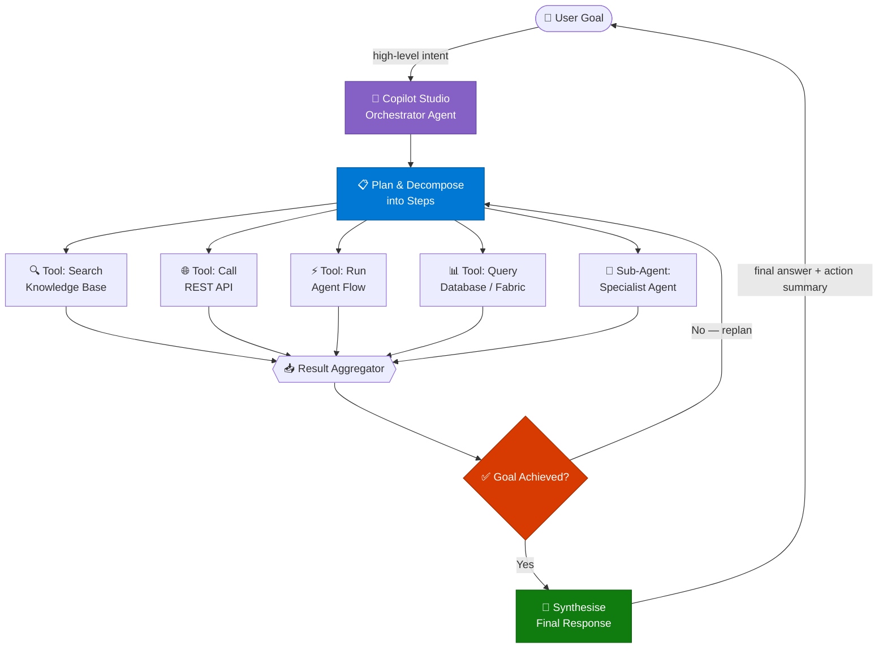
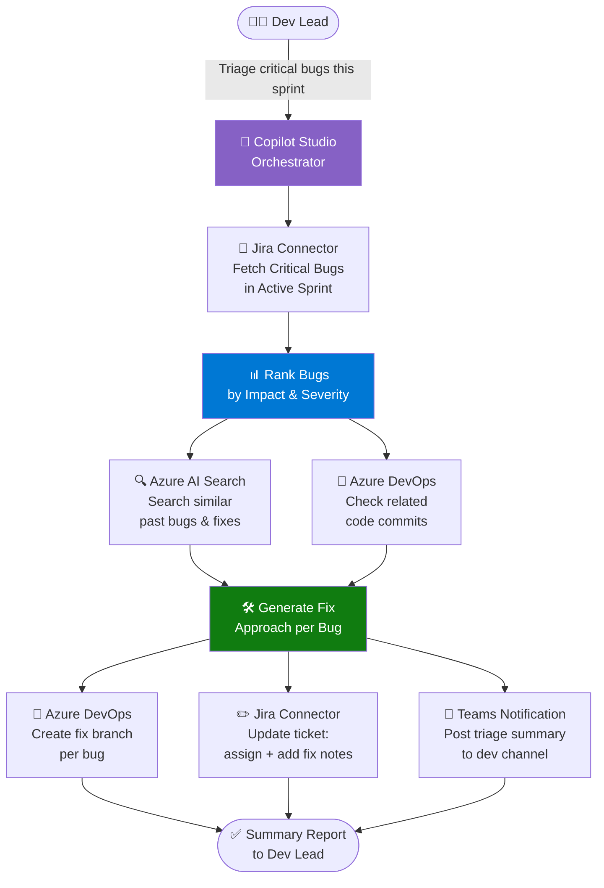
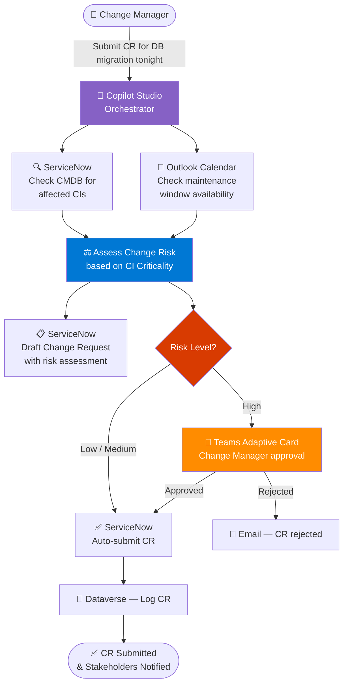
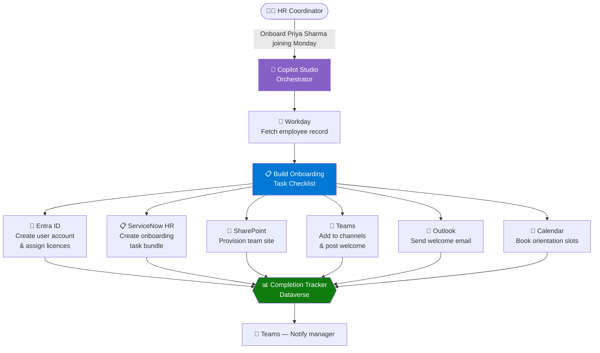
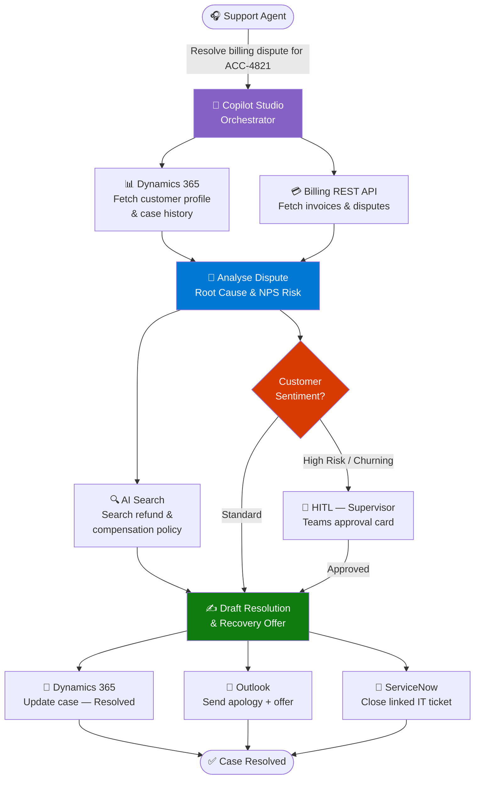
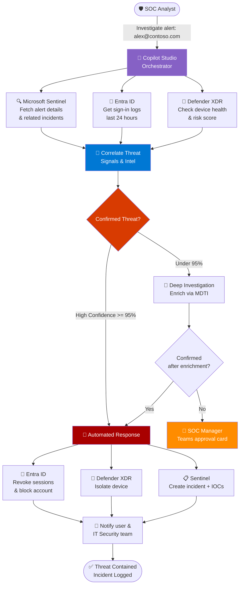

# Agentic Workflow Orchestration — Implementation Runbook

> **For Solution Architects & Technical Implementation Teams**
> Version 1.0 | April 2026 | Classification: Internal

---

## 📋 Table of Contents

1. [Purpose & Scope](#1-purpose--scope)
2. [Prerequisites](#2-prerequisites)
3. [Reference Composition](#3-Reference Composition)
   - [3.1 Component Responsibilities](#31-component-responsibilities)
   - [3.2 Data Flow — Step by Step](#32-data-flow--step-by-step)
   - [3.3 Planning Mechanism — Instructions vs Topics vs Hybrid](#33-planning-mechanism--instructions-vs-topics-vs-hybrid)
4. [Connector Configuration Guides](#4-connector-configuration-guides)
   - [4.1 ServiceNow](#41-servicenow-connector)
   - [4.2 Jira](#42-jira-connector)
   - [4.3 Microsoft Entra ID (Graph API)](#43-microsoft-entra-id-graph-api-connector)
   - [4.4 Dynamics 365](#44-dynamics-365-connector)
   - [4.5 Custom REST API](#45-custom-rest-api-connector)
5. [Implementation Guide by Scenario](#5-implementation-guide-by-scenario)
   - [5.1 DevOps — Jira Bug Triage & Auto-Fix PR](#51-scenario-d--devops-jira-bug-triage--auto-fix-pr)
   - [5.2 ITSM — ServiceNow Change Request](#52-scenario-e--itsm-servicenow-change-request-automation)
   - [5.3 HR — Employee Onboarding](#53-scenario-f--hr-employee-onboarding-orchestration)
   - [5.4 Customer Service — Complaint Resolution](#54-scenario-g--customer-service-complaint-resolution)
   - [5.5 Security — Threat Detection & Response](#55-scenario-h--security-threat-detection--response)
6. [Testing & Quality Assurance](#6-testing--quality-assurance)
7. [Observability & Monitoring](#7-observability--monitoring)
8. [Design Principles & Best Practices](#8-design-principles--best-practices)
9. [Troubleshooting Guide](#9-troubleshooting-guide)
10. [Related Labs & Accelerators](#10-related-labs--accelerators)
- [Appendix A — Connector Cheatsheet](#appendix-a--quick-reference-connector-cheatsheet)
- [Appendix B — Glossary](#appendix-b--glossary)

---

## 1. Purpose & Scope

This runbook is a **technical reference for implementing the Agentic Workflow Orchestration pattern** on Microsoft Copilot Studio and Azure AI. It describes one possible composition of tools, connectors, sub-agents, and planning mechanisms — the maker (the team building the agent) decides which components to use, how to wire them together, and what trigger mode (conversational, event-driven, or scheduled) fits the scenario. Five example scenarios are included with connector-specific configuration, testing checklists, and troubleshooting guides; treat each as a worked illustration, not a prescribed deployment.

| Attribute | Value |
|-----------|-------|
| **Intended audience** | Solution Architects, Cloud Architects, Power Platform developers, Azure engineers |
| **Pattern complexity** | ⭐⭐⭐⭐ High |
| **Estimated implementation time** | 3–10 days per scenario depending on connector complexity |
| **Core platform** | Microsoft Copilot Studio (built-in generative AI) + Agent Flows (Power Automate) |

### What This Pattern Is For

Compared with fixed-flow bots, this pattern is designed for situations where the maker wants an
implementation that **can**:
- **Plan** — decompose a high-level user goal into atomic executable steps at runtime
- **Execute** — call tools (agent flows wrapping connectors) in the order the LLM selects
- **Adapt** — replan based on intermediate results when a step fails or returns unexpected output
- **Coordinate** — delegate to specialist sub-agents for deep-domain tasks
- **Audit** — log every action to Dataverse for compliance and debugging

Each item above is a capability the maker enables by configuring the corresponding tools, instructions,
and guardrails. The pattern itself does not run — it is a design blueprint.

> **Terminology note — Agent Flows vs Cloud Flows:** This runbook uses *agent flows* as the primary
> automation mechanism. Agent flows are built natively in Copilot Studio (GA mid-2025) and are the
> recommended approach for new development. They run on the same Power Automate engine as cloud flows.
> Where platform-specific guidance applies (troubleshooting, connection settings, run history), this
> runbook references Power Automate directly, as both flow types share the same runtime infrastructure.

---

## 2. Prerequisites

### 2.1 Azure & M365 Licensing

| Component | Minimum SKU | Notes |
|-----------|-------------|-------|
| Copilot Studio | Copilot Studio licence (per tenant) | Generative Orchestration must be enabled. Uses the built-in Copilot Studio generative AI model and built-in knowledge sources (SharePoint, files, websites, Dataverse, public sites) — no separate Azure OpenAI or Azure AI Search resource required. |
| Power Automate | Premium | Per-flow licence for connector calls |
| Dataverse | Power Platform environment | For audit logging |
| Azure Monitor | Standard | *Optional* — only if the maker wants centralised Azure-side observability beyond Power Platform analytics |
| Azure AI Search | Standard S1 | *Optional* — only if the maker needs vector / hybrid search beyond what Copilot Studio's built-in knowledge sources provide |

> **Note on the planning model:** This runbook assumes the **default generative AI model that ships with Copilot Studio** — makers do not need to provision their own Azure OpenAI resource or deploy a model. A custom Azure OpenAI deployment is only required if your governance, region-residency, or fine-tuning needs call for it; in that case, configure it via the Copilot Studio model settings or call it directly from an agent flow.

> **Note on knowledge sources:** Copilot Studio ships with native knowledge connectors for SharePoint, OneDrive files, public web URLs, Dataverse tables, and uploaded documents. Use these first. **Azure AI Search is only needed** when the maker requires advanced retrieval (vector / hybrid search, custom skillsets, large-scale enterprise indexes) that the built-in knowledge sources do not cover.

### 2.2 Permissions Required

| Role | Where | Why |
|------|-------|-----|
| Environment Admin | Power Platform | Create environment, connections, connectors |
| Azure Contributor | Azure Resource Group | Deploy AI Search and Monitor resources (only required for optional components the maker chooses to add) |
| SharePoint Site Owner | Target sites | Grant AI Search indexer read access |
| ServiceNow Admin / Integration User | ServiceNow instance | Create/read incident, change, CMDB records |
| Jira Admin | Jira Cloud project | OAuth 2.0 app registration |
| Global Admin (one-time) | Entra ID | Consent for Power Platform connector registrations |

### 2.3 Technical Prerequisites Checklist

Before starting any scenario implementation, verify:

- [ ] Power Platform environment with Dataverse enabled
- [ ] Copilot Studio licence assigned to implementation team
- [ ] **Generative Orchestration** feature flag enabled in Copilot Studio settings (uses the built-in Copilot Studio model — no Azure OpenAI deployment required)
- [ ] Azure subscription active with Contributor access *(only if AI Search, Azure Monitor, or other optional Azure components will be used)*
- [ ] Azure AI Search resource created (Standard S1 or above) *(only if knowledge-base tools are in scope)*
- [ ] Network connectivity confirmed: Power Automate → target system (ServiceNow / Jira / Dynamics 365)
- [ ] Service accounts created per connector (see Section 4)
- [ ] Azure Key Vault provisioned for storing connector secrets

---

## 3. Core Architecture

The diagram below shows the logical components an implementation built on this pattern would
coordinate at runtime. It is a reference composition — the maker decides which tools, sub-agents,
and replanning behaviour to include, and which trigger surface (conversational, event-driven, or
scheduled) starts the flow.



### 3.1 Component Responsibilities

| Component | Technology | Responsibility |
|-----------|-----------|----------------|
| Orchestrator Agent | Copilot Studio | Entry point; manages conversation and tool dispatch |
| Goal Planner | Copilot Studio (built-in generative AI model) | Decomposes user goals into executable steps |
| Tools | Agent Flows | Wrap each system action (create ticket, fetch data, send email). Built natively in Copilot Studio or imported from Power Automate cloud flows. |
| Result Aggregator | Copilot Studio runtime | Collects outputs from parallel/sequential tool calls |
| Replanning Loop | Copilot Studio (built-in generative AI model) | Evaluates goal completion; replans if not achieved (max 5–8 iterations) |
| Sub-Agents | Azure AI Agent Service | Specialist agents for deep-domain tasks (forensics, financial analysis) |
| Audit Log | Dataverse | Persists every tool call, input, output, and decision |

### 3.2 Data Flow — Step by Step

The sequence below describes what an implementation built on this pattern would do at runtime once
the maker has configured tools, instructions, and the chosen trigger. Steps are illustrative — a
given implementation may include or skip any of them.

1. The user (or a trigger event) submits a high-level goal via Teams, web chat, or an embedded M365 surface
2. Copilot Studio routes the intent to the Orchestrator Agent
3. The configured planner (the built-in Copilot Studio generative AI model by default) decomposes the goal into 2–N atomic tool steps
4. Tools are dispatched (sequentially or in parallel based on dependencies declared by the maker)
5. Each tool calls the target system via an agent flow → returns structured JSON
6. The Result Aggregator evaluates completeness against the original goal
7. **If incomplete:** the LLM replans remaining steps, up to the maker-defined iteration budget
8. **If complete:** the LLM synthesises a final response with an action summary
9. Every step is logged to the Dataverse audit table with input, output, duration, and status

### 3.3 Planning Mechanism — Instructions vs Topics vs Hybrid

Copilot Studio offers two complementary mechanisms for encoding planning logic.
The maker picks the right one (or combines both) based on the predictability and
compliance needs of each step.

| Mechanism | Where the maker configures it | Best for |
|-----------|-------------------------------|----------|
| **Instructions** (Generative Orchestration) | Agent description + custom instructions + knowledge sources; toggle **Generative Orchestration** on | Open-ended goals where the LLM dynamically sequences tools and sub-agents at runtime |
| **Topics** (classic authoring) | Topic trigger phrases + nodes + conditions in the topic editor | Deterministic, regulated, or compliance-gated flows where the path must not vary |
| **Hybrid** (recommended for enterprise) | Instructions drive the outer loop; topics handle specific guard-railed sub-flows (e.g., approval gates, refund issuance) | Most enterprise scenarios — flexible planning with deterministic checkpoints |

#### What to put in instructions (the planning brain)

- **Role & scope** — who the agent is and what tasks are in/out of scope
- **Tool preferences** — which tool to try first, fallbacks, and when to delegate to a sub-agent
- **Replanning policy** — what to do when a tool returns no result or an error (retry, escalate, ask the user)
- **HITL thresholds** — actions that require human approval (e.g., refunds > $200, account lockouts)
- **Output format** — how to summarise the final result back to the user

#### What to put in topics

- High-stakes flows with mandatory steps (e.g., KYC verification, change-request approval)
- Compliance-required confirmation prompts that must appear verbatim
- Deterministic data-collection sequences before invoking a tool

#### Example — instructions snippet for the Orchestrator Agent

```
You are an enterprise orchestrator agent. For any user goal:
1. Decompose into atomic steps and pick the smallest set of tools needed.
2. Prefer AI Search for knowledge; prefer connector tools for system actions.
3. If a tool returns an error or empty result, retry once with adjusted parameters,
   then escalate to the user with what you tried.
4. Stop after 6 planning iterations; if the goal is unmet, summarise progress and ask.
5. For irreversible actions (refunds > $200, account lockouts, mass email send),
   invoke the "ApprovalGate" topic before executing.
6. Final response: 3-line summary + action list + links to created records.
```

> **Note:** The topic name `ApprovalGate` above is an example pattern — build a corresponding topic with a deterministic Adaptive Card approval flow and route irreversible actions through it.

---

## 4. Connector Configuration Guides

---

### 4.1 ServiceNow Connector

**Use cases:** Incident creation/update, Change Request management, CMDB lookups, ticket closure

**Authentication:** OAuth 2.0 (preferred) or Basic Auth (legacy)

#### Setup Steps

1. In ServiceNow: navigate to **System OAuth → Application Registry** → create a new OAuth 2.0 app. Note the **Client ID** and **Client Secret**
2. Assign the service account roles: `itil`, `rest_api_explorer`, `web_service_admin`
3. In Power Platform admin centre: **Connections → New connection → ServiceNow**
4. Enter your ServiceNow instance URL: `https://<instance>.service-now.com`
5. Select OAuth 2.0, enter Client ID and Secret
6. In Power Automate: create a cloud flow with HTTP trigger → add ServiceNow action (Create Record / Update Record / Get Record)
7. Register the flow as a Tool in Copilot Studio with a precise description

#### Key API Endpoints

| Operation | Table API Endpoint | Key Fields |
|-----------|-------------------|------------|
| Create Incident | `POST /api/now/table/incident` | short_description, category, priority, caller_id |
| Update Incident | `PATCH /api/now/table/incident/{sys_id}` | state, assignment_group, work_notes |
| Get CMDB CI | `GET /api/now/table/cmdb_ci` | Filter by name or sys_class_name |
| Create Change Request | `POST /api/now/table/change_request` | type, risk, category, assignment_group |
| Close Ticket | `PATCH /api/now/table/incident/{sys_id}` | state=6, close_code, close_notes |

#### Power Automate Flow Pattern (Incident Creation)

```
Trigger: HTTP POST from Copilot Studio tool call
  Body: { short_description, category, priority, caller_id, description }

→ Action: ServiceNow — Create Record (table: incident)
→ Action: Parse JSON (extract sys_id, number, link)
→ Response: { "ticket_number": "", "sys_id": "", "url": "" }
```

#### Common Errors & Fixes

| Error | Cause | Fix |
|-------|-------|-----|
| 401 Unauthorized | OAuth token expired | Enable token auto-refresh in Power Automate connection |
| 403 Forbidden | Service account missing role | Add `itil` role in ServiceNow user admin |
| 404 Not Found | Wrong table name | Verify table API name via sys_db_object |
| 400 Bad Request | Missing required field | Check ServiceNow field dictionary for mandatory fields |

---

### 4.2 Jira Connector

**Use cases:** Fetch sprint issues, update status, create issues, add comments, link PRs

**Authentication:** OAuth 2.0 (Jira Cloud) or API Token + Basic Auth

#### Setup Steps

1. In Jira Cloud: go to **Atlassian Developer Console** → create a new OAuth 2.0 app
2. Add scopes: `read:jira-work`, `write:jira-work`, `read:jira-user`
3. Note Client ID and Secret; set redirect URI to Power Automate callback URL
4. In Power Platform: use the certified **Jira (Cloud)** connector or create a custom connector from Jira's OpenAPI spec
5. In Power Automate: authenticate the Jira connection using OAuth 2.0
6. Build flows for each operation: fetch issues, update status, create issue, add comment
7. Register each flow as a Copilot Studio Tool

#### Key API Endpoints

| Operation | Endpoint | Notes |
|-----------|----------|-------|
| Get Sprint Issues | `GET /rest/agile/1.0/sprint/{sprintId}/issue` | Add JQL filter for priority=Critical |
| Get Issue | `GET /rest/api/3/issue/{issueIdOrKey}` | Returns full issue detail |
| Update Issue | `PUT /rest/api/3/issue/{issueIdOrKey}` | Body: `{ fields: { ... } }` |
| Create Issue | `POST /rest/api/3/issue` | Body: `{ fields: { project, summary, issuetype, priority } }` |
| Add Comment | `POST /rest/api/3/issue/{issueIdOrKey}/comment` | Body: ADF-formatted comment |
| Transition Issue | `POST /rest/api/3/issue/{issueIdOrKey}/transitions` | Get valid transitionIds first |
| Link Issues | `POST /rest/api/3/issueLink` | Link bug to PR, epic, or related issue |

#### JQL Query Examples for Tool Descriptions

```
# All critical bugs in active sprint
project = "MyProject" AND sprint in openSprints() AND priority = Critical

# Unresolved bugs assigned to current user
assignee = currentUser() AND resolution = Unresolved AND issuetype = Bug

# Recently updated high-priority issues
priority in (Critical, High) AND updated >= -7d ORDER BY updated DESC
```

#### Common Errors & Fixes

| Error | Cause | Fix |
|-------|-------|-----|
| 401 Unauthorized | API token revoked | Regenerate in Atlassian account settings |
| 400 Transition not valid | Wrong transitionId | Call GET /transitions to get valid IDs first |
| 403 Permission denied | User lacks project role | Add service account to project as Developer |

---

### 4.3 Microsoft Entra ID (Graph API) Connector

**Use cases:** Create user, assign licences, revoke sessions, add to groups, block sign-in

**Authentication:** App registration with Client Credentials (service principal)

#### Setup Steps

1. In Azure portal → **Entra ID → App registrations** → New registration: `CopilotStudio-GraphConnector`
2. Add API permissions (Application, not delegated):
   - `User.ReadWrite.All`
   - `Directory.ReadWrite.All`
   - `AuditLog.Read.All`
3. Grant admin consent
4. Create a client secret (copy value immediately — shown once only)
5. Store the secret in **Azure Key Vault** — reference it in Power Automate via Key Vault connector
6. In Power Automate: use HTTP action with Bearer token from `https://login.microsoftonline.com/{tenantId}/oauth2/v2.0/token`

#### Key Graph API Calls

| Operation | Method | Endpoint |
|-----------|--------|----------|
| Create User | POST | `/v1.0/users` |
| Assign Licence | POST | `/v1.0/users/{id}/assignLicense` |
| Add to Group | POST | `/v1.0/groups/{groupId}/members/$ref` |
| Revoke Sessions | POST | `/v1.0/users/{id}/revokeSignInSessions` |
| Block Sign-in | PATCH | `/v1.0/users/{id}` — body: `{"accountEnabled": false}` |
| Get User | GET | `/v1.0/users/{id or UPN}` |

---

### 4.4 Dynamics 365 Connector

**Use cases:** Read/write cases, accounts, contacts, opportunities; update case status; add notes

**Authentication:** OAuth 2.0 via Power Platform (first-party — no additional registration for same tenant)

#### Setup Steps

1. The **Dataverse connector** is available natively in Power Automate — no additional registration required for same-tenant D365
2. Create a service account with Dynamics 365 roles: `Customer Service Representative` or `System Administrator`
3. Use the **Dataverse connector** (preferred over legacy Dynamics 365 connector) for new implementations

#### Key Operations

| Operation | Power Automate Action | Notes |
|-----------|----------------------|-------|
| Get Account | List rows (Accounts) | Filter by accountnumber or name |
| Get Case | Get a row by ID (Cases) | Use incidentid |
| Create Case | Add a new row (Cases) | Required: title, customerid, subject |
| Update Case | Update a row (Cases) | Set statecode=1 for Resolved |
| Add Note | Add a new row (Annotations) | Link via objectid |

---

### 4.5 Custom REST API Connector

For cloud-hosted systems without a certified connector (proprietary billing systems, partner portals, internal APIs):

#### Setup Steps

1. In Power Platform admin centre: **Custom connectors → + New custom connector → Import an OpenAPI file**
2. If no OpenAPI spec exists: use **Create from blank** and define operations manually
3. Set authentication: API Key, OAuth 2.0, or Basic Auth
4. Define each operation with input/output schema
5. Test each operation in the connector test console
6. Create a connection and reference it in Power Automate flows

#### Best Practices for Custom Connectors

- Write clear operation descriptions — the LLM uses these to decide when to call the tool
- Return structured JSON with consistent camelCase field names
- Include error response schemas (400, 401, 404, 500) for graceful error handling
- Set timeouts appropriately: 30s default; 120s for long-running external API calls
- Use **Azure API Management** as a gateway for throttling, caching, and monitoring

---

## 4.6 MCP Server Integration (Model Context Protocol)

MCP is **generally available in Copilot Studio** (since May 2025). MCP servers provide a dynamic, AI-native integration layer alongside traditional Power Platform connectors. MCP servers are deployed and connected through the Power Platform connector infrastructure — they inherit the same DLP, VNet, and authentication controls.

### When to Use MCP vs Power Platform Connectors

| Use MCP servers when... | Use Power Platform connectors when... |
|------------------------|--------------------------------------|
| Tools need to update automatically as the server evolves | Operations are stable and well-defined |
| You need Azure infrastructure management (Key Vault, Monitor, Storage) | You need ITSM/CRM operations (ServiceNow, Jira, D365) |
| Work IQ capabilities are needed (Copilot Search, M365 reasoning) | Standard email/calendar/Teams actions suffice |
| Building multi-tool agents that need dynamic tool discovery | Building deterministic flows with known inputs/outputs |

### Available Microsoft MCP Server Layers

#### Layer 1 — Azure MCP Server (47+ Azure services)

A single unified server covering Azure infrastructure. Install via npm, NuGet, or pip.

| Namespace | Azure Services | Key Operations |
|-----------|---------------|----------------|
| `storage` | Azure Storage | Account, container, blob CRUD; file shares; queues; tables |
| `keyvault` | Azure Key Vault | Get/set secrets, certificates, keys |
| `monitor` | Azure Monitor | KQL queries, Log Analytics, activity logs |
| `cosmos` | Cosmos DB | Database/container CRUD, SQL queries, item operations |
| `search` | Azure AI Search | Index management, document search, queries |
| `sql` | Azure SQL | Server/database management, firewall rules |
| `appservice` | App Service | Web app management, deployment, configuration |
| `functionapp` | Azure Functions | Function app listing and management |
| `aks` | AKS | Kubernetes cluster listing and configuration |
| `foundry` | Microsoft Foundry | Models, deployments, endpoints |

**Authentication:** Uses developer Azure credentials (az login) or managed identity. Access controlled via Azure RBAC.

**Copilot Studio integration:** Deploy the Azure MCP Server to Azure Container Apps → create a custom connector in Power Platform pointing to the server endpoint → register as an MCP action in Copilot Studio.

#### Layer 2 — Specialized MCP Servers

| Server | Source | Key Operations |
|--------|--------|----------------|
| **Azure DevOps MCP** | `microsoft/mcp` repo | Work items, pipelines, repos, branches, wikis, test plans |
| **Microsoft Fabric MCP** | `microsoft/mcp` repo | Data pipelines, lakehouse queries, KQL analytics |
| **Dataverse MCP** | `microsoft/mcp` repo | Table CRUD, business process flows, solution management |

#### Layer 3 — Work IQ MCP Servers (requires M365 Copilot licence)

Enterprise-grade MCP servers for Microsoft 365 workloads. Managed via the Microsoft 365 admin centre.

| MCP Server | Key Tools | Operations Count |
|------------|-----------|-----------------|
| **Outlook Mail** | Create, send, reply, replyAll, search, delete, update emails | 10 tools |
| **Outlook Calendar** | Create, update, accept, decline, cancel events; find free/busy | 10+ tools |
| **SharePoint & OneDrive** | File upload, metadata, search, sensitivity labels | 8+ tools |
| **Teams** | Chat creation, channel ops, member management, messaging | 10+ tools |
| **Word** | Create documents from HTML/text, retrieve content, comments | 5+ tools |
| **Copilot Search** | Cross-M365 semantic search, multi-turn conversations, file grounding | 3+ tools |
| **User Profile** | Manager chain, direct reports, people search, org hierarchy | 5+ tools |
| **SharePoint Lists** | List create, column management, item CRUD, filtered queries | 6+ tools |
| **Admin Centre** | Administrative operations (limited documentation) | Varies |

**Prerequisites for Work IQ MCP:**
- [ ] Microsoft 365 Copilot licence assigned
- [ ] Frontier program enrolment (for preview features)
- [ ] Admin consent granted in Microsoft 365 admin centre
- [ ] MCP servers enabled in tenant agent policies

### MCP Integration Pattern in the Agentic Architecture

```
User Goal → Copilot Studio Orchestrator
               ├── Agent Flow Tools (connectors for ServiceNow, Jira, D365, etc.)
               ├── MCP Actions (Azure MCP for infra, DevOps MCP for repos)
               ├── Work IQ MCP (Copilot Search, Outlook Mail, Teams for M365 context)
               └── Sub-Agents (Azure AI Agent Service for specialist tasks)
```

In an implementation of this pattern, MCP servers and Power Platform connectors can **sit side by side** as tools available to the LLM planner. At runtime the orchestrator would dynamically select among them — for example, an agent flow calling ServiceNow or an MCP action querying Azure Key Vault — based on the user's goal and the tool descriptions the maker authored.

---

## 5. Implementation Guide by Scenario

> The five scenarios below are **example implementations** of this pattern. Each shows one way a
> maker could compose tools, instructions, and HITL gates to meet a specific business goal. Use them
> as worked references — adapt the components, trigger mode, and risk thresholds to fit your
> environment rather than treating them as fixed deployments.

---

### 5.1 Scenario D — DevOps: Jira Bug Triage & Auto-Fix PR

**Example business goal:** Triage critical Jira bugs each sprint and create fix branches in Azure DevOps. In this example, the implementation runs on demand from a dev-lead prompt; a maker could equally trigger it on a sprint-start event or a schedule.

#### Architecture



#### Components Required

| Component | Technology | Purpose |
|-----------|-----------|---------|
| Orchestrator Agent | Copilot Studio | Entry point and task coordinator |
| Bug Fetch Tool | Agent Flow + Jira connector | Fetch critical sprint bugs via JQL |
| Bug Ranking | AI Analysis | Score bugs by impact × reproducibility |
| Historical Search Tool | Azure AI Search | Find similar resolved bugs and past fixes |
| Commit History Tool | Agent Flow + Azure DevOps | Query relevant commits and blame history |
| Branch Creation Tool | Agent Flow + Azure DevOps | Create fix branch from main |
| Jira Update Tool | Agent Flow + Jira | Update ticket: assign, add fix notes, link branch |
| Teams Notification Tool | Agent Flow + Teams | Post ranked triage card to dev channel |

#### Implementation Steps

**Step 1** — Create Jira OAuth connection in Power Platform (Section 4.2)

**Step 2** — Create agent flow: **"GetSprintCriticalBugs"**
```
Trigger: HTTP POST from Copilot Studio
Input: { projectKey, sprintId }
Action: HTTP GET → Jira /rest/agile/1.0/sprint/{sprintId}/issue?jql=priority=Critical
Response: [{ id, key, summary, priority, description, assignee }]
```

**Step 3** — Register as Copilot Studio Tool with description:
> *"Use this tool to fetch all critical bugs from the current active Jira sprint. Call this when the user wants to triage or review sprint bugs."*

**Step 4** — Create agent flow: **"CreateFixBranch"**
```
Trigger: HTTP POST
Input: { bugId, branchName, repositoryId }
Action: Azure DevOps Repos API → POST /repos/{repoId}/refs
Response: { branchUrl, branchName, status }
```

**Step 5** — Create agent flow: **"UpdateJiraIssue"**
```
Trigger: HTTP POST
Input: { issueKey, comment, assignee, fixApproach }
Action: Jira PUT /rest/api/3/issue/{issueKey}
Action: Jira POST /rest/api/3/issue/{issueKey}/comment
Response: { success: true, issueUrl }
```

**Step 6** — In Copilot Studio: enable **Generative Orchestration**, set max iterations to **6**

**Step 7** — Test with: *"Triage critical bugs in the current sprint and set up fix branches for the top 3."*

#### Validation Checklist

- [ ] Jira OAuth connection tested — returns 200 on test call
- [ ] `GetSprintCriticalBugs` returns properly formatted JSON array
- [ ] Bug ranking produces consistent top-3 results for same input
- [ ] Azure DevOps branch created with naming convention `fix/BUG-{id}`
- [ ] Jira ticket shows updated comment and assignee post-orchestration
- [ ] Teams triage summary posted to dev channel
- [ ] All steps logged in Dataverse audit table with duration_ms
- [ ] Agent replans correctly when Jira returns 0 critical bugs

---

### 5.2 Scenario E — ITSM: ServiceNow Change Request Automation

**Example business goal:** Prepare and submit a Change Request with automated risk assessment and a Teams approval gate for high-risk changes. Trigger mode is the maker's choice — this example uses a conversational prompt from a change manager.

#### Architecture



#### Risk Scoring Logic

| Input | Source | Weight |
|-------|--------|--------|
| CI business criticality | ServiceNow CMDB field `business_criticality` | High |
| Change type | Normal = higher risk than Standard | High |
| Maintenance window availability | Outlook Calendar | Medium |
| Number of dependent CIs | CMDB relationship query | Medium |

**Risk thresholds:**

| Level | Score | Action |
|-------|-------|--------|
| Low | < 30 | Auto-submit CR, notify via email |
| Medium | 30–69 | Auto-submit CR, post summary to Teams channel |
| High | ≥ 70 | Block submission, send Teams Adaptive Card to Change Manager |

#### Implementation Steps

**Step 1** — Set up ServiceNow OAuth connection (Section 4.1)

**Step 2** — Create flow **"LookupAffectedCIs"**: query CMDB, return CI list with criticality ratings

**Step 3** — Create flow **"CheckMaintenanceWindow"**: query Outlook Calendar for maintenance window events in next 24 hours

**Step 4** — Create flow **"CreateChangeRequest"**: POST to ServiceNow `change_request` table with pre-filled risk fields

**Step 5** — Create agent flow **"SendApprovalCard"**: post Teams Adaptive Card to Change Manager; use Power Automate **Approval** action to wait

**Step 6** — Wire conditional: if risk = High → approval flow → then `CreateChangeRequest`

**Step 7** — Create flow **"LogCRToAudit"**: write to Dataverse `cr_audit_log` with CR number, requestor, risk, approver, timestamp

#### Validation Checklist

- [ ] CMDB lookup returns CI list with `business_criticality` populated
- [ ] Maintenance window detection works for calendar events
- [ ] Low-risk CR auto-submitted without Teams approval prompt
- [ ] High-risk CR blocked until Teams card approval received
- [ ] Rejected CR generates email notification to requestor
- [ ] ServiceNow CR number logged in Dataverse with timestamp and approver
- [ ] Stakeholder notifications fired via ServiceNow notification workflow

---

### 5.3 Scenario F — HR: Employee Onboarding Orchestration

**Example business goal:** Orchestrate Day-0 onboarding across M365, ServiceNow HR, and Workday. This example uses a single natural-language prompt from HR; an event-driven variant (Workday "new hire" record created) is equally valid — the maker decides.

#### Architecture



#### Tool & Connector Map

| Tool Name | Connector | Operation | Key Fields |
|-----------|-----------|-----------|------------|
| GetEmployeeProfile | Workday REST | GET /workers/{id} | role, department, costCentre, location, manager |
| CreateM365Account | Graph API | POST /v1.0/users | displayName, mailNickname, department |
| AssignLicences | Graph API | POST /v1.0/users/{id}/assignLicense | skuId for M365 E3/E5 |
| CreateOnboardingTasks | ServiceNow HR | POST /api/now/table/sn_hr_core_case | category=onboarding, assignment_group=IT |
| ProvisionSharePointSite | SharePoint REST | POST /_api/SPSiteManager/Create | siteUrl, title, template |
| AddToTeamsChannels | Graph API | POST /v1.0/teams/{teamId}/members | userId |
| SendWelcomeEmail | Outlook connector | Send email | personalised template with Day-1 guide link |
| BookOrientationSlots | Outlook Calendar | Create event | attendees, subject, start, end, location |

#### Onboarding Task Bundle (ServiceNow HR)

| Category | Tasks Created |
|----------|--------------|
| IT Setup | Laptop provisioning, software licences, VPN access, email setup |
| Security | MFA enrolment, security awareness training, DLP policy acknowledgement |
| HR Admin | Benefits enrolment, payroll setup, ID card, contract signing |
| Manager | 30-60-90 day plan template, team introduction meeting |
| Buddy Programme | Buddy assignment and first-week check-in scheduling |

#### Validation Checklist

- [ ] Workday profile returns all required fields: role, dept, costCentre, manager
- [ ] M365 account created with correct UPN format
- [ ] Licences assigned — verify in Entra admin centre
- [ ] ServiceNow HR onboarding case opened with correct assignment group
- [ ] SharePoint site provisioned — new hire added as member
- [ ] Teams channel memberships confirmed
- [ ] Welcome email received by new hire mailbox
- [ ] 3 calendar events created: IT setup, orientation, manager 1:1
- [ ] All 8 steps logged in Dataverse with completion timestamp
- [ ] Manager notified via Teams with onboarding summary card

---

### 5.4 Scenario G — Customer Service: Complaint Resolution

**Example business goal:** Resolve billing disputes end-to-end — analyse root cause, draft a resolution, update CRM, and send a personalised recovery offer. The maker chooses the trigger (agent-desk prompt, CRM case-creation event, or queue handoff) and the risk thresholds that gate HITL approval.

#### Architecture



#### Sentiment-Based Routing Logic

| Customer Profile | Condition | Route |
|-----------------|-----------|-------|
| High Churn Risk | NPS < 6 AND open cases > 2 | Supervisor approval for offers > $50 |
| Standard | NPS 6–8 AND first contact | Auto-draft resolution |
| Advocate | NPS ≥ 9 | Fast-track, add loyalty note to CRM |

#### Recovery Offer Tiers

| Tier | Trigger | Offer | Auto-Approve Threshold |
|------|---------|-------|----------------------|
| Bronze | First dispute, standard risk | 10% discount voucher | Always auto-approve |
| Silver | Second dispute or NPS < 7 | Free month of service | Auto-approve up to $50 |
| Gold | NPS < 5 or 3+ disputes | Dedicated account manager + 2 months free | Requires supervisor approval |

#### Validation Checklist

- [ ] Dynamics 365 case created and linked to correct account
- [ ] Billing API returns correct invoice data for test account
- [ ] LLM correctly classifies churn risk — test 3 distinct sample profiles
- [ ] High-risk cases route to supervisor Teams approval card
- [ ] Resolution email sent from correct sender address with personalised content
- [ ] Case status updated to Resolved in Dynamics 365
- [ ] Linked ServiceNow IT ticket closed
- [ ] Recovery offer recorded in billing system

---

### 5.5 Scenario H — Security: Threat Detection & Response

**Example business goal:** Investigate suspicious login alerts and contain confirmed threats with a full audit trail. The maker is responsible for choosing confidence thresholds, the trigger (SOC-analyst prompt vs. Sentinel-alert webhook), and which containment actions remain gated behind HITL.

> **⚠️ CRITICAL — Irreversible Actions Gate**
> The following actions MUST have a Human-in-the-Loop gate unless confidence ≥ 95%:
> - Revoking user sessions
> - Blocking a user account
> - Isolating a device from the network
>
> Set replanning budget to **3 iterations maximum** for security scenarios to avoid delayed response.

#### Architecture



#### Confidence Thresholds

| Confidence | Score | Action |
|------------|-------|--------|
| High | >= 95% | Auto-contain: revoke sessions + isolate device |
| Medium | 70–94% | HITL: SOC manager Teams card before containment |
| Low | < 70% | Deep investigation: enrich with MDTI / VirusTotal |

#### Investigation Flow

| Step | Tool | Connector | What Is Retrieved |
|------|------|-----------|------------------|
| 1 | FetchSentinelAlert | Microsoft Sentinel | Alert details, entities, related incidents |
| 2 | GetSignInLogs | Entra ID (Graph) | Login history: IP, device, location, risk level |
| 3 | GetDeviceRisk | Defender XDR | Device risk score, active threats, isolation status |
| 4 | CorrelateSignals | AI Analysis | Threat correlation across all 3 sources |
| 5 | EnrichWithThreatIntel | MDTI / VirusTotal REST | IP reputation, hash matches, known IOCs |
| 6 | ContainThreat or HITL | Entra ID + Defender XDR | Revoke session + isolate device OR approval card |
| 7 | CreateSentinelIncident | Microsoft Sentinel | Incident with timeline, IOCs, and evidence |
| 8 | NotifyTeam | Outlook + Teams | Alert user and IT Security team |

#### Validation Checklist

- [ ] Sentinel connector authenticated — requires `Microsoft Sentinel Responder` role
- [ ] Sign-in logs retrieved within 30 seconds
- [ ] Defender XDR device risk score returned correctly
- [ ] High-confidence test case (>= 95%) triggers auto-containment without human prompt
- [ ] Medium-confidence test case shows SOC manager Teams approval card
- [ ] Entra session revocation confirmed in Entra audit log
- [ ] Device isolation confirmed in Defender XDR portal
- [ ] Sentinel incident created with correct severity and IOCs attached
- [ ] User and security team notified via email
- [ ] Full investigation timeline persisted in Dataverse

---

## 6. Testing & Quality Assurance

### 6.1 Test Strategy

| Test Type | When | Coverage | Tools |
|-----------|------|----------|-------|
| Unit tests | Per tool / flow | Each Power Automate flow tested independently | Power Automate test run |
| Integration tests | After all tools built | End-to-end agent conversation | Copilot Studio Test panel |
| Adversarial tests | Before go-live | Edge cases: empty result, API down, ambiguous goal | Copilot Studio test cases |
| Load tests | Pre-production | 10, 50, 100 concurrent sessions | Azure Load Testing |
| Regression tests | After each change | Core flows still work after connector updates | Automated test suite in Power Automate |

### 6.2 Adversarial Test Cases — Run Before Every Go-Live

| Test Case | Input | Expected Behaviour | Pass Criteria |
|-----------|-------|-------------------|---------------|
| Tool returns empty | "Triage bugs" when sprint has no critical issues | Agent replies: *"No critical bugs found in the current sprint."* | No hallucinated bug data |
| API timeout | ServiceNow down during CR creation | Agent retries once, then notifies user of failure | Graceful error message, no partial state |
| Replanning budget exceeded | Goal requires 10+ tool calls | Agent escalates to human after 8 iterations | HITL card sent, no infinite loop |
| Ambiguous goal | "Fix the problem" (no context) | Agent asks a clarifying question | Clarification prompt, not a random tool call |
| High-risk action without approval | Security: isolate device with 60% confidence | Agent routes to SOC manager for approval | HITL gate triggered, no auto-isolation |
| Duplicate tool call | Orchestrator calls CreateIncident twice | Second call is idempotent — no duplicate ticket | One ticket created in ServiceNow |
| Wrong connector scope | User asks for data outside service account permissions | Agent surfaces plain-language error message | No raw HTTP error codes or stack traces surfaced |

### 6.3 Performance Benchmarks

| Metric | Target | How to Measure |
|--------|--------|---------------|
| First tool call latency | < 3 seconds from user submit | Copilot Studio conversation log |
| Total orchestration time (3-tool task) | < 15 seconds | End-to-end conversation duration |
| Total orchestration time (6-tool task) | < 45 seconds | End-to-end conversation duration |
| Tool call success rate | >= 98% | Power Automate run history |
| Replanning rate | < 20% of sessions | Dataverse audit log query |
| HITL escalation rate | Scenario-specific baseline | Dataverse approval queue analytics |

---

## 7. Observability & Monitoring

### 7.1 Dataverse Audit Table Schema

Create a Dataverse table named `awo_audit_log` with the following columns:

| Field | Type | Description |
|-------|------|-------------|
| `session_id` | GUID | Unique conversation session identifier |
| `user_id` | String | Entra UPN of the user who initiated the request |
| `tool_name` | String | Name of the tool called (e.g., "GetSprintCriticalBugs") |
| `tool_input` | JSON (Text, multiline) | Full input payload sent to the tool |
| `tool_output` | JSON (Text, multiline) | Full response received from the tool |
| `duration_ms` | Integer | Time taken for the tool call in milliseconds |
| `success` | Boolean | True if HTTP 200/201, False otherwise |
| `error_code` | String | HTTP status or error type if failed |
| `iteration_number` | Integer | Which replanning iteration (1 = first attempt) |
| `goal_achieved` | Boolean | True if this was the final successful step |
| `timestamp` | DateTime (UTC) | UTC timestamp of the tool call |
| `scenario` | String | e.g., "ITSMChangeRequest", "JiraBugTriage" |

### 7.2 Azure Monitor Alerts to Configure

| Alert | Condition | Severity | Notification |
|-------|-----------|----------|-------------|
| High tool failure rate | Tool error rate > 5% in 15 min | High | PagerDuty / Teams alert to on-call |
| Replanning budget exceeded | `iteration_number` > 8 in a session | Medium | Teams notification to agent owner |
| Security containment triggered | `tool_name` = "IsolateDevice" OR "BlockUser" | Critical | Immediate Teams alert to CISO |
| Audit log gap | No entries for > 30 min during business hours | High | Check Power Automate health dashboard |

---

## 8. Design Principles & Best Practices

### 8.1 Core Principles

| Principle | Guidance | Anti-pattern to Avoid |
|-----------|----------|----------------------|
| **Atomic tools** | Each tool does exactly one thing with one system | Don't create a "do everything" tool that calls 3 systems internally |
| **Idempotency** | Write tools must handle retries safely — no duplicate records | Don't create incidents without checking for existing duplicates first |
| **Least privilege** | Each connector uses a service account with minimum required permissions | Don't use a Global Admin account for routine tool calls |
| **Replanning budget** | Cap iterations at 5–8; add HITL fallback when exceeded | Don't leave replanning unbounded — infinite loops are a real risk |
| **Graceful degradation** | Non-critical tool failure should not abort the entire session | Don't treat a Power BI refresh failure the same as user account creation failure |
| **HITL for irreversibles** | Always include human approval for actions that cannot be undone | Don't auto-execute device isolation, account deletion, or bulk emails without a gate |
| **Observability first** | Log every tool call input/output to Dataverse from day one | Don't wait until production to add logging |
| **Describe tools precisely** | LLM routing quality depends on specific, unambiguous tool descriptions | Don't write generic descriptions like "calls the API" |

### 8.2 Tool Description Writing Guide

| Quality | Example Description | Why |
|---------|-------------------|-----|
| Bad | *"Calls ServiceNow"* | Too vague — LLM doesn't know what it does |
| Bad | *"Gets data from the ticket system"* | Ambiguous — which system, what data? |
| Good | *"Use this tool to create a new incident in ServiceNow. Call this when the user reports an IT issue that needs a ticket. Input: short_description, category, priority (1–5). Returns: ticket_number and URL."* | Specific trigger, clear inputs and outputs |
| Good | *"Use this tool to fetch all critical Jira bugs in the currently active sprint. Call this when the user wants to triage sprint bugs. Returns a list with id, summary, priority, and assignee."* | Clear when to call, what it returns |

### 8.3 Security Hardening Checklist

- [ ] All service account credentials stored in **Azure Key Vault** — never hardcoded in Power Automate connections
- [ ] Custom connectors use **HTTPS only** — reject HTTP endpoints at connector level
- [ ] OAuth 2.0 client secrets rotated every **90 days** — set Key Vault expiry policy
- [ ] Power Automate flows that take irreversible actions protected by a **named Approval step**
- [ ] Copilot Studio agent scoped to **authenticated users only** — anonymous access disabled
- [ ] Dataverse audit log table has **read-only access** for service accounts — no delete permissions
- [ ] Azure Monitor alerts configured for unusual tool call patterns (see Section 7.2)
- [ ] **Penetration test** performed before go-live for Scenario H (Security) agents

---

## 9. Troubleshooting Guide

### 9.1 Agent Is Not Calling the Right Tool

**Symptoms:** Agent responds with a generic answer instead of calling a tool, or calls the wrong tool.

**Diagnosis steps:**
1. Open the Copilot Studio conversation trace — check which tools were considered
2. Review the tool description — is it specific about when to call it?
3. Check if the user's phrasing matches the tool description's trigger condition

**Common fixes:**
- Rewrite tool description to be more specific about trigger conditions and expected inputs
- Add explicit input/output schema examples to the tool description
- Lower the orchestration confidence threshold in Copilot Studio settings

---

### 9.2 Power Automate Flow Fails Intermittently

**Symptoms:** Tool calls succeed most of the time but fail 5–10% of the time with timeout or 503.

**Diagnosis steps:**
1. Check Power Automate run history — identify the failing action
2. Check the target system's status page (ServiceNow, Jira)
3. Determine if failure is consistent for specific inputs (data issue) or random (connectivity)

**Common fixes:**
- Add **retry policy** to the HTTP action: 3 retries, exponential backoff starting at 5 seconds
- Increase timeout: 60s for ServiceNow, 30s for Jira
- Add a **Try/Catch scope** in Power Automate to return structured error JSON

---

### 9.3 Replanning Loop Does Not Terminate

**Symptoms:** Agent keeps replanning past the configured budget, or session times out.

**Diagnosis steps:**
1. Check Dataverse audit log — how many iterations actually ran?
2. Did any tool return ambiguous output the LLM couldn't interpret as success or failure?

**Common fixes:**
- Ensure at least one tool returns a clear `"success": true` indicator
- Add a system prompt instruction:
  > *"If you have called more than 8 tools and the goal is not achieved, stop and ask the user to clarify."*
- Reduce tool output verbosity — a full LLM context window causes confusion during replanning

---

### 9.4 Connector Authentication Fails After Working Previously

**Symptoms:** Tools that worked correctly suddenly return 401 Unauthorized.

**Diagnosis steps:**
1. Check if the OAuth token has expired (most access tokens expire in 60 minutes)
2. Check if the service account password was changed after a 90-day rotation
3. Check if the client secret in Azure Key Vault has reached its expiry date

**Common fixes:**
- In Power Automate: **Edit the connection → sign in again** to refresh the OAuth grant
- Rotate the client secret in Entra ID → update the Key Vault secret value
- Enable **token auto-refresh** in Power Automate connection settings where supported

---

## 10. Related Labs & Accelerators

| Resource | Location | What It Covers |
|----------|----------|---------------|
| Lab 1.2 — Tools in Copilot Studio | `/labs/lab-1.2` | Building, testing, and describing tools end-to-end |
| Lab 1.3 — MCP Integration | `/labs/lab-1.3` | Model Context Protocol for external agent connections |
| Lab 2.1 — ServiceNow ITSM Integration | `/labs/lab-2.1` | Full ServiceNow OAuth setup and connector configuration |
| Lab 2.2 — Jira DevOps Agent | `/labs/lab-2.2` | Jira Cloud OAuth setup and sprint management tools |
| Lab 2.3 — HR Onboarding Orchestration | `/labs/lab-2.3` | End-to-end HR onboarding scenario walkthrough |
| Functional Scoping Accelerator | `/accelerators/functional-scoping` | Defines tool boundaries and agent responsibilities |
| Connector Security Hardening Guide | `/accelerators/connector-security` | Service account hardening, Key Vault integration patterns |
| Observability Accelerator | `/accelerators/observability` | Pre-built Dataverse audit schema + Power BI monitoring dashboard |

---

## Appendix A — Quick Reference Connector Cheatsheet

| System | Auth Method | Power Platform Connector | Key Roles / Permissions |
|--------|-------------|--------------------------|------------------------|
| ServiceNow | OAuth 2.0 | ServiceNow (certified) | `itil`, `rest_api_explorer` |
| Atlassian Jira | OAuth 2.0 | Atlassian Jira (certified) | `read:jira-work`, `write:jira-work` |
| Azure DevOps | OAuth 2.0 | Azure DevOps (first-party) | Project Contributor |
| Dynamics 365 | OAuth 2.0 (M365) | Dataverse (first-party) | Customer Service Representative |
| Salesforce | OAuth 2.0 | Salesforce (certified) | API + CRM User profile |
| Workday | OAuth 2.0 | Workday (certified) | Integration System User |
| Azure AD / Entra ID | App Client Credentials | Azure AD + HTTP with Azure AD | `User.ReadWrite.All`, `Directory.ReadWrite.All` |
| Microsoft Sentinel | OAuth 2.0 (M365) | Microsoft Sentinel (first-party) | `Microsoft Sentinel Responder` |
| Defender for Endpoint | OAuth 2.0 (M365) | Windows Defender ATP (first-party) | `SecurityAdmin` |
| Azure Key Vault | Azure Managed Identity | Azure Key Vault (first-party) | Key Vault Secrets User |
| Power BI | OAuth 2.0 (M365) | Power BI (first-party) | Workspace Member |
| Microsoft Fabric | OAuth 2.0 | Microsoft Fabric (first-party) | Workspace Contributor |
| Approvals | OAuth 2.0 (M365) | Approvals (first-party) | Power Automate Premium |
| Office 365 Outlook | OAuth 2.0 (M365) | Office 365 Outlook (first-party) | Mailbox Owner |
| Custom REST API | Varies | Custom Connector | Application-specific |

---

## Appendix B — Glossary

| Term | Definition |
|------|------------|
| **Agentic Orchestration** | A design approach where an AI agent plans, sequences, and executes multi-step tasks at runtime instead of following a rigid pre-programmed flow. Whether a given implementation runs autonomously, with human approvals, or under a scheduled trigger is a choice the maker configures. |
| **Copilot Studio** | Microsoft's low-code platform for building AI agents and copilots with generative AI capabilities |
| **Generative Orchestration** | Copilot Studio feature that uses an LLM to dynamically select and sequence tools based on user intent |
| **Agent Flow** | A flow built natively in Copilot Studio as a tool for an agent. Runs on the Power Automate engine with exclusive AI capabilities. Existing Power Automate cloud flows can also be imported as tools. |
| **Replanning** | The process by which the LLM evaluates intermediate results and adjusts the remaining execution plan |
| **Replanning Budget** | The maximum number of replanning iterations allowed before the agent escalates to a human |
| **HITL** | Human-in-the-Loop — a pattern where the AI defers a decision or action to a human reviewer before proceeding |
| **Sub-Agent** | A specialist agent delegated a sub-task by the orchestrator, typically via Azure AI Agent Service |
| **Result Aggregator** | The logical component that collects outputs from all tool calls and presents them for synthesis |
| **Audit Log** | A Dataverse table that persists every tool call input, output, and decision for compliance and debugging |
| **Idempotency** | The property of a tool call that guarantees calling it multiple times produces the same result as calling it once |
| **Least Privilege** | Security principle: each service account should have only the minimum permissions required |
| **Adaptive Card** | An interactive Teams card format used to present HITL approval requests with action buttons |
| **JQL** | Jira Query Language — the structured query syntax used to filter Jira issues |

---
