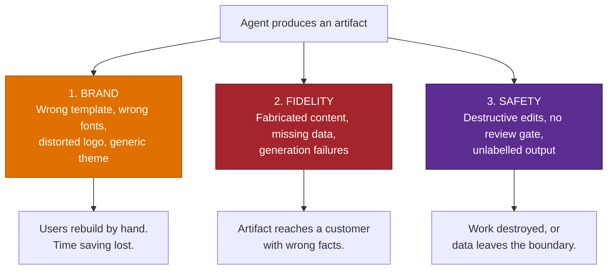

# Branded Office Artifact Generation Pattern

> **The output is a document someone has to send.** Agents that reason well and produce
> off-brand, unreviewable artifacts do not save time — they move the work from writing to
> reformatting.

---

## Why This Pattern

| Signal | Evidence |
|---|---|
| **Industries** | All. Sharpest in regulated, brand-governed, and customer-facing functions: marketing, sales, legal, pharma, manufacturing |
| **Where it appears** | Cowork artifact generation, Office Agent Mode, agents that produce decks, proposals, RFP responses, and reports |
| **Typical trigger** | "Copilot made the deck but it's not our template", "the RFP agent can't produce the Word document", "the logo came out wrong" |
| **Business impact** | Determines whether a working agent is actually adopted |

Artifact generation is now a first-class agent output. Copilot Cowork creates Word, Excel,
PowerPoint, and PDF files; Office Agent Mode edits documents directly; agents produce proposals
and reports. Every one of these lands in a brand-governed environment, and the gap between
"generated" and "usable" is where adoption is won or lost.

---

## The Three Problems



Most teams design for problem 1 and get ambushed by 2 and 3.

---

## Problem 1 — Brand Compliance

### The mechanism

Brand compliance for Copilot-generated Office files runs on the **Organization Asset Library**
(OAL): SharePoint document libraries designated to hold the organization's approved templates
and imagery.

| Element | Configuration |
|---|---|
| PowerPoint templates | `.potx` in a library designated `OfficeTemplateLibrary` |
| Word templates | `.dotx`, same |
| Excel templates | `.xltx`, same |
| Approved images and logos | A library designated `ImageDocumentLibrary` |
| Designation | `Add-SPOOrgAssetsLibrary` via SharePoint Online Management Shell |

Constraints that shape the plan:

- Up to **30** organization asset libraries, and **all must be on the same site**.
- Templates can take **up to 24 hours** to appear to users.
- Desktop apps need Microsoft 365 Apps 2002 or later; PowerPoint on the web needs an Office 365
  E3 or E5 licence for the library to appear.
- **Not available** for 21Vianet or US Government plans.
- Users need at least read permission on the organization's root site.

### The part that surprises people

**Template adherence is not uniform across entry points or models.** The same organization can
observe:

- The in-app Copilot sidebar respecting the OAL template.
- Agent Mode or chat-based generation applying a generic theme instead.
- Behaviour differing depending on which model the user selected.
- A mandatory theme-selection step interrupting a prompt-driven workflow.
- Brand Kit and OAL interacting in ways nobody has documented end to end.

The practical consequence: **you must test the exact entry point and the exact model your users
will use.** A brand team that has verified the sidebar has verified the sidebar, and nothing else.

### Template hygiene

Even with OAL configured, templates themselves are frequently the problem. Before blaming the
platform, check:

| Check | Why |
|---|---|
| Placeholders correctly defined in the slide master | Generated content lands in the wrong place without them |
| Consistent placeholder alignment and text colour | Inconsistencies get amplified across generated slides |
| A small number of clean layouts, clearly named | Layout names are a signal; "Layout 14" tells the model nothing |
| Fonts embedded or organization fonts configured | Substitution breaks the look immediately |
| No legacy or orphaned masters | The model may pick the wrong one |
| Logos as clean assets in the image library | Generation and regeneration distorts embedded imagery |

Making a template "AI-ready" is a real workstream owned by the brand team. Budget for it.

---

## Problem 2 — Fidelity

Artifacts differ from chat answers in one important way: **nobody re-reads them.** A wrong
sentence in a chat window is noticed. The same sentence on slide 14 of a 30-slide deck ships.

| Failure | Design response |
|---|---|
| Fabricated figures, names, or dates | An explicit "if the data is not there, say so" rule in the skill or instructions — with the exact phrase to use |
| Missing data because the payload was truncated | Bound and shape the upstream payload. See [MCP Server Integration](../MCP-Server-Integration/MCP-Server-Integration.md) |
| Generation simply fails (document not produced) | Test the artifact type explicitly; some formats and lengths fail more than others |
| Image or infographic text cropped | Keep generated imagery simple; prefer template placeholders over generated graphics for anything customer-facing |
| Logos altered in shape, colour, or sharpness by generation | Never let the model *generate* a logo. Reference the approved asset from the image library |
| Content moderation blocking generation | Expect it on brand assets and sensitive topics; have a fallback path |

The single most effective control is a **required-phrase rule**:

```text
If a value is not present in the retrieved source, write exactly
"Not recorded in <source>" — do not estimate, infer, or leave it blank.
```

It converts a silent fabrication into a visible gap, which is what a reviewer needs.

---

## Problem 3 — Safety and Governance

| Risk | Mitigation |
|---|---|
| **Destructive edits.** Agent Mode has been observed replacing existing content and formatting without asking, with no in-context undo — recovery only through version history | Require agents to write to a **new** file rather than edit in place for anything of value. Train users on version history. Treat in-place editing of important documents as a deliberate, informed choice |
| **No review gate before send** | Never allow external send without human review. Approval prompts exist for this reason — do not design them away |
| **Unlabelled output formats** | Some output formats sit outside sensitivity-labelling coverage. If the agent produces them, either constrain the output formats or accept and document the gap |
| **Rights-protected source content** | Protected documents are not consistently accessible across every Copilot surface. Test with real protected content if it is in scope |
| **Discoverability of generated artifacts** | Autonomously created documents are discoverable data. Confirm the audit, retention, and hold position before broad rollout |
| **Where the file lands** | Default to a governed location (SharePoint or OneDrive), not a download |

---

## How to Use This Pattern — Step by Step

**Step 1 — Get the actual templates**
Not descriptions. The `.potx`, `.dotx`, and `.xltx` files, plus the brand guidelines they
implement. If they do not exist in this form, that is your first work item.

**Step 2 — Make them AI-ready**
Run the template hygiene checklist with the brand team. This is usually the longest item.

**Step 3 — Configure the Organization Asset Library**
Designate the libraries, allow up to 24 hours for propagation, and verify as a normal user on
both desktop and web.

**Step 4 — Define the artifact structure explicitly**
Sections, order, length limits, and what is never included — encoded as a custom skill or agent
instruction, not left to the model's taste.

**Step 5 — Add the fidelity rules**
Required-phrase rule for missing data. Explicit prohibition on inventing names, figures, and
dates. Length limits.

**Step 6 — Test the matrix, not the happy path**
Every entry point × every model your users can select. Record which combinations honour the
template.

**Step 7 — Put a human in the loop before anything leaves**
No external send without review. New file rather than in-place edit by default.

**Step 8 — Have the artifact owner review, not the engineer**
The brand team judges brand. The seller judges the deck. An engineer only judges that a file
appeared.

---

## Test Matrix

Fill this in per artifact type. The blank cells are where the surprises live.

| Entry point | Model A | Model B | Model C |
|---|---|---|---|
| In-app Copilot sidebar | | | |
| Office Agent Mode | | | |
| Copilot Chat | | | |
| Cowork session | | | |
| Custom agent | | | |

For each cell record: correct template, correct fonts, correct logo, correct layouts.

---

## Real-World Scenarios

### Scenario A — Brand template guidance for a large retailer
A retail pharmacy chain needed generated decks to inherit their brand template without manual
cleanup. Their existing templates had placeholder alignment and text-colour inconsistencies that
Copilot faithfully reproduced and amplified.

**Resolution:** template remediation first, OAL configuration second, and a documented "what good
looks like" master deck. The platform work was the smaller half.

### Scenario B — Model-dependent template adherence
An industrial conglomerate with centrally governed templates distributed through OAL found that
decks generated through Agent Mode with one model bypassed the OAL template and applied generic
colour schemes, while the in-app sidebar respected it. The brand team could not explain why two
"Copilot for PowerPoint" experiences produced different output.

**Resolution:** build the behaviour matrix above, publish it internally, and steer users to the
verified path until parity exists. An honest matrix beats an unexplained inconsistency.

### Scenario C — Mandatory theme selection breaking the workflow
An organization with strict corporate identity rules wanted decks generated straight from a
prompt, with branding expressed in the prompt or applied afterwards from the corporate template.
A mandatory theme-selection step interrupted that flow.

**Resolution:** design the workflow to generate first and apply the corporate template as an
explicit step, rather than depending on theme selection to carry brand compliance.

### Scenario D — Destructive edit without consent
A partner using Agent Mode asked for narrative text on two pages of a document. The agent
replaced the existing content *and* formatting on both pages without asking, with no in-context
undo — recoverable only through version history, which many users do not know exists.

**Resolution:** default to producing a new file; reserve in-place editing for drafts; make
version history part of user enablement. This is a trust issue, and trust does not recover
quickly.

### Scenario E — Document generation failure
An RFP agent built to produce Word documents failed to generate them at all — the reasoning
worked, the artifact did not appear.

**Resolution:** test artifact generation as a first-class capability with its own test cases,
not as an assumed final step. Generation is where a working agent turns into a delivered one.

---

## When to Use / Avoid

| Apply this pattern when... | Lighter touch when... |
|---|---|
| The agent produces documents anyone sends or presents | Output stays in chat |
| The organization has brand governance | No brand constraints |
| Artifacts are customer-facing | Internal, informal use only |
| Agents edit existing documents | Read-only agents |
| Regulated or audited outputs | Low-stakes drafts |

---

## Pre-Launch Checklist

- [ ] Templates obtained as files, not descriptions
- [ ] Template hygiene checklist completed with the brand team
- [ ] Organization Asset Library configured and verified as a normal user
- [ ] Desktop and web behaviour both verified
- [ ] Artifact structure defined explicitly in a skill or instruction
- [ ] Required-phrase rule for missing data in place
- [ ] Entry-point × model test matrix completed
- [ ] New-file-by-default behaviour confirmed for anything of value
- [ ] Human review gate before any external send
- [ ] Output location is a governed one
- [ ] Sensitivity-labelling coverage of the output formats confirmed, gaps documented
- [ ] Audit and retention position for generated artifacts confirmed
- [ ] Brand team and artifact owner have both reviewed real output

---

## Related Patterns and Scenarios

- Runbook: [Branded-Office-Artifact-Generation-Runbook.md](Branded-Office-Artifact-Generation-Runbook.md)
- [MCP Server Integration](../MCP-Server-Integration/MCP-Server-Integration.md) — where the data comes from
- [Grounding & Response Quality Remediation](../Grounding-and-Response-Quality-Remediation/Grounding-and-Response-Quality-Remediation.md) — fidelity problems upstream of the artifact
- [Agent Publishing & Channel Deployment](../Agent-Publishing-and-Channel-Deployment/Agent-Publishing-and-Channel-Deployment.md)
- Scenario: [CRM Account Planning Cowork Agent](../../01-scenarios/CRM-Account-Planning-Cowork-Agent/1.Overview.md)

---

## Reference Documentation

- [Copilot Cowork overview](https://learn.microsoft.com/en-us/copilot/microsoft-365/cowork)
- [Use plugins with Cowork](https://learn.microsoft.com/en-us/copilot/microsoft-365/cowork-plugins)
- [Create an organization assets library](https://learn.microsoft.com/en-us/sharepoint/organization-assets-library)
- [Add-SPOOrgAssetsLibrary](https://learn.microsoft.com/en-us/powershell/module/sharepoint-online/add-spoorgassetslibrary)
- [Support for organization fonts in PowerPoint for the web](https://learn.microsoft.com/en-us/sharepoint/support-for-organization-fonts-in-powerpoint-for-the-web)
- [Save a PowerPoint file as a template (.potx)](https://support.microsoft.com/office/ee4429ad-2a74-4100-82f7-50f8169c8aca)
- [Create a Word template (.dotx)](https://support.microsoft.com/topic/create-a-template-86a1d089-5ae2-4d53-9042-1191bce57deb)
- [Save an Excel workbook as a template (.xltx)](https://support.microsoft.com/office/save-a-workbook-as-a-template-58c6625a-2c0b-4446-9689-ad8baec39e1e)
- [Keep your presentation on-brand with Copilot](https://support.microsoft.com/topic/keep-your-presentation-on-brand-with-copilot-a3f7ff23-4d5a-4a4d-9ba0-a0a3e0dc8db4)
