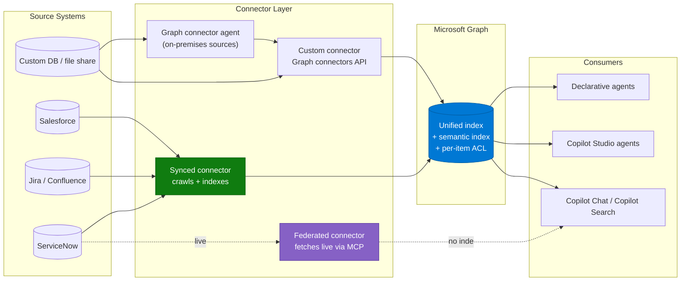

# Copilot Connector Knowledge Onboarding Pattern

> **The most reused pattern in Microsoft 365 Copilot agent delivery.** Gets third-party
> enterprise content — ServiceNow, Jira, Confluence, Salesforce, Workday, file shares — into
> the Microsoft Graph index with correct permissions, so agents can ground on it.

---

## Why This Pattern

| Signal | Evidence |
|---|---|
| **Industries** | Every industry. This is infrastructure, not a vertical solution |
| **Data sources** | ServiceNow (Knowledge, Catalog, HRSD), Jira, Confluence, Salesforce, Workday, Zendesk, Box, file shares, custom databases |
| **Agent types it feeds** | Declarative agents, Copilot Studio custom agents, Copilot Chat, Copilot Search |
| **Where it shows up** | IT service desk agents, employee self-service, enterprise search displacement, competitive bake-offs |

Almost every knowledge-grounded agent scenario contains this pattern. It is also where most of
the unbudgeted delivery time goes, because the difficulty is not the connector wizard — it is
the permission model of the source system.

---

## Architecture

---

## Choose the Connector Type First

| | Synced (tenant config) | Synced (personal config) | Federated |
|---|---|---|---|
| Data | Indexed into Microsoft 365 | Indexed, scoped to the user | Fetched live, never indexed |
| Access model | Organization-level | User-level | User-level |
| Setup | Admin configures | Admin enables, user authenticates | Admin enables, user authenticates |
| Custom connectors | Yes | No | No |
| Best for | Broad, stable knowledge bases | Personally relevant content | Sensitive, live, or fast-moving data |
| Watch out for | Crawl lag, ACL fidelity | Limited coverage | Read-only, no write-back |

Rule of thumb: **synced for knowledge, federated for records that change by the minute or must
not be copied.**

---

## How to Use This Pattern — Step by Step

**Step 1 — Inventory the source, not the connector**
List every content container in the source system with its permission mechanism, content
volume, language, and owner. A connector inherits the source's permission model; if that model
is messy, the connector will faithfully reproduce the mess.

**Step 2 — Classify the permission complexity**
For each container, answer: is access governed by simple group membership, or by scripted or
computed rules? Scripted rules are the fork in the road — they usually require the connector's
advanced configuration path and additional source-side setup.

**Step 3 — Resolve identity mapping**
Connectors map source identities to Entra identities, usually by email. Confirm that assumption.
Organizations with a separate ITSM identity namespace, contractors without mailboxes, or
non-email user keys need a custom mapping formula configured at connection time.

**Step 4 — Deploy with a limited rollout audience**
Every synced connector supports staged rollout. Use it. A connector rolled out tenant-wide
before validation is very hard to walk back once users have seen content they should not have.

**Step 5 — Customize the display name and the access URL**
The display name appears on citations and acts as a content-source filter, so make it something
a user would recognise. The access URL expression determines whether citation links actually
open. Note that on several connectors the URL expression **can only be set when creating the
connection** — you cannot retrofit it.

**Step 6 — Validate both directions**
Positive test: a user who should see content, sees it. Negative test: a user who should not,
does not. Record both. The negative test is the one security review asks for.

**Step 7 — Reconcile the counts**
Compare the indexed item and user counts against the source. A large shortfall is a
configuration problem, not a timing problem — usually a query-string filter, a missing role on
the service account, or a permission evaluation that failed safe and blocked everything.

**Step 8 — Set the crawl expectations with the business**
Content changes appear on the incremental crawl. Permission changes at container level often
only apply after a **full** crawl. Tell the content owners this before they change a permission
and expect it to take effect in five minutes.

---

## Real-World Scenarios

### Scenario A — ITSM knowledge for an employee support agent
A global manufacturer connected two ServiceNow knowledge bases and the service catalog to
ground a declarative agent. The connector configuration took a day; reconciling article-level
user criteria took two weeks. The gating issue was script-based criteria that the default
configuration path could not evaluate, causing affected content to be blocked for everyone —
correct fail-safe behaviour, mistaken for a bug for several days.

**Lesson:** classify permission complexity in discovery, not in testing.

### Scenario B — Engineering knowledge for enterprise search displacement
A media company ran a competitive evaluation against an incumbent enterprise search product,
grounded on Jira and Confluence. The connectors worked; the problems were result-count limits
on issue queries and the expectation that the agent could take action (create a ticket), which
a read-only synced connector cannot do.

**Lesson:** separate "find it" from "do it" in scoping. Retrieval and action are different
architectures.

### Scenario C — Custom connector over an internal database
A consultancy indexed a projects-and-skills database through a custom connector. Search worked;
agent grounding did not, because agents made limited use of the connector's custom properties
for relevance. The requirement — "find people with skill X who worked in vertical Y" — was a
structured query dressed up as a search problem.

**Lesson:** if the requirement is a join across structured fields, a connector is the wrong
tool. Use a database-backed action or a structured knowledge source.

### Scenario D — HR content in a scoped ITSM application
An organization connected an ITSM instance containing HR Service Delivery knowledge bases. The
service account lacked the HR-scoped read role, so permission queries returned empty rather than
erroring, and restricted HR content was treated as unrestricted.

**Lesson:** for scoped applications inside a source system, verify the service account can read
the permission tables — and prove it with a negative test on the most sensitive article you can
find.

---

## When to Use / Avoid

| Use when... | Avoid when... |
|---|---|
| Content is authoritative, stable, and text-based | Data changes by the minute (use federated, or an action) |
| Source permissions are well-defined and enforceable | Source permissions are ad-hoc or unmaintained — fix that first |
| Users need the content inside Copilot alongside M365 content | Users only ever need it inside the source system's own UI |
| Citations and traceability are required | Answers must be computed or aggregated |
| The requirement is retrieval | The requirement is a structured query or a write-back |

---

## Known Constraints

| Constraint | Impact | Mitigation |
|---|---|---|
| Custom connector relevance relies on a limited set of semantic labels | Rich custom metadata may not drive retrieval as expected | Map the most important field to the title semantic label; do not depend on many custom properties for ranking |
| Some connectors cap the number of items returned per query | "Show me all my tickets" returns a partial list | Set expectations; use the source system for exhaustive lists |
| Identity mapping defaults to email | Users without matching email keys get no results | Configure a custom mapping formula at connection time |
| Container-level permission changes need a full crawl | Access changes appear delayed | Document the lag; schedule full crawls around known permission events |
| On-premises sources need the Graph connector agent | An extra deployed component with its own patch cycle | Include it in vulnerability-scanning scope; expect security review on its bundled runtime |
| Access-URL expressions are set at connection creation | Wrong citation links cannot be fixed in place | Get the URL format right the first time, or recreate the connection |

---

## Related Patterns and Scenarios

- Runbook: [Copilot-Connector-Knowledge-Onboarding-Runbook.md](Copilot-Connector-Knowledge-Onboarding-Runbook.md)
- [Grounding & Response Quality Remediation](../Grounding-and-Response-Quality-Remediation/Grounding-and-Response-Quality-Remediation.md) — what to do when the content is indexed but answers are still poor
- [Enterprise RAG Pattern](../Enterprise-RAG-Pattern/Enterprise-RAG-Pattern.md) — when Graph connectors are not enough and you need Azure AI Search
- Scenario: [IT Service Desk Insights Agent](../../01-scenarios/IT-Service-Desk-Insights-Agent/1.Overview.md)
- Scenario: [Employee Self-Service Agent](../../01-scenarios/Employee-Self-Service-Agent/1.Overview.md)

---

## Reference Documentation

- [Copilot connectors overview](https://learn.microsoft.com/en-us/microsoft-365/copilot/connectors/overview)
- [Set up connectors in the admin center](https://learn.microsoft.com/en-us/microsoft-365/copilot/connectors/deployment-overview)
- [Deploy the ServiceNow Knowledge connector](https://learn.microsoft.com/en-us/microsoft-365/copilot/connectors/servicenow-knowledge-deployment)
- [Staged rollout](https://learn.microsoft.com/en-us/microsoft-365/copilot/connectors/staged-rollout)
- [Enhance Copilot discovery of connector content](https://learn.microsoft.com/en-us/microsoft-365/copilot/connectors/enhance-copilot-discovery)
- [Map non-Microsoft Entra ID identities](https://learn.microsoft.com/en-us/microsoft-365/copilot/connectors/map-non-entra-id)
- [Microsoft Graph connectors API](https://learn.microsoft.com/en-us/graph/connecting-external-content-connectors-api-overview)
- [Graph connector agent for on-premises sources](https://learn.microsoft.com/en-us/microsoft-365/copilot/connectors/connector-agent)
- [Semantic index for Copilot](https://learn.microsoft.com/en-us/microsoftsearch/semantic-index-for-copilot)
