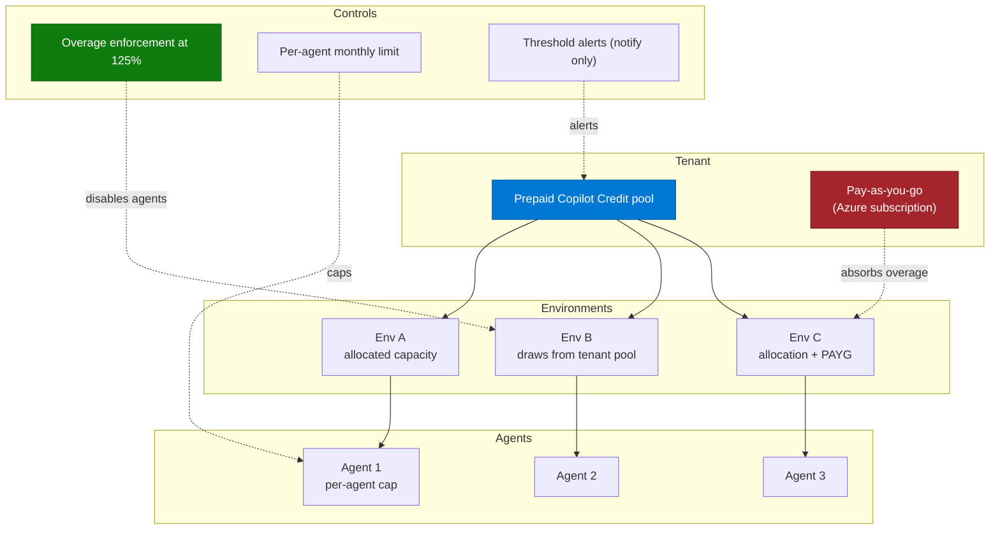

# Copilot Credits & Cost Control Pattern

> **The second most common rollout blocker after governance.** Organizations will not scale
> agents they cannot budget for, and they will not budget for something they cannot cap,
> attribute, or forecast.

---

## Why This Pattern

| Signal | Evidence |
|---|---|
| **Industries** | All. Cost predictability is universal; regulated and cost-conscious sectors raise it hardest |
| **Where it appears** | Every rollout beyond a pilot, and every conversation involving unlicensed users |
| **Typical trigger** | "We can't deploy agents until we can guarantee we won't get an unexpected bill" |
| **Symptom in the field** | Agent deployments blocked pending a chargeback model; thousands of credits consumed during testing; departments refusing to sponsor an agent they cannot cost |

Cost questions in this space are rarely about the price. They are about **predictability,
attribution, and enforcement** — can I cap it, can I see who spent it, and does the cap actually
stop anything.

---

## How Consumption Actually Works

Copilot Credits are the unit of agent consumption. The rates below apply to Copilot Studio's
standard billing and are the numbers to reason with when estimating.

| Agent activity | Credits | Included for a Microsoft 365 Copilot licensed user? |
|---|---|---|
| Classic answer (authored, deterministic) | 1 | No charge |
| Generative answer | 2 | No charge |
| Agent action (triggers, topic transitions, deep reasoning) | 5 | No charge |
| Tenant graph grounding per message | 10 | No charge |
| Agent flow actions, per 100 actions | 13 | No charge, when triggered by "When an agent calls the flow" with a licensed user |
| Text/generative AI tools — basic, per 10 responses | 1 | No charge |
| Text/generative AI tools — standard, per 10 responses | 15 | No charge |
| Text/generative AI tools — premium, per 10 responses | 100 | No charge |
| Content processing tools, per page | 8 | No charge |

Three consequences worth internalising:

1. **A single interaction can bill several meters.** A tenant-graph-grounded generative answer
   is 10 + 2 = 12 credits, not 2.
2. **Reasoning models cost extra on top of the feature rate.** Total = feature rate + premium
   text/generative AI tool charge for the reasoning tokens. Switching an agent to a reasoning
   model can change its unit economics substantially.
3. **The "no charge" column is why the licensed vs unlicensed audience question dominates.**
   Employee-facing usage by a Microsoft 365 Copilot licensed user, running under that user's
   identity, is largely included. Everything else consumes credits — which is exactly the
   population most ESS and helpdesk agents target.

---

## Enforcement — What Actually Stops

This is the single most misunderstood area, and it produces the most escalations.

| Mechanism | What it does | What it does not do |
|---|---|---|
| Prepaid capacity + overage enforcement | Custom agents are **disabled** once the tenant reaches **125%** of prepaid capacity | Does not interrupt an in-flight conversation; does not give a precise per-agent stop |
| Agent flow enforcement | Blocks **new agent flow runs** when prepaid capacity is exhausted; in-flight runs complete; the agent still answers non-flow questions | Does not disable the agent |
| Pay-as-you-go meter | Absorbs overage by billing an Azure subscription | **Removes the hard stop entirely** — overage is billed, not blocked |
| Per-agent monthly consumption limit | Caps a specific agent, set in Power Platform admin center → Licensing → Copilot Studio → Manage Agents | Only settable by tenant-level admins today |
| Budget threshold alerts | Notify an admin | Does not stop consumption |

The pattern that repeatedly surprises customers: **a budget threshold is an alert, not a brake.**
Teams configure a threshold, expect execution to stop, and discover it does not. If a genuine
hard stop is required, the design must rely on prepaid capacity with enforcement — and
explicitly *not* enable pay-as-you-go for that environment.

---

## Architecture — Where the Money Is Controlled

Allocation behaviour worth knowing: an environment with an explicit allocation is protected from
tenant-level overage enforcement while it still has allocated capacity remaining. An environment
with no allocation draws from — and is exposed to — the shared tenant pool. **Allocate capacity
to environments you care about.**

---

## How to Use This Pattern — Step by Step

**Step 1 — Estimate before you build**
Use the Copilot Studio agent usage estimator with the intended agent design: agent type, traffic
volume, orchestration mode, knowledge sources, and tools. Do this at design time. An estimate
produced after the build cannot change the design that drives the cost.

**Step 2 — Design for the cheaper meter where it does not hurt quality**
Deterministic topics bill at the classic-answer rate; generative answers cost double, and tenant
graph grounding adds ten. For high-volume, well-understood questions, an authored topic is both
cheaper and more reliable. Reserve generative orchestration and graph grounding for the
questions that need them.

**Step 3 — Decide the audience and licensing boundary explicitly**
Who uses this agent: Microsoft 365 Copilot licensed users, Copilot Chat users, or both? This
single answer changes the cost model by an order of magnitude. Write it down before the pilot.

**Step 4 — Allocate capacity per environment**
Do not let development, test, and production all draw from an unallocated tenant pool. Allocate
explicitly, especially to the development environment.

**Step 5 — Cap the individual agent**
Set a monthly consumption limit for each production agent. This is the closest thing to a
per-agent brake available today.

**Step 6 — Budget for testing**
Testing consumes credits at production rates. Agents with action flows can consume thousands of
credits during iteration. Allocate a testing budget, and tell the maker community that the test
button is not free.

**Step 7 — Design chargeback early**
If departments must be billed, work out how before rollout. Validate that the identifiers you
intend to use for attribution are consistent across the usage report and the audit log — do not
assume they are.

**Step 8 — Monitor and reconcile monthly**
Power Platform admin center → Licensing → Copilot Studio → Environments. Reconcile actual
consumption against the estimate. A large variance in month one is normal; a large variance in
month three means the design changed underneath you.

---

## Real-World Scenarios

### Scenario A — Testing consumed the budget
A healthcare organization consumed over five thousand credits in overage from repeated use of
the authoring test canvas on an agent containing action flows — before go-live.

**Prevention:** allocate a bounded capacity to the development environment, set a per-agent cap
during build, and brief makers that testing bills.

### Scenario B — The cap that did not cap
Multiple large enterprises attached a billing policy with a threshold and a "turn off when
exceeded" expectation, then found agents continued to run past the limit and consumption data
updated slowly.

**Prevention:** distinguish alerting thresholds from enforcement. If a hard stop is a
requirement, use prepaid capacity with overage enforcement and do **not** enable pay-as-you-go
for that environment. Set expectations that enforcement is a platform-level brake, not a precise
per-request cut-off.

### Scenario C — Chargeback across business units
A telecoms group and several banks needed per-user or per-department attribution to cross-charge
IT costs back to the business.

**Prevention:** design attribution up front. Use one environment per cost centre where the
organizational structure allows it — environment-level consumption reporting is the most
reliable attribution boundary available, and it is far simpler than reconstructing per-user cost
from usage data.

### Scenario D — Decentralised budgets
A large enterprise with thousands of environments found that only tenant administrators could
set credit caps, which does not scale to environment-owner-managed budgets.

**Prevention:** consolidate agent-hosting environments where possible, allocate capacity per
environment, and define a lightweight internal process for environment owners to request
changes — accepting that central admin action is required today.

---

## When to Use / Avoid

| Apply this pattern when... | Lighter touch is fine when... |
|---|---|
| Any agent will be used by unlicensed users | Agent is used only by Microsoft 365 Copilot licensed users, employee-facing, running as the user |
| Autonomous or event-triggered agents are in scope | Purely conversational, low volume |
| Agent flows or premium AI tools are used | Instruction-and-knowledge-only declarative agent |
| Multiple business units must be cross-charged | Single cost centre |
| The organization requires a hard spend ceiling | Consumption is small relative to the overall agreement |

---

## Cost Estimation Worksheet

| Input | Value |
|---|---|
| Monthly interactions | |
| Average messages per interaction | |
| % of interactions using generative answers | |
| % using tenant graph grounding | |
| Agent actions per interaction | |
| Agent flow actions per interaction | |
| % of users with a Microsoft 365 Copilot licence | |
| Reasoning model in use? | |

Estimated monthly credits =
`interactions × [(generative × 2) + (graph grounding × 10) + (actions × 5) + (flow actions × 0.13)]`
applied to the **unlicensed** share of the audience, plus any premium AI tool usage.

Cross-check the result against the Copilot Studio agent usage estimator. If your arithmetic and
the estimator disagree by more than a factor of two, one of your assumptions about the agent
design is wrong.

---

## Related Patterns and Scenarios

- Runbook: [Copilot-Credits-Cost-Control-Runbook.md](Copilot-Credits-Cost-Control-Runbook.md)
- [Agent Governance & Rollout Control Plane](../Agent-Governance-and-Rollout-Control-Plane/Agent-Governance-and-Rollout-Control-Plane.md)
- [Agent Publishing & Channel Deployment](../Agent-Publishing-and-Channel-Deployment/Agent-Publishing-and-Channel-Deployment.md) — publishing to some channels carries its own billing prerequisites
- Scenario: [Copilot Licence Lifecycle Agent](../../01-scenarios/Copilot-License-Lifecycle-Agent/1.Overview.md)

---

## Reference Documentation

- [Copilot Studio billing rates and management](https://learn.microsoft.com/en-us/microsoft-copilot-studio/requirements-messages-management)
- [Copilot Studio agent usage estimator](https://microsoft.github.io/copilot-studio-estimator/)
- [Manage Copilot Studio credits and capacity](https://learn.microsoft.com/en-us/power-platform/admin/manage-copilot-studio-messages-capacity)
- [Microsoft Copilot Studio Licensing Guide](https://go.microsoft.com/fwlink/?linkid=2320995)
- [Agent flows overview](https://learn.microsoft.com/en-us/microsoft-copilot-studio/flows-overview)
- [Tenant graph grounding with semantic search](https://learn.microsoft.com/en-us/microsoft-copilot-studio/knowledge-copilot-studio#tenant-graph-grounding-with-semantic-search)
