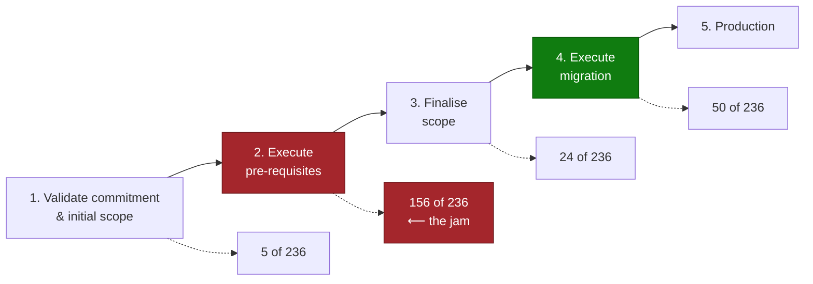

# Copilot Studio Migration & Modernisation Pattern

> **Most agent work in the field is not greenfield.** It is replacing something: a legacy bot
> framework, a competitor platform, a custom RAG stack, or a pile of Power Automate flows that
> grew into a product. Migration has its own failure modes, and they are not the ones you plan for
> when you think you are building an agent.

---

## Why This Pattern

| Signal | Evidence |
|---|---|
| **Prevalence** | In one CAF delivery portfolio, **236 of 236 engagements** carried a migration path — none were greenfield |
| **Target split** | 157 to Copilot Studio · 57 to Copilot Studio + Foundry · 21 to Copilot Studio with accelerator IP |
| **Where they stall** | 156 of 236 were still executing *pre-requisites* — not building |
| **Industries** | All. Concentrated wherever a chatbot or RAG proof-of-concept already exists |

The headline number is the one worth internalising: **two thirds of engagements were stuck before
the build started.** Not on agent design — on environments, access, connectors, and scope. Plan
the migration accordingly.

---

## What You Are Usually Migrating From

| Source | Typical driver | What actually transfers |
|---|---|---|
| **Legacy bot framework** (Bot Framework, custom web bots) | Technical debt, instability, operational cost | Intents and knowledge. Almost none of the code |
| **Competitor AI platform** (Gemini, ChatGPT Enterprise, Vertex) | Consolidation onto Microsoft, licence rationalisation | The prompt library and the use case. Nothing else |
| **Custom RAG stack** (blob + embeddings + custom API) | Cost, maintenance burden, wanting to stop copying data | The corpus, if the retrieval design still fits |
| **Accelerator IP** (GPT-RAG and similar) | Move from a template to a supported platform | Architecture decisions, sometimes the index |
| **Power Automate sprawl** | Flows that became an unofficial application | The business logic, as agent tools |

A recurring and specific driver: teams want to **stop copying data into blob storage** just to make
it searchable. Reaching the source directly — through a connector or an MCP server — is often the
real motivation rather than the agent itself.

---

## The Migration Pipeline, and Where It Jams

**Stage 2 is where migrations die.** The pre-requisites are unglamorous and almost always
underestimated:

| Pre-requisite | Why it stalls |
|---|---|
| Power Platform environment provisioned | Internal provisioning processes, often weeks |
| Delivery team has environment access | Access requests, security review, contractor onboarding |
| Connectors approved through DLP | Requires a policy decision nobody has made yet |
| Source system credentials and test accounts | Owned by a team with no stake in the project |
| Data classification sign-off on the corpus | Legal or privacy review |
| Licensing confirmed (Copilot Studio capacity) | Procurement cycle |

Treat stage 2 as a **project phase with its own owner and plan**, not as a checklist item in week
one. On a portfolio basis it is where two thirds of your engagements are sitting right now.

---

## The Five Migration Traps

### 1. Assuming scope survives nomination

The scope agreed to win the engagement is not the scope that can be delivered. One engagement was
approved on the basis of an integration requiring **three custom connectors**, then hit a delivery
policy allowing **one per use case** — after approval, in front of the customer.

**Do:** validate scope against delivery constraints *before* approval, not after. Publish the
constraints (connector limits, supported topologies, what "one use case" means) where the people
scoping can see them.

### 2. Lifting the old architecture

A legacy bot's topic tree, its custom NLU intents, and its bespoke integrations are artefacts of a
platform that worked differently. Re-implementing them produces a worse agent with the same
technical debt.

**Do:** migrate the *use case*, not the implementation. Rebuild against generative orchestration
and knowledge sources, and expect the topic count to drop sharply.

### 3. Not deciding what stays outside Copilot Studio

57 of 236 engagements targeted **Copilot Studio and Foundry together**. Teams that had not decided
the boundary spent weeks discovering it. See
[Copilot Studio & Foundry Split Architecture](../Copilot-Studio-and-Foundry-Split-Architecture/Copilot-Studio-and-Foundry-Split-Architecture.md).

### 4. Leaving the partner boundary undefined

Where a systems integrator is involved, the split has to be explicit and written down. One
engagement lost weeks to scope ambiguity that resolved to: the SI owns pro-code and image
processing, the delivery team owns orchestration and the Copilot Studio build.

**Do:** name the boundary in the statement of work — who owns which component, which environment,
and which defects.

### 5. Migrating without a comparison baseline

If you cannot show the new agent is better than the thing it replaced, the migration has no
completion criterion and the customer will keep the old system running.

**Do:** capture the incumbent's behaviour on a fixed question set **before** you switch anything.
That baseline is the acceptance test.

---

## How to Use This Pattern — Step by Step

**Step 1 — Classify the source.** Which of the five source types is it? That determines what
transfers and what gets rebuilt.

**Step 2 — Capture the incumbent baseline.** A fixed question set run against the existing
solution, with answers recorded. Do this while you still have access.

**Step 3 — Plan pre-requisites as a phase.** Named owner, dated plan, escalation path. Assume it
is the long pole.

**Step 4 — Validate scope against delivery constraints.** Connector limits, supported channels,
environment topology, licensing. Reconcile before commitment.

**Step 5 — Decide the platform boundary.** Copilot Studio alone, or Copilot Studio plus Foundry —
and exactly where the line falls.

**Step 6 — Define the partner boundary** if an SI is involved.

**Step 7 — Rebuild the use case, not the implementation.**

**Step 8 — Run the baseline comparison** and use it as the go-live gate.

**Step 9 — Decommission deliberately.** A migration that leaves the old system running has not
delivered its business case.

---

## Real-World Scenarios

### Scenario A — Legacy bot modernisation at a health technology multinational
A 24/7 IT support assistant in Teams, built on a legacy bot framework with integrations to
Dynamics 365 and ServiceNow, carried high technical debt, limited stability, and heavy operational
complexity. The migration rebuilt it on native Dynamics 365 and Copilot Studio capabilities.

**Lesson:** the stated goal was stability and lower operational cost, not new features. Migrations
of this kind are judged on *reduced fragility*, so make reliability the acceptance measure.

### Scenario B — Competitor platform consolidation at a Japanese recruitment firm
Migration from Google Gemini to Copilot Studio, with a proof of concept built alongside the
customer's in-house AI team, then Copilot Studio established as the standard enterprise agent
platform.

**Lesson:** the PoC was as much about transferring capability to the customer's team as proving
the platform. Budget for enablement inside the migration.

### Scenario C — Escaping the data-copy architecture at an asset manager
An existing generative chatbot required copying data into blob storage. The customer explicitly did
not want to continue that, and wanted the Foundry-built chatbot connected to SharePoint through an
MCP server instead.

**Lesson:** "stop copying our data" is a legitimate and common architectural driver. Treat it as a
first-class requirement, not a preference.

### Scenario D — Fragmentation at scale at a food and agriculture group
Strong early momentum — thousands of users, an AI Council, multiple HR and IT agents in pilot — then
an inflection point where fragmentation across agents, inconsistent performance, and unresolved
architecture decisions blocked the move to production.

**Lesson:** success at pilot creates the scaling problem. See
[Agent Governance & Rollout Control Plane](../Agent-Governance-and-Rollout-Control-Plane/Agent-Governance-and-Rollout-Control-Plane.md).

---

## When to Use / Avoid

| Use this pattern when... | Not needed when... |
|---|---|
| Anything is being replaced | Genuinely greenfield with no incumbent |
| A competitor platform is in play | Single new use case, no existing solution |
| An SI or partner shares delivery | Single-team delivery |
| The customer already has agents in pilot | First agent in the tenant |

---

## Related Patterns

- Runbook: [Copilot-Studio-Migration-and-Modernisation-Runbook.md](Copilot-Studio-Migration-and-Modernisation-Runbook.md)
- [Copilot Studio & Foundry Split Architecture](../Copilot-Studio-and-Foundry-Split-Architecture/Copilot-Studio-and-Foundry-Split-Architecture.md)
- [Agent Governance & Rollout Control Plane](../Agent-Governance-and-Rollout-Control-Plane/Agent-Governance-and-Rollout-Control-Plane.md)
- [Grounding & Response Quality Remediation](../Grounding-and-Response-Quality-Remediation/Grounding-and-Response-Quality-Remediation.md) — for the baseline comparison
- [MCP Server Integration](../MCP-Server-Integration/MCP-Server-Integration.md) — for the "stop copying our data" driver

---

## Reference Documentation

- [Copilot Studio overview](https://learn.microsoft.com/en-us/microsoft-copilot-studio/fundamentals-what-is-copilot-studio)
- [Generative orchestration](https://learn.microsoft.com/en-us/microsoft-copilot-studio/advanced-generative-actions)
- [Power Platform ALM](https://learn.microsoft.com/en-us/power-platform/alm/solution-concepts-alm)
- [Power Platform environment strategy](https://learn.microsoft.com/en-us/power-platform/guidance/adoption/environment-strategy)
- [Power Platform DLP policies](https://learn.microsoft.com/en-us/power-platform/admin/wp-data-loss-prevention)
- [Copilot Studio licensing guide](https://go.microsoft.com/fwlink/?linkid=2320995)
