# Copilot Studio & Foundry Split Architecture Pattern

> **The most consequential architecture decision in an agent engagement is what does *not* go in
> Copilot Studio.** Teams that decide the boundary up front build steadily. Teams that discover it
> mid-build lose weeks.

---

## Why This Pattern

| Signal | Evidence |
|---|---|
| **Prevalence** | **57 of 236** engagements in one CAF portfolio targeted Copilot Studio **and** Foundry together — roughly a quarter |
| **Distinct customers** | 50 |
| **Trigger workloads** | Document processing and OCR, image and vision, custom models, long-running jobs, multi-agent research |
| **Where it hurts** | Discovered late, it means rebuilding the part of the solution that carries the business value |

Copilot Studio is an excellent orchestration and conversation layer. It is not a document
processing engine, a vision pipeline, or a place to host bespoke model logic. The pattern is not
"Copilot Studio *or* Foundry" — it is knowing where the line falls and designing to it deliberately.

---

## The Boundary

```mermaid
flowchart LR
    U([👤 User])

    subgraph CPS["Copilot Studio — the front of house"]
        ORCH["Orchestration & routing"]
        CONV["Conversation, topics, prompts"]
        KNOW["Knowledge sources<br/>SharePoint · Dataverse · connectors"]
        AUTH["User authentication & consent"]
        CHAN["Channel publishing<br/>Teams · M365 Copilot · web"]
        HITL["Approval & human-in-the-loop gates"]
    end

    subgraph FDY["Foundry — the back of house"]
        DOC["Document processing & OCR"]
        VIS["Image / vision workloads"]
        MODEL["Custom or fine-tuned models"]
        LONG["Long-running / batch processing"]
        MULTI["Multi-agent research workflows"]
    end

    SOR[("Systems of record")]

    U --> CPS
    CPS -->|tool call| FDY
    FDY --> SOR
    CPS --> SOR

    style CPS fill:#107c10,color:#fff,stroke:#0a5c0a
    style FDY fill:#0078d4,color:#fff,stroke:#005a9e
```

| Workload | Home | Why |
|---|---|---|
| Conversation, topics, disambiguation | **Copilot Studio** | Purpose-built; cheapest place to iterate |
| Knowledge retrieval over SharePoint / Dataverse / connectors | **Copilot Studio** | Native, permission-trimmed, no code |
| Channel publishing and identity | **Copilot Studio** | Teams, M365 Copilot and web are first-class |
| Approval gates and human review | **Copilot Studio** | The conversation is where the human is |
| **OCR and document field extraction** | **Foundry** | Copilot Studio cannot reliably interpret scanned or complex documents |
| **Image analysis, defect detection** | **Foundry** | Vision workloads have no Copilot Studio equivalent |
| **Custom, fine-tuned, or specialised models** | **Foundry** | Model control and evaluation tooling |
| **Long-running or batch processing** | **Foundry** | Copilot Studio orchestration is synchronous |
| **Multi-step research across many sources** | **Foundry** | Depth and tool budget |

---

## The Decision, in One Question

> **"Can this step complete in a few seconds, over content Copilot Studio can already read?"**

If yes, it belongs in Copilot Studio. If no — because it needs OCR, vision, a specialised model, or
minutes of processing — it belongs behind a Foundry tool call.

Three specific triggers that should move a workload to Foundry immediately:

1. **The source is a scanned or image-based document.** Copilot Studio grounding will return
   nothing useful. One healthcare engagement moved document processing to Foundry precisely because
   OCR and document interpretation "cannot be accomplished with Copilot".
2. **The output depends on interpreting an image.** Surface defect detection, engineering drawing
   analysis, inspection photography.
3. **The step takes minutes, not seconds.** Synchronous orchestration will time out; you need an
   asynchronous handoff.

---

## Integration Between the Layers

| Concern | Guidance |
|---|---|
| **Call mechanism** | Foundry agent as a connected agent, an MCP tool, or a custom connector over an API |
| **Identity** | Decide early whether the Foundry component runs as the user or as a service identity. Identity passthrough to downstream services is not guaranteed — see [MCP Server Integration](../MCP-Server-Integration/MCP-Server-Integration.md) |
| **Latency** | Every hop adds orchestration overhead. Budget for it and set user expectations |
| **Long-running work** | Do not block the conversation. Return a handle, notify on completion |
| **Payload size** | Return shaped, bounded results — not raw extraction output |
| **Publishing** | Publishing Foundry agents and workflows into Teams and M365 Copilot is its own integration workstream, not a packaging step |
| **Governance** | The two halves are governed in different places. Neither inherits the other's DLP or audit posture |

---

## Who Builds Which Half

On engagements involving a systems integrator, the split usually mirrors the architecture — and it
must be written down. One manufacturing engagement lost weeks to exactly this ambiguity before
resolving that the SI owned pro-code and image processing while the delivery team owned
orchestration and the Copilot Studio build.

| Component | Typical owner | Put in the SoW |
|---|---|---|
| Copilot Studio orchestration and conversation | Delivery team / customer makers | ✅ |
| Foundry pro-code, vision, document pipelines | SI or customer engineering | ✅ |
| The integration contract between them | **Jointly — name it explicitly** | ✅ |
| Defect triage across the boundary | **Name a single owner** | ✅ |

The integration contract is the item most often left unowned, and it is where defects land.

---

## Real-World Scenarios

### Scenario A — Clinical document processing at a paediatric hospital
A policy and procedure use case required document interpretation and OCR that Copilot Studio could
not perform. Document processing moved to Foundry; Copilot Studio retained the conversational
experience and the human review gate.

**Lesson:** the trigger was a document format, not a capability wish-list. Check the *format* of the
source early.

### Scenario B — Surface defect detection at a steel producer
Image-based defect classification with an SI performing the pro-code and image processing work and
the delivery team owning orchestration and the Copilot Studio build. Scope closure between the two
parties took real calendar time.

**Lesson:** in split-build engagements, the responsibility boundary is a deliverable in its own
right. Draft it before the build starts.

### Scenario C — CRM-embedded sales coaching at a flooring manufacturer
Three coordinated agents — a customer 360 view over CRM, Power BI and ERP, a project tracker, and an
advisor agent for next-best-action — built on Foundry and surfaced into the CRM experience.

**Lesson:** when the requirement is multi-agent reasoning across several systems, the orchestration
depth pushes the design toward Foundry even when the front door is conversational.

### Scenario D — Knowledge management at a banking group
Azure AI Search plus agents providing a single conversational interface over approved enterprise
content, rather than native Copilot Studio knowledge alone.

**Lesson:** at corpus scale, retrieval quality requirements can push the knowledge layer out of
Copilot Studio too. See [Enterprise RAG Pattern](../Enterprise-RAG-Pattern/Enterprise-RAG-Pattern.md).

---

## When to Use / Avoid

| Split the architecture when... | Stay in Copilot Studio when... |
|---|---|
| Sources are scanned, image-based, or complex documents | Sources are text documents Copilot Studio can already read |
| Vision or image interpretation is required | Everything is conversational and text-based |
| A custom or fine-tuned model is required | Platform models are sufficient |
| Processing takes minutes | Everything completes in seconds |
| Multi-step research across many systems | Single-domain retrieval and action |
| An SI already owns a pro-code component | One team owns everything |

> ⚠️ Do not split for architectural elegance. Every boundary adds latency, an integration contract,
> a second governance surface, and a defect triage question. Split only when a workload genuinely
> cannot live in Copilot Studio.

---

## Related Patterns

- Runbook: [Copilot-Studio-and-Foundry-Split-Architecture-Runbook.md](Copilot-Studio-and-Foundry-Split-Architecture-Runbook.md)
- [Copilot Studio Migration & Modernisation](../Copilot-Studio-Migration-and-Modernisation/Copilot-Studio-Migration-and-Modernisation.md)
- [Intelligent Document Processing Pipeline](../Intelligent-Document-Processing-Pipeline/Intelligent-Document-Processing-Pipeline.md)
- [MCP Server Integration](../MCP-Server-Integration/MCP-Server-Integration.md)
- [Agent Publishing & Channel Deployment](../Agent-Publishing-and-Channel-Deployment/Agent-Publishing-and-Channel-Deployment.md)
- [Enterprise RAG Pattern](../Enterprise-RAG-Pattern/Enterprise-RAG-Pattern.md)

---

## Reference Documentation

- [Microsoft Foundry documentation](https://learn.microsoft.com/en-us/azure/ai-foundry/)
- [Connect to Microsoft Foundry agents from Copilot Studio](https://learn.microsoft.com/en-us/microsoft-copilot-studio/add-agent-foundry-agent)
- [Add other agents overview](https://learn.microsoft.com/en-us/microsoft-copilot-studio/authoring-add-other-agents)
- [Multi-agent orchestration patterns](https://learn.microsoft.com/en-us/microsoft-copilot-studio/guidance/multi-agent-patterns)
- [Azure AI Document Intelligence](https://learn.microsoft.com/en-us/azure/ai-services/document-intelligence/)
- [Azure AI Vision](https://learn.microsoft.com/en-us/azure/ai-services/computer-vision/)
- [Azure AI Search](https://learn.microsoft.com/en-us/azure/search/)
