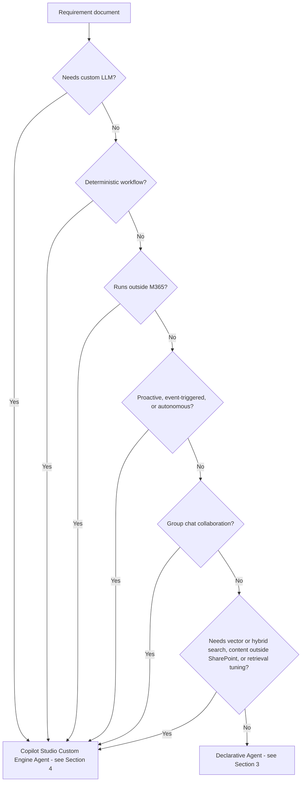
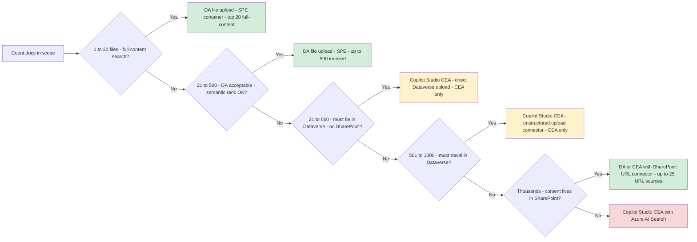
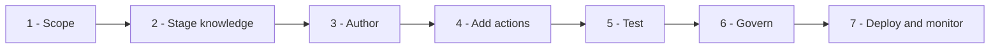
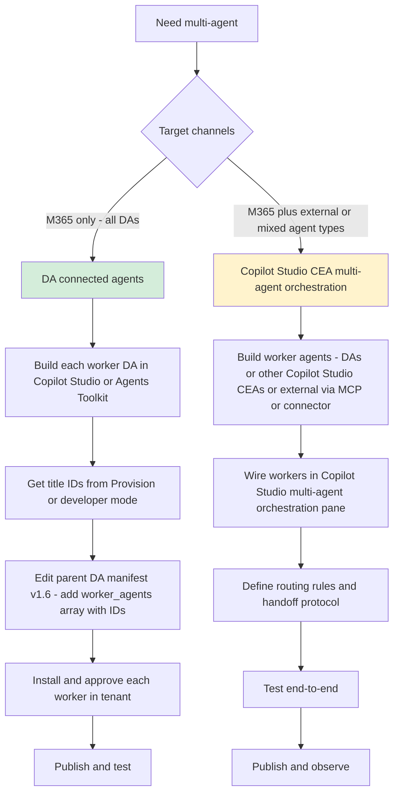
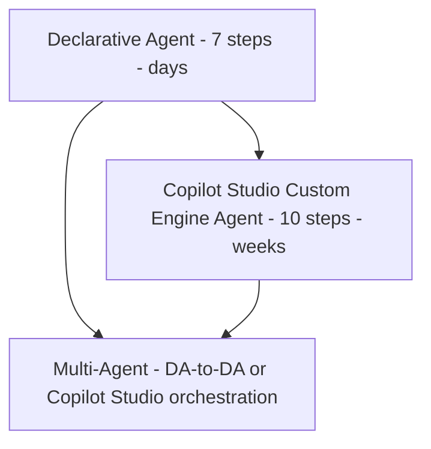

# Implementing Declarative and Copilot Studio Custom Engine Agents for Microsoft 365 Copilot

> **Scope note:** In this runbook, **CEA refers exclusively to a Copilot Studio Custom Engine Agent** — authored in `copilotstudio.microsoft.com`, using Copilot Studio generative orchestration and its managed hosting. Optional plug-ins: Azure OpenAI (PTU or PayGo), Azure AI Search knowledge, custom topics, Power Automate flows, MCP servers, OpenAPI plugins. Hand-coded Bot Framework / Semantic Kernel / LangGraph agents and Azure AI Foundry Agent Service are **out of scope**.

---

## 0. How to use this runbook

1. Read the companion pattern `technical-pattern-declarative-vs-custom-engine-agents.md`.
2. Run **Section 1** decision gate, pick DA or CEA.
3. Run **Section 2** scale check to confirm DA is viable for your document volume.
4. If DA, follow **Section 3**. If CEA, follow **Section 4**.
5. For multi-agent designs, apply **Section 5**.
6. Apply **Section 6** governance checklist before go-live.
7. Use **Section 7** operations playbook post-launch.

---

## 1. Decision Gate



**Artifact to produce:** `decision-record.md` capturing the 6 answers and rationale.

---

## 2. Knowledge Scale Check

Before committing to DA, validate the document count and layout:



### Critical limits to validate (verified April 2026)
- **DA file upload (SharePoint Embedded container, "Declarative Agent" app):** top **20 files full-content** per query; up to **500 files per agent** indexed (rest ranked semantically). Available in **Agent Builder, Copilot Studio DA, and Toolkit**. No SharePoint site needed.
- **Copilot Studio CEA direct Dataverse file upload: 500 files per agent. CEA-only** — DA has no Dataverse upload path on any authoring surface.
- **Copilot Studio CEA unstructured SharePoint/OneDrive upload connector: 1,000 files TOTAL per agent** (summed across upload sources — **not** 1,000 per source). 50 folders, 10 subfolder levels. **CEA-only** — DA's "Add knowledge → Advanced" tab does not expose this connector. The DA Advanced tab shows only Graph connectors (Confluence, Custom Connector, Enterprise websites, Jira, ServiceNow, Bing).
- **SharePoint URL connector: no per-file limit.** Up to **25 SharePoint URL knowledge sources per agent.** Available to **DA and CEA** — this is the only file-knowledge path shared between them with no per-file ceiling.
- Up to 20 files referenced in `items_by_url` get full-content search. Beyond 20, only top 20 most-relevant files per query are full-content searched; remaining files ranked semantically.
- Recommended 300 total pages across referenced files.
- Recommended 36,000 characters (15-20 pages) per SharePoint-referenced file.
- Max uploaded file size: 512 MB for pptx, pdf, docx; 150 MB for xlsx, csv, txt, ppt, xls, doc.
- Agent Builder: max 4 public website URLs and 5 Teams chat URLs.

### Toolkit default scope (important)
In Microsoft 365 Agents Toolkit, if `declarativeAgent.json` does **not** include `items_by_url` (or `items_by_sharepoint_ids`), the DA will search **all SharePoint and OneDrive content accessible to the signed-in user**. This is useful for "broad knowledge worker" agents but reduces precision for curated scenarios. Always add `items_by_url` when you want the agent focused on a specific set of files or folders.

### The five file-upload paths — DA vs Copilot Studio CEA

There are **five distinct upload paths**, with different storage, ceilings, and availability. **One is DA-only, three are CEA-only, and one (SharePoint URL connector) is shared.**

| Path | Storage | Available to | File ceiling |
|---|---|---|---|
| **DA file upload** | SharePoint Embedded container (system-provisioned, app name "Declarative Agent") | **DA only** (Agent Builder, Copilot Studio DA, Toolkit) | **Top 20 files full-content; up to 500 files per agent** indexed (rest semantically ranked) |
| **CEA direct Dataverse file upload** | Dataverse table in the agent's environment, indexed by Dataverse Search | **CEA only** — DA has no equivalent path | **500 files per agent** |
| **CEA unstructured SharePoint/OneDrive upload connector** | Dataverse (index of SharePoint content) | **CEA only** — DA's "Add knowledge → Advanced" tab does not expose this connector | **1,000 files TOTAL per agent**, summed across all upload sources (not per source). 50 folders, 10 subfolder levels |
| **SharePoint URL connector** | SharePoint / OneDrive (live search; nothing copied) | **DA and CEA** | **No per-file limit.** Up to **25 URL knowledge sources** per agent |
| **Azure AI Search** | Azure AI Search service (custom index built outside the agent) | **CEA only** | Unbounded by agent platform; bounded by AI Search tier |

**Practical rule:**
- **1 to 20 curated files, full-content search across all** → DA file upload (SPE-backed; available in Agent Builder, Copilot Studio DA, or Toolkit).
- **21 to 500 files, DA acceptable, semantic-rank OK beyond top 20** → DA file upload (SPE indexes up to 500 per agent; only top 20 are full-content per query).
- **21 to 500 files, must travel in Dataverse, no SharePoint site** → **Copilot Studio CEA + direct Dataverse upload** (CEA-only).
- **501 to 1,000 files, must travel with the agent in Dataverse** → **Copilot Studio CEA + unstructured SharePoint/OneDrive upload connector** (CEA-only — DA does not expose this).
- **Thousands of files already in SharePoint** → DA or CEA with the **SharePoint URL connector** (no per-file limit, 25 URL sources).
- **Vector/hybrid retrieval, content outside SharePoint, or tuning control** → **Copilot Studio CEA + Azure AI Search**.

**When to choose which on knowledge scale alone:**

| Situation | Pick | Reason |
|---|---|---|
| 1–20 curated files, fastest to ship | **DA file upload** | SPE-backed, top 20 full-content |
| 21–500 files, DA acceptable, semantic rank OK beyond top 20 | **DA file upload (SPE) at 500 ceiling** | Stays within DA simplicity |
| 21–500 files, must be in Dataverse (regulated, isolated, no SharePoint) | **Copilot Studio CEA + direct Dataverse upload** | CEA-only path; Dataverse storage |
| 501–1,000 files, must travel with the agent in Dataverse | **Copilot Studio CEA + unstructured SharePoint/OneDrive upload connector** | CEA-only; DA Add-knowledge dialog does not expose it |
| Thousands of files already in SharePoint | **DA or CEA + SharePoint URL connector** | No per-file limit; live search |
| Multiple SharePoint sites | **DA or CEA with multiple URL sources (up to 25)** | Each URL source independent |
| Need vector / hybrid / tuned retrieval, or large-scale precision | **Copilot Studio CEA + Azure AI Search** | BM25 + vector, chunking control, security trimming |
| Content outside SharePoint / OneDrive (SQL, Fabric, file share, third-party repo) | **Copilot Studio CEA** | DA connectors cannot ingest these |
| Highly structured data | **Copilot Studio CEA with code-based retrieval** | Managed DA retrieval is not suitable |

**Key rule:**
- The **1,000-file unstructured SharePoint/OneDrive upload connector** is **CEA-only**. The DA "Add knowledge → Advanced" tab in Copilot Studio shows Graph connectors (Confluence, Custom Connector, Enterprise websites, Jira, ServiceNow, Bing) — **not** the unstructured upload connector. The cap is **per-agent**, not per-source — stacking sources does not raise it.
- The **500-file Dataverse direct upload** is also **CEA-only**. DA cannot upload files directly to Dataverse from any authoring surface.
- **DA file upload** (SPE container) indexes up to **500 files per agent**, but only the **top 20** get full-content search per query — the rest are semantically ranked.
- The **SharePoint URL connector** is the only file-knowledge path **shared between DA and CEA** with no per-file ceiling.
- Escalate from DA to CEA for **direct Dataverse upload, the unstructured upload connector, Azure AI Search, topics, Power Automate flows, autonomous triggers, or out-of-M365 channels** — not because you have "a lot of files."

### Special content types check (images in PDFs, unstructured XLSX)

Before committing to DA, confirm the content is text-based. Image and structurally complex content needs a different path — neither connector type fixes this, because the limitation is in how the content is parsed and grounded, not in the file count.

| Content type | Works on DA? | Recommended path |
|---|---|---|
| Text-based PDFs, DOCX, PPTX (text) | Yes | DA, either connector |
| **Image-heavy PDFs** (diagrams, annotated screenshots, chart images) | **No** — images not analysed | **Copilot Studio CEA** with Azure OpenAI **GPT-4o vision** plugged in and called via a Power Automate flow |
| **Scanned / image-only PDFs** | Partial — depends on OCR legibility | **Copilot Studio CEA** with **Azure AI Document Intelligence** pre-processing flow; land extracted text in SharePoint or Azure AI Search before ingest |
| **Embedded screenshots** in docs | **No** — pixel content ignored | **Copilot Studio CEA** with vision model |
| **Clean tabular XLSX** (single sheet, one header, consistent types) | Yes for lookup; arithmetic unreliable | DA for lookup; **Copilot Studio CEA + custom connector to SQL / Fabric / Dataverse** for numeric precision |
| **Unstructured XLSX** (merged cells, multi-sheet, pivots, embedded charts) | **No** — fidelity collapses | **Copilot Studio CEA** with code-based parsing (Power Automate + Office Scripts / Graph Excel API) or ingest via Fabric |
| **Formula-heavy workbooks** | Values only; formula intent lost | **Copilot Studio CEA + structured data pipeline** |
| **XLSX > 150 MB** | **Rejected** by upload connector | **Copilot Studio CEA** with Fabric / SQL / custom-connector ingestion |

**Quick gate:** if any "No" rows above appear in your content inventory and the content is load-bearing for answers, do not ship a DA — go to **Section 4** for the Copilot Studio CEA path.

---

## 3. Runbook A, Declarative Agent, 7 steps



### Step 1, Scope
- One-paragraph purpose, 3 to 5 canonical prompts, required knowledge sources, required actions.
- Confirm document count is under the DA ceiling from Section 2.
- Output: `agent-spec.md`.

### Step 2, Stage knowledge
- Create a dedicated SharePoint site or OneDrive folder.
- Apply sensitivity labels.
- Verify search indexing.
- For 3rd-party content, provision Graph connector and run initial crawl.
- Strip special formatting (tables, images) from referenced files where possible. Copilot cannot parse them reliably.

### Step 3, Author (pick one)

| Method | When to pick | How |
|---|---|---|
| **Agent Builder** | PoC, personal productivity. DA file upload (SPE-backed) — top 20 full-content per query, up to 500 indexed per agent. **No direct Dataverse upload, no unstructured upload connector — escalate to a Copilot Studio CEA if either is needed.** | Copilot Chat, Create agent, fill form, Create |
| **Copilot Studio** (DA) | LoB with IT governance. DA file upload (SPE) up to 500 per agent and SharePoint URL connector (no file limit, up to 25 URL sources). **Note: DA in Copilot Studio does NOT expose the unstructured SharePoint/OneDrive upload connector or direct Dataverse upload — the Add-knowledge → Advanced tab shows only Graph connectors. For the 1,000-file unstructured upload or 500-file Dataverse upload, choose CEA in Section 4.** | copilotstudio.microsoft.com, Agents, New agent, Declarative, configure instructions, knowledge, topics, actions |
| **Agents Toolkit** | Enterprise or ISV, ALM required, multi-agent, broad-scope (all-SPO) DAs. DA file upload (SPE) up to 500 per agent and SharePoint URL connector. | VS Code with Microsoft 365 Agents Toolkit, Create new agent, Declarative, edit `declarativeAgent.json`, commit to git |

#### File handling per DA authoring surface

All three surfaces share the **same DA manifest** and the **same file-knowledge limits** (top 20 files full-content per query; up to 500 files per agent indexed in the SPE container; SharePoint URL connector with no per-file limit and 25 URL sources). The differences below are operational — how files are added, what scoping options exist, and the default-scope behaviour.

| Behaviour | Agent Builder | Copilot Studio (DA) | Agents Toolkit (VS Code) |
|---|---|---|---|
| File upload (SPE) | UI drag-and-drop | Add knowledge → Files | Manifest-driven or Toolkit UI |
| SharePoint URL knowledge | UI | UI | `capabilities.OneDriveAndSharePoint` in manifest |
| **`items_by_url` / `items_by_sharepoint_ids` for pinned full-content scope** | ❌ Not exposed | ❌ Not exposed | ✅ **Manifest-only — edit `declarativeAgent.json`** |
| **Default scope when no items pinned** | Only what was added in UI | Only what was added in UI | ⚠️ **All SharePoint + OneDrive accessible to signed-in user** — broad |
| Public website URLs | Up to 4 | Configurable | Manifest |
| Teams chat URLs | Up to 5 | N/A | Manifest |
| Graph connectors (Confluence, Jira, ServiceNow, etc.) | Limited | ✅ Add knowledge → Advanced | ✅ Manifest |
| Max file size | 512 MB pptx/pdf/docx; 150 MB others | Same | Same |
| Direct Dataverse upload (500) | ❌ CEA-only | ❌ CEA-only | ❌ CEA-only |
| Unstructured SP/OneDrive upload connector (1,000) | ❌ CEA-only | ❌ CEA-only | ❌ CEA-only |
| Azure AI Search | ❌ CEA-only | ❌ CEA-only | ❌ CEA-only |

**Operational notes:**
- **Agent Builder / Copilot Studio DA** are UI-driven — the UI manages scope. You cannot hand-write `items_by_url`. Useful for makers who want to add files and ship.
- **Agents Toolkit** is the only DA path that supports `items_by_url`, `items_by_sharepoint_ids`, manifest schema v1.6 `worker_agents` (multi-agent), and git-based ALM. Use it when curation, scope precision, or source control matters.
- **Toolkit default-scope warning**: omit `items_by_url`/`items_by_sharepoint_ids` and the DA searches **all SharePoint + OneDrive content the signed-in user can access**. Always pin scope when precision matters.

#### Tools (MCP, OpenAPI, flows) and multi-agent per DA authoring surface

MCP went **GA in December 2025** for declarative agents — but the GA path Microsoft Learn documents is the **Toolkit manifest** (`declarativeAgent.json` actions array). Support on the UI surfaces (Agent Builder, Copilot Studio DA) is **uneven** and should be verified in your tenant before committing. Multi-agent ("connected agents") is exposed on **two of three** — Agent Builder does not have a native multi-agent UI.

| Capability | Agent Builder | Copilot Studio (DA) | Agents Toolkit (VS Code) |
|---|---|---|---|
| **MCP server** (GA Dec 2025) | ❌ **Not a supported MCP authoring path for DA.** Agent Builder does not surface MCP as a tool option for declarative agents | ⚠️ **Partial — verify in tenant.** "Add tool → Create new → Model Context Protocol" tile launches a creation wizard, and **typing in the tool search box does surface some pre-existing MCP servers** as discoverable connections — **but the tool catalog has no MCP filter chip** (filters: All / Connector / Prompt / REST API). The same dialog also surfaces tiles (Agent flow, Computer use) that are CEA-only — visibility ≠ DA runtime parity. Treat as not yet on par with Toolkit | ✅ **Primary, GA-documented path.** Declared in `declarativeAgent.json` actions array. This is the path Microsoft Learn calls out for the Dec 2025 GA |
| **OpenAPI plugin** | Limited (curated set) | ✅ Add tool → REST API / Connector | ✅ Manifest + spec in `appPackage/` |
| **Power Automate flow as a tool** | Limited | ✅ Add tool → Agent flow / Connector | ✅ Manifest |
| **Custom connector** | Limited | ✅ Add tool → Connector | ✅ Manifest |
| **Multi-agent (connected agents, schema v1.6 `worker_agents`)** | ❌ **No native UI** | ⚠️ **Not visible in tested tenants for DA.** The connected-agents UI referenced in some documentation does not appear on the Declarative Agent overview pane in current Copilot Studio rollouts. Verify in your tenant; **the reliable DA multi-agent path today is the Toolkit manifest** | ✅ **Reliable path — edit `worker_agents` array in `declarativeAgent.json`** directly |
| **Manifest schema version control** | ❌ Hidden | ❌ Hidden | ✅ Explicit in `declarativeAgent.json` |
| **Wrap external (non-Microsoft) agent as a worker** | N/A | ❌ DA-to-DA only — wrap external agent via MCP or custom connector | Same |

**Operational notes:**
- **MCP-for-DA is a Toolkit story.** The Dec 2025 GA announcement is grounded in the **manifest declaration** in `declarativeAgent.json`. **If MCP is a hard requirement, build the DA in Agents Toolkit** — do not assume the Copilot Studio DA Add-tool dialog gives you parity.
- The Copilot Studio Add-tool dialog **does return some MCP servers via search** (the search box surfaces MCP-backed tools), and the Create-new wizard has an MCP tile — **but there is no MCP filter chip** in the tool catalog (filters: All / Connector / Prompt / REST API). The asymmetry — present in search and Create-new, absent as a first-class filter — is the cue that the surface is not at GA parity for DA.
- **Multi-agent (connected agents) on Copilot Studio DA is unreliable today.** Despite documentation references to a connected-agents UI on the DA overview pane, it is **not visible in tested tenants**. Use **Agents Toolkit `worker_agents`** in the manifest as the reliable DA multi-agent path. Copilot Studio multi-agent orchestration is the strong path **for CEA**, not DA.
- The "Add tool" dialog (where wizard tiles live) is **different from** the "Add knowledge" dialog (where files / SharePoint / Graph connectors live).
- **DA connected agents are DA-to-DA only** on every surface that supports them. For external agent interop, wrap as MCP server (built in Toolkit) or custom connector — or escalate to Copilot Studio CEA multi-agent orchestration (Section 5).
- **Agent Builder cannot do multi-agent at all and does not support MCP for DA.** For both, build the parent DA in **Agents Toolkit** (manifest `worker_agents` for multi-agent, manifest actions array for MCP).

### Step 4, Add actions (optional)
- Pick action type:
  - **OpenAPI plugin** for REST APIs with OpenAPI 3.0.x spec.
  - **MCP server** (GA since Dec 2025) for internal LoB systems with MCP protocol.
  - **Graph connector** for read-only indexed content.
- Configure auth: OAuth 2.0 preferred, Entra ID for internal APIs.
- Test end-to-end with a sandbox environment.

### Step 5, Test
- Execute the 3 to 5 canonical prompts.
- Validate citations link to correct source.
- Validate actions produce correct side effects.
- Red-team: prompt injection, out-of-scope, sensitive data leak.
- **Gate:** 100 percent canonical prompts pass before Step 6.

### Step 6, Govern
- Admin approves app in Teams Admin Center, Manage apps, or M365 Admin, Integrated apps.
- Assign app setup policy to pilot Entra group.
- Confirm DLP policy covers agent data paths.
- Record in Agent Registry (owner, purpose, sources, SLA).

### Step 7, Deploy and monitor
- Publish to pilot for 1 to 2 weeks.
- Monitor Copilot Admin Center usage and feedback.
- Iterate instructions weekly.
- Graduate to org-wide after at least 90 percent positive feedback and under 5 percent hallucination rate.

---

## 4. Runbook B, Copilot Studio Custom Engine Agent, 10 steps

```mermaid
flowchart LR
    C1["1 - Design"] --> C2["2 - Provision Copilot Studio plus optional Azure"]
    C2 --> C3["3 - Configure agent topics and model"]
    C3 --> C4["4 - Connect knowledge"]
    C4 --> C5["5 - Build tools and flows"]
    C5 --> C6["6 - Conversation state"]
    C6 --> C7["7 - Publish channels"]
    C7 --> C8["8 - RAI and security"]
    C8 --> C9["9 - ALM and solutions"]
    C9 --> C10["10 - Launch and observe"]
```



### Step 1, Solution design
- Conversation map per journey, topic inventory, tool (flow / MCP / connector) list, model choice (default Copilot Studio model vs plugged-in Azure OpenAI), data residency and compliance posture.
- Output: `solution-design.md` signed off by architecture review.

### Step 2, Provision Copilot Studio + optional Azure dependencies

| Resource | Purpose | Required? |
|---|---|---|
| **Copilot Studio environment** (Power Platform) | Authoring + managed hosting | **Yes** |
| **Copilot Studio message capacity** (message packs) | Per-message billing meter | **Yes** |
| Dataverse (bundled with environment) | Topic variables, session state, custom tables, **and direct file upload (up to 500 files per agent — CEA-only knowledge path)** | Yes (auto) |
| Azure OpenAI resource (PTU or PayGo) | Plug-in your own model for quality or region control | Optional |
| Azure AI Search | Hybrid (BM25 + vector) knowledge index for > 1,000 docs | Optional |
| Key Vault | Store secrets for custom connectors | Optional |
| Application Insights | Custom telemetry beyond Copilot Studio analytics | Optional |
| Power Automate environment | Author flows used as tools | Yes (bundled) |

Copilot Studio handles channel adapters, state, and LLM by default — **no** Azure Bot Service, App Service, Cosmos, Redis, or Front Door is needed unless you have a specific reason.

> **Native billing: Copilot credits (mandatory).** Every Copilot Studio CEA interaction is metered as a **Copilot Studio message** and paid for in **Copilot credits**. Credits are purchased either pre-paid (message packs — e.g., 25,000 messages) or pay-as-you-go on an Azure subscription linked to the Power Platform tenant. This meter is **always on** for a Copilot Studio CEA — there is no "free" runtime.
>
> Credit consumption varies by interaction type: a **classic topic answer** costs fewer credits than a **generative answer**; **grounded generative answers** (with a knowledge source) cost more; **autonomous / event-triggered actions** cost more again; **tenant graph grounding** is premium. Provision the message pack against your expected mix, and cap with **environment capacity** + **Copilot credits policy**.
>
> **Is Azure OpenAI / PTU required on top?** **No.** A Copilot Studio CEA runs on the **Copilot Studio default model** out of the box — no Azure OpenAI resource, no PTU, no PayGo billing on Azure. Credits alone cover inference on the default model. Plug in Azure OpenAI (and choose PTU vs PayGo) **only** when one of these applies:
>
> | Driver | PTU vs PayGo |
> |---|---|
> | Predictable p95 / p99 tail latency at peak | **PTU** |
> | Sustained high TPM where reserved capacity beats per-token pricing | **PTU** |
> | Specific model version pinned (e.g., GPT-4o vision, fine-tuned variant) | PTU or PayGo |
> | Data residency / specific Azure region | PTU or PayGo |
> | Compliance requires dedicated capacity | **PTU** |
> | Bursty low-volume experimentation | **PayGo** |
>
> If none applies, **stay on the default model** and skip Azure OpenAI entirely. Azure OpenAI tokens (PTU or PayGo) are **additive** to Copilot credits — they do not replace them. Every "PTU" mention below is conditional on one of these drivers being in play.

### Step 3, Configure the Copilot Studio agent
- Create a new **Custom Engine Agent** in `copilotstudio.microsoft.com`.
- Choose orchestration: **generative orchestration** (default; Copilot Studio picks topics, knowledge, and tools) or **classic/topic-driven** (deterministic).
- **Decide reactive vs autonomous**: a reactive CEA waits for a user prompt; an **autonomous agent** is triggered by events (new email, SharePoint file, Dataverse row, Power Automate signal) or a schedule and runs without a human in the loop. If authoring as an autonomous agent, **configure the event trigger first** (Power Automate trigger, Dataverse row event, scheduled recurrence, or email connector) — the trigger shapes the conversation state model, credit-consumption forecast, and RAI controls for each run.
- Author **topics** for deterministic flows (e.g., decision trees, structured intake). For autonomous agents, each trigger should map to a deterministic entry topic rather than relying on generative routing.
- Optional: connect **Azure OpenAI** as the model endpoint for GPT-4o, fine-tuned variants, or PTU-backed capacity.
- Craft the system instruction (persona, guardrails, escalation rules).

### Step 4, Connect knowledge
- Add knowledge sources in Copilot Studio: SharePoint sites (URL connector — shared with DA, no per-file limit), **unstructured SharePoint/OneDrive upload connector (CEA-only, 1,000 files per agent indexed into Dataverse)**, public websites, Dataverse, **direct file upload to Dataverse (CEA-only, 500 files per agent)**, uploaded files, or **Azure AI Search** for large/vector-based retrieval.
- **Direct Dataverse file upload** — **CEA-only path**: upload files in Copilot Studio's agent-knowledge UI; files are stored in a Dataverse table and indexed by Dataverse Search. Use this when files must travel with the agent and SharePoint is undesirable (regulated content, no SharePoint site, isolated tenant). Cap: **500 files per agent**.
- **Unstructured SharePoint/OneDrive upload connector** — **CEA-only path**: pick SharePoint or OneDrive files/folders as a knowledge source; content is indexed into Dataverse. **Not available to DA** — the DA "Add knowledge → Advanced" tab in Copilot Studio shows only Graph connectors (Confluence, Custom Connector, Enterprise websites, Jira, ServiceNow, Bing). Cap: **1,000 files TOTAL per agent** (summed across all upload sources, not per source); 50 folders, 10 subfolder levels.
- For AI Search: build the index separately (chunking, embeddings, security trimming), then connect as a custom knowledge source.
- Enable citations and grounding.

### Step 5, Build tools and flows
- **Power Automate flows** exposed as actions: wrap internal APIs, write-backs, approvals.
- **MCP servers** (GA): plug internal LoB tools via the MCP protocol.
- **OpenAPI plugins / custom connectors**: for REST APIs with OpenAPI 3.0.x specs.
- Idempotency and retry handled at the flow or connector layer.

### Step 6, Conversation state
- **Per-session**: topic variables and Dataverse session tables handle short-term memory.
- **Cross-session**: persist user context in a Dataverse custom table keyed by Entra user ID.
- PII: apply sensitivity labels; respect retention policy.
- Copilot Studio manages channel connection state — no custom state store required.

### Step 7, Publish channels
- From the Copilot Studio **Channels** pane, enable: Microsoft 365 Copilot, Microsoft Teams (personal, group, channel, meetings), Web Chat (public website), Direct Line (mobile / custom apps), Slack, Facebook.
- Customer-facing Web Chat: embed the snippet behind your existing WAF / CDN.
- No Azure Bot Service resource to create — Copilot Studio provisions channel adapters automatically.

### Step 8, Responsible AI and security

| Control | How |
|---|---|
| Content moderation | Built-in Copilot Studio content filters + optional Azure AI Content Safety on connected Azure OpenAI |
| Prompt-injection defense | Topic-scoped tool allow-list, input validation in topic nodes |
| AuthN | Entra ID single sign-on (Copilot Studio native) |
| AuthZ | Role checks inside topics; connector-level Entra role binding |
| Audit | Copilot Studio conversation transcripts + Power Platform analytics + (optional) App Insights |
| Red team | One adversarial pass before launch; capture in Copilot Studio test chat |

### Step 9, ALM via Copilot Studio Solutions
- Environments: **dev**, **test**, **prod** Power Platform environments.
- Export agent + dependent flows as a **solution**; import into downstream environments.
- Use **Power Platform Pipelines** or **Azure DevOps solution-import tasks** for CI/CD.
- Version topics and instructions in solution exports under git.
- Feature flags via environment variables; gradual rollout through channel-by-channel publish.

### Step 10, Launch and observe
- Pilot via Teams to a small Entra group; ramp by channel.
- Dashboards: **Copilot Studio analytics** (sessions, containment, CSAT, top topics, escalation rate), Power Automate flow runs, (optional) App Insights custom events.
- Weekly review cadence, tune topics and instructions from conversation transcripts.

---

## 5. Runbook C, Multi-Agent Composition (NEW)

Use when a single agent grows too large or when multiple teams own adjacent capabilities.



### DA connected-agents steps
1. Confirm each worker is itself a DA. External systems go through MCP or API plugins, not connected agents.
2. In each worker's manifest ensure `name`, `description`, and `conversation_starters` are discoverable. The parent DA routes based on these.
3. Build each worker with its own knowledge scope so it stays within connector limits (1,000 files per agent for the upload connector; no file limit for the SharePoint URL connector).
4. Run Provision in Agents Toolkit to get each worker's title ID (format: letter, underscore, GUID).
5. Add IDs to the parent DA manifest:
   ```json
   "worker_agents": [
     { "id": "A_11111111-2222-3333-4444-555555555555" },
     { "id": "B_aaaaaaaa-bbbb-cccc-dddd-eeeeeeeeeeee" }
   ]
   ```
6. Set manifest schema version to 1.6 or later.
7. Deploy each worker to the tenant so users have them installed.
8. Test that the parent routes the right prompts to the right workers.

### Copilot Studio CEA multi-agent steps
1. Inventory all worker agents: DA title IDs, other Copilot Studio CEAs, external agents to be wrapped as MCP tools or custom connectors.
2. In the parent Copilot Studio CEA, open the **multi-agent orchestration** pane and add each worker (DA or Copilot Studio CEA) as a connected agent.
3. For external non-Microsoft agents, expose them as **MCP tools** or **custom connectors** rather than as first-class worker agents.
4. Define routing: let Copilot Studio generative orchestration pick workers via name + description, or pin specific routes with topic triggers.
5. Define handoff payload: text plus structured context passed through topic variables.
6. Add per-worker timeouts and fallback topics.
7. Test failure modes (worker unavailable, worker slow, worker returns error) in Copilot Studio test chat.
8. Publish with channel-by-channel rollout; ramp traffic gradually.

### Multi-agent tool selection

| Scenario | Best tool |
|---|---|
| 2-3 DAs, low-code LoB | Copilot Studio, connected agents UI |
| 3 or more DAs, source-controlled, ALM | Agents Toolkit, `worker_agents` in manifest v1.6 |
| Copilot Studio CEA orchestrates DAs and other Copilot Studio CEAs | Copilot Studio, multi-agent orchestration pane |
| Includes non-Microsoft agents | Copilot Studio CEA, wrap via MCP server or custom connector |

### Multi-agent limitations
- DA connected agents talk to DAs only. For external agent interop use MCP or API plugins.
- Communication between DAs is text-only.
- Adaptive cards from a worker are consumed by the parent, not shown to user directly.
- Each connected DA must be installed by users or deployed via admin policy.
- Agent Builder has no native multi-agent UI.

---

## 6. Governance Checklist (all agents)

- Business owner named.
- Technical owner named.
- Purpose statement approved.
- Data sources inventoried with sensitivity labels.
- DLP policy covers agent data paths.
- Entra app registration with least privilege.
- AuthN configured (OAuth or Entra ID).
- Red-team pass recorded.
- Privacy review signed off (if personal data).
- Compliance review signed off (if regulated).
- Runbook entry created in ITSM.
- Decommission plan documented.
- For multi-agent: each worker agent separately registered and approved.

---

## 7. Operations Playbook

### 7.1 Monitoring SLIs

| Metric | DA target | Copilot Studio CEA target |
|---|---|---|
| Availability | 99.9 percent (inherits M365) | 99.9 percent (Copilot Studio managed service) |
| P95 response latency | Baseline the agent after launch, then set a target from the measured distribution. Shared Copilot pool — variance at peak is expected. | Baseline after launch. On the Copilot Studio default model, variance is similar to DA (shared pool). Tighter p95 targets are realistic **only** when a plugged-in Azure OpenAI **PTU** is reserved. |
| Tool-call success rate (PA flow, MCP, connector) | at least 98 percent | at least 98 percent |
| Hallucination rate (sampled) | under 3 percent | under 3 percent |
| User thumbs-up rate | at least 70 percent | at least 70 percent |
| Multi-agent handoff success | at least 95 percent | at least 95 percent |
| Copilot credits / message-pack utilisation | N/A | under 80 percent of provisioned capacity; alert at 70 percent |
| Credit cost per session (rolling 7-day) | N/A | track trend; investigate if a generative / grounded / autonomous path is burning more credits than forecast |

### 7.2 Incident response
1. Detect (Copilot Studio analytics alert, Power Automate flow failure, or user report).
2. Triage, unpublish the agent or revert the latest Copilot Studio solution import.
3. Mitigate, roll back to last-known-good topic version, model connection, or knowledge source.
4. Root cause, review Copilot Studio conversation transcripts, flow run history, tool responses.
5. Fix and re-ship with regression test.
6. Post-mortem within 5 business days.

### 7.3 Change management
- Prompt change: PR review plus automated eval.
- Knowledge refresh: reindex plus diff report.
- Model upgrade: A-B test 10 percent traffic for at least 72 h before full rollout.
- Worker-agent update: re-test parent routing.

### 7.4 Performance tuning playbook

> **Disclaimer:** Microsoft does **not publish official p50/p95 latency benchmarks** for DA or Copilot Studio CEA. The guidance below is **architectural — faster/slower/similar** — derived from the execution paths each agent type follows. Baseline your own workload after launch before committing to a latency SLO.

**Execution-path baseline (architectural)**
- **DA path:** user → M365 Copilot orchestrator → foundation model → M365 Search / SharePoint → response. **One orchestration hop**, in-tenant retrieval, no cold-start.
- **Copilot Studio CEA path (default model):** user → Copilot Studio orchestration (topic match + generative orchestration) → default model → knowledge / tool → response. **One extra orchestration hop vs DA.** No cold-start on the managed orchestrator.
- **Copilot Studio CEA with plugged-in Azure OpenAI PTU:** same path, model call hits reserved PTU capacity instead of shared Microsoft pool — p95 / p99 predictability improves.

**Architectural ranking by workload**

| Workload | Who's faster | Why |
|---|---|---|
| Simple single-turn Q&A | **DA** | Shorter path — no topic-orchestration hop |
| Deterministic multi-step workflow (known steps, approvals, SLAs) | **Copilot Studio CEA** | Topics + Power Automate flows execute known steps without LLM planning per step |
| p95 / p99 tail latency at peak | **Copilot Studio CEA only when PTU is plugged in** | Reserved capacity removes shared-queue variance; default model still follows shared-queue variance |
| Cold-start | **Tie** | Both managed; no cold-start on either orchestrator |
| Retrieval at scale with vector / hybrid needs | **Copilot Studio CEA + Azure AI Search** | BM25 + vector; security-trimmed at index time |

**DA optimisation levers (in order of impact)**
1. Tighten `items_by_url` to the 20 most relevant curated files for full-content search.
2. Split one large SharePoint source into multiple scoped sources (each under 1,000 files), let Copilot route.
3. Shorten instructions to under 8,000 characters.
4. Compress referenced files to under 15-20 pages each.
5. Use connected agents (schema v1.6) to split responsibilities; each worker stays focused.

**Copilot Studio CEA optimisation levers (in order of impact — the CEA is metered in Copilot credits; every lever below either cuts credit burn, cuts latency, or both. Start on the default model, skip Azure OpenAI unless a §4 Step 2 driver requires it)**
1. Convert frequent LLM-planned paths into **deterministic topics** so known steps skip generative calls entirely. **Biggest impact on both latency and Copilot credit burn** — classic topic answers cost fewer credits than generative / grounded answers.
2. Parallelise independent tools inside a topic rather than chaining them.
3. Trim knowledge sources — fewer, tighter sources beat many broad ones for retrieval speed and precision, and reduce grounded-answer credit consumption.
4. Cap environment **Copilot credit capacity** and set alerts before you hit the message-pack ceiling; review top credit-consuming topics weekly and refactor the hottest generative paths into classic topics.
5. Configure **Azure AI Search** hybrid search (BM25 + vector) only when SharePoint retrieval plateaus; scope indexes per topic.
6. **Only if a driver from §4 Step 2 applies** (peak p95 / p99 predictability, sustained high TPM, pinned model version, residency, compliance): plug in **Azure OpenAI** and choose PTU vs PayGo accordingly. Azure OpenAI tokens are **additive** to Copilot credits, not a replacement — budget both. Default model first; do not plug in Azure OpenAI just to chase speed.
7. If Azure OpenAI is plugged in, use the default Copilot Studio model for routing and reserve the larger Azure OpenAI model for final generation only, to keep reserved capacity or token spend focused.

**When to escalate DA → Copilot Studio CEA on performance alone**
- Simple Q&A latency and retrieval consistently miss your baselined target after DA tuning is exhausted.
- Retrieval precision stays inadequate on gold-set queries despite scoped sources.
- Multi-step workflows regularly drop or re-plan in the middle.
- Retrieval precision still inadequate after switching to the **SharePoint URL connector** on scoped sites — vector / hybrid search in **Azure AI Search** is needed.
- Content is outside SharePoint / OneDrive (SQL, Fabric, file share, third-party repo).

---

### 7.5 Decommission
- Announce 30 days in advance.
- Export conversation logs from Copilot Studio analytics per retention policy.
- Unpublish the agent from each channel in Copilot Studio.
- Disable app in M365 and Teams Admin Center.
- Remove the Copilot Studio solution from prod environment; deprovision optional Azure OpenAI / AI Search resources.
- Close Agent Registry entry.

---

## 8. Quick-Reference Card



| Tool | Role | Supports multi-agent |
|---|---|---|
| Agent Builder | No-code DA authoring | No |
| Copilot Studio | Low-code DA and **Custom Engine Agent** authoring + managed hosting + channel publishing | Yes, connected agents UI + multi-agent orchestration pane |
| Microsoft 365 Agents Toolkit | Pro-code DA authoring in VS Code or VS (DA only for in-scope scenarios) | Yes, manifest v1.6 worker_agents |
| Teams Admin Center | App approval and distribution | N/A |
| Copilot Admin Center | Usage and agent governance | N/A |
| Power Platform Admin Center | Environments, solutions, DLP, CoE | N/A |
| Power Automate | Flows used as CEA tools | N/A |
| Dataverse | Session state and custom tables for CEA | N/A |
| **Copilot credits / message packs** | **Mandatory billing meter for every Copilot Studio CEA interaction** (classic, generative, grounded, autonomous) | N/A |
| Azure AI Search | Optional vector/hybrid knowledge index for CEA (extra Azure bill on top of credits) | N/A |
| Azure OpenAI (PTU or PayGo) | Optional plug-in model endpoint for CEA (extra Azure bill on top of credits) | N/A |

---

## 9. Appendix, Document Scale Cheat-Sheet

| Content volume | Path | Storage | Tool |
|---|---|---|---|
| 1 to 20 files, full-content search across all | DA file upload (SPE), top 20 full-content | SharePoint Embedded container | Agent Builder, Copilot Studio DA, or Toolkit |
| 21 to 500 files, DA acceptable, semantic rank OK beyond top 20 | DA file upload (SPE) at 500-per-agent ceiling | SharePoint Embedded container | Copilot Studio DA or Toolkit |
| **21 to 500 files, must travel in Dataverse, no SharePoint site** | **Copilot Studio CEA — direct Dataverse upload (CEA-only)** | **Dataverse table** | Copilot Studio |
| **501 to 1,000 files, must travel with the agent in Dataverse** | **Copilot Studio CEA — unstructured SharePoint/OneDrive upload connector (CEA-only — DA does not expose this)** | **Dataverse (index of SharePoint content)** | Copilot Studio |
| Thousands of files already in SharePoint | DA or CEA with **SharePoint URL connector** (no per-file limit, up to 25 URL sources) | SharePoint (live search) | Copilot Studio or Toolkit |
| Need vector / hybrid search, content outside SharePoint, or retrieval tuning | CEA with Azure AI Search | AI Search index | Copilot Studio |
| Structured data (SQL, Fabric) | CEA with code-based retrieval | External | Agents Toolkit or code |
| Broad "all-of-my-SPO-and-OneDrive" DA | Toolkit DA with `items_by_url` omitted | SharePoint / OneDrive | Agents Toolkit |
