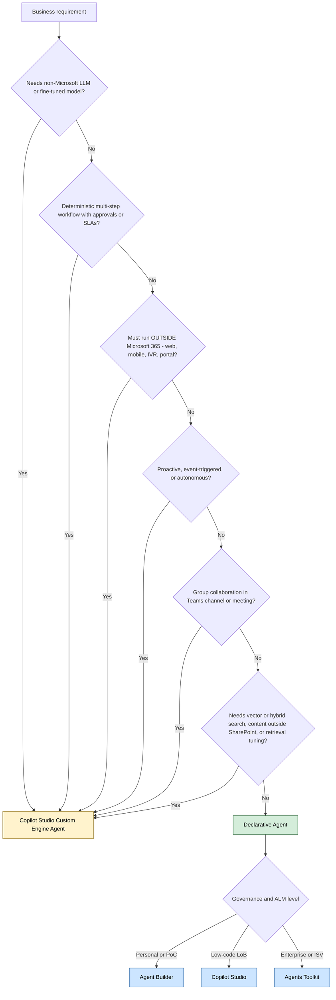
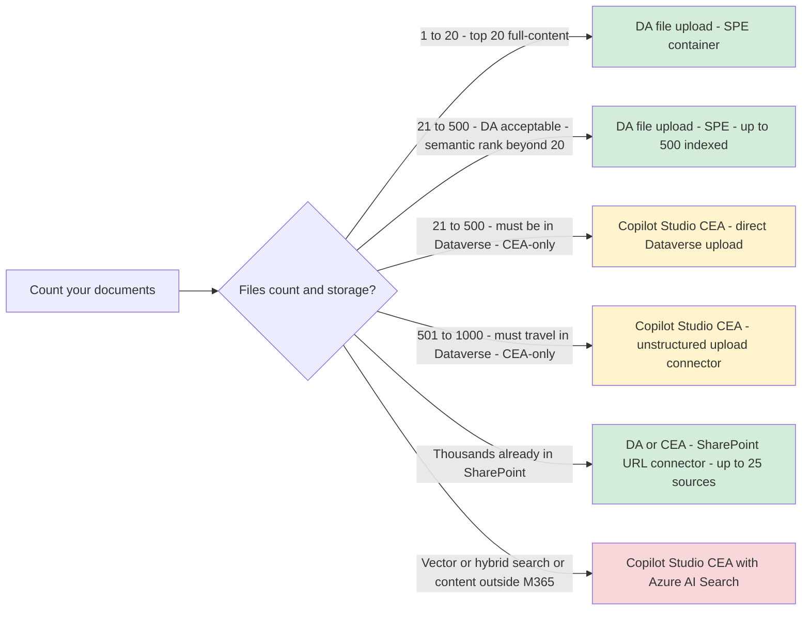
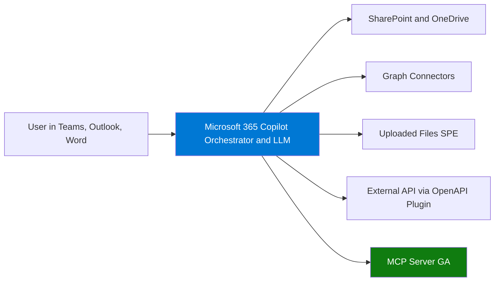
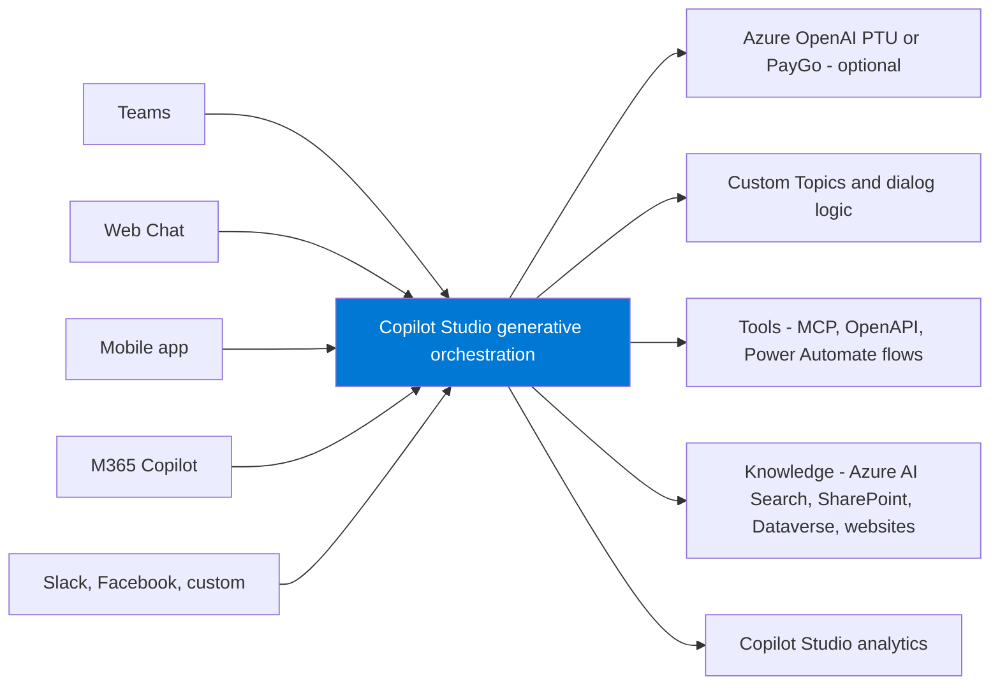
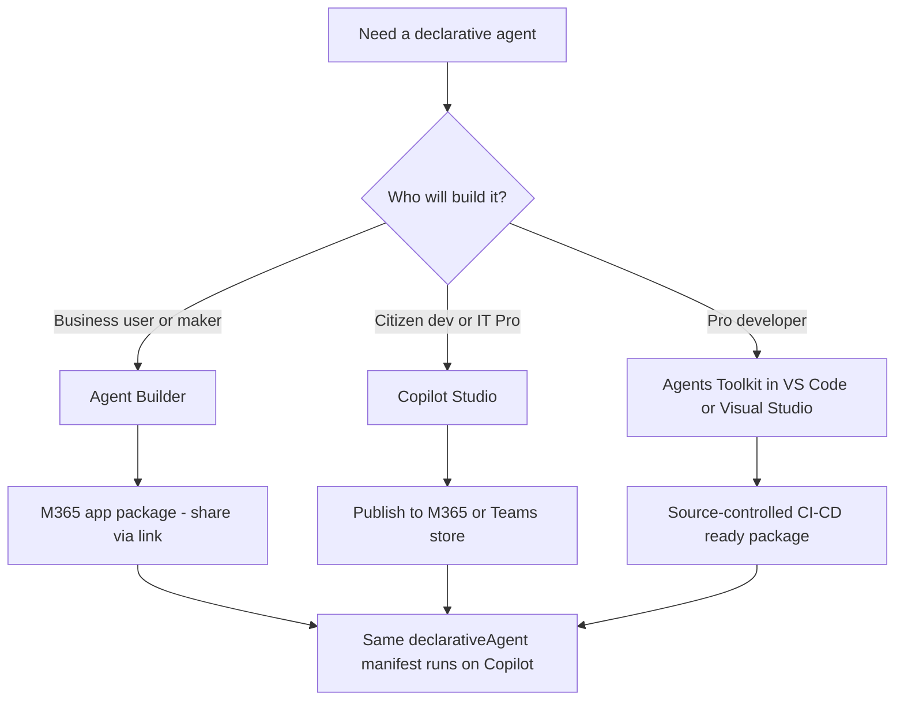
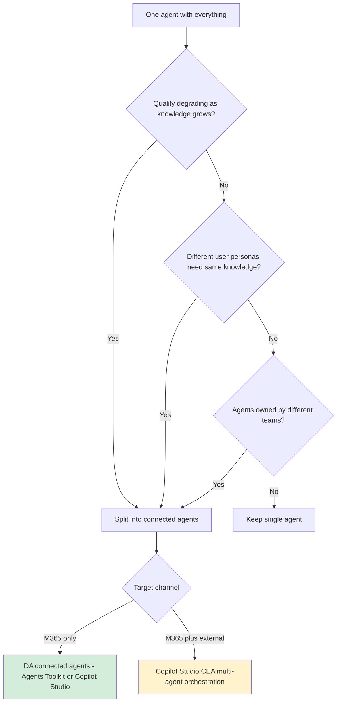

# Declarative Agents vs Copilot Studio Custom Engine Agents

> **Scope note:** In this document, **CEA refers exclusively to a Copilot Studio Custom Engine Agent** — built in `copilotstudio.microsoft.com` using generative orchestration, with optional plug-in of your own Azure OpenAI model, Azure AI Search knowledge, custom topics, Power Automate actions, MCP servers, and OpenAPI plugins. It is **not** an Azure AI Foundry Agent Service agent, nor a hand-coded Semantic Kernel / LangGraph / Bot Framework agent. Those pro-code alternatives exist but are out of scope here.

---

## 1. Intent

Provide a single, repeatable decision pattern for choosing between a **Declarative Agent (DA)** and a **Custom Engine Agent (CEA)** in the Microsoft 365 Copilot ecosystem, together with the three build methods for declarative agents (Agent Builder, Copilot Studio, Microsoft 365 Agents Toolkit), reference architectures, scenario library, industry fit, and a scale-based selection matrix.

---

## 2. Context

Microsoft 365 Copilot can be extended with two agent archetypes:

- **Declarative Agent (DA)** — configure Copilot with custom **instructions, knowledge, and actions**. Copilot's orchestrator and foundation model do the reasoning. No extra hosting. Now supports **MCP (Model Context Protocol) servers for actions, GA since December 2025**.
- **Custom Engine Agent (CEA)** — bring your **own orchestrator, model, tools, memory, and channels**. Surfaces via Copilot Studio, Teams, web, mobile, and custom apps.

Both share the same extensibility spine (MCP, OpenAPI plugins, Graph connectors) but differ fundamentally in control, scale, cost, and reach.

---

## 3. Core Decision Pattern

> **Default to Declarative. Graduate to a Copilot Studio Custom Engine Agent only when a non-negotiable requirement forces it.**

Any **Yes** on questions 1 to 6 pushes to a **Copilot Studio CEA** — not an Azure AI Foundry agent, Semantic Kernel, LangGraph, or hand-coded Bot Framework agent (those pro-code alternatives are out of scope for this pattern). All **No** goes to DA, and governance picks the build method.

---

## 4. Feature Comparison

| Capability | Declarative Agent | Copilot Studio Custom Engine Agent |
|---|---|---|
| Authoring surface | Agent Builder, Copilot Studio, or Agents Toolkit | **Copilot Studio only** (low-code) |
| Orchestrator | Copilot fixed | **Copilot Studio generative orchestration** with custom topics |
| LLM | Copilot foundation model | Copilot Studio default model, or plug-in **Azure OpenAI** (PTU or PayGo) |
| Hosting | M365 no extra cost | Copilot Studio managed service (no VMs or App Service to run) |
| Channels | Copilot Chat, Teams, Word, Excel, Outlook, PowerPoint | All of the above plus Web Chat, Direct Line, Slack, Facebook, Teams group chat, custom apps via Azure Bot Service |
| Proactive messages | No | Yes, via Copilot Studio proactive messaging |
| **Autonomous / event-triggered execution** | **No** — prompt-response only, user must initiate | **Yes** — can be authored as an **autonomous agent** triggered by events (new email, SharePoint file, Dataverse row, Power Automate signal) or schedules; runs multi-step topics/flows without a human in the loop. Premium Copilot credit rate applies. |
| Group collaboration | Individual | Individual plus group in Teams channels and meetings |
| Compliance and RAI | Inherited from M365 | Copilot Studio-managed plus your responsibility on data sources |
| Knowledge sources | SharePoint, OneDrive, Graph connectors, Dataverse, uploaded files, web | SharePoint, OneDrive, public websites, Dataverse, **Azure AI Search**, uploaded files, custom connectors |
| **MCP server support** | **Yes, GA since Dec 2025** | **Yes, via Copilot Studio tools** |
| OpenAPI plugin support | Yes | Yes |
| Power Automate actions | Limited | Yes, full Power Automate flows as tools |
| **Multi-agent** | Yes, connected agents, DA-to-DA, schema v1.6 worker_agents | **Yes, Copilot Studio multi-agent orchestration** (can call DAs and other Copilot Studio agents) |
| Knowledge scale ceiling | **DA file upload: SharePoint Embedded container** ("Declarative Agent" app). **Top 20 files full-content; up to 500 files per agent** indexed. **SharePoint URL connector: no per-file limit**, up to 25 URL sources per agent. **No Dataverse, no unstructured upload connector.** | DA SharePoint URL connector PLUS **direct file upload to Dataverse: 500 files** AND **unstructured SharePoint/OneDrive upload connector: 1,000 files indexed in Dataverse**. Both CEA-only. Unbounded via **Azure AI Search**. |
| **Direct file upload to Dataverse** | **Not available** — DA has no Dataverse upload path | **Yes, 500 files per agent** — files stored in Dataverse, indexed by Dataverse Search. Useful when files must travel with the agent and SharePoint is undesirable. |
| **Unstructured SharePoint/OneDrive upload connector** (indexes files into Dataverse) | **Not available** — DA cannot pick this knowledge source. The "Add knowledge → Advanced" tab on a DA shows only Graph connectors (Confluence, Jira, ServiceNow, Custom Connector, etc.), not the unstructured upload connector | **Yes, 1,000 files TOTAL per agent** (summed across all upload sources, not per source). 50 folders, 10 subfolder levels |
| Setup time | Minutes to hours | Hours to days |
| Cost model | Included with M365 Copilot license | **Copilot Studio message meter** (message packs) plus optional Azure OpenAI / AI Search if connected |

---

## 5. Knowledge Scale Decision Matrix (NEW)

**Critical:** declarative agents have hard and soft limits. Use this matrix to pick the right path based on document volume and retrieval behaviour.

| Content volume | Connector / limit | Recommended path |
|---|---|---|
| **1 to 20 curated files** | DA file upload (SharePoint Embedded container) — **top 20 files get full-content search**. | DA via **Agent Builder**, **Copilot Studio**, or manifest `items_by_url` |
| **21 to 500 files, must travel with the agent (DA path)** | DA file upload (SPE) — up to **500 files per agent** indexed; only top 20 are full-content per query, rest ranked semantically. | DA via **Copilot Studio** or **Agents Toolkit** |
| **21 to 500 files, prefer Dataverse over SPE** | **Copilot Studio CEA — direct Dataverse file upload — 500 files per agent.** DA has no Dataverse path. | **Copilot Studio CEA** with Dataverse-uploaded files |
| **501 to 1,000 files, files must travel with the agent in Dataverse** | **Copilot Studio CEA — unstructured SharePoint/OneDrive upload connector — 1,000 files TOTAL per agent** (summed across all upload sources; indexed into Dataverse). **CEA-only — DA does not expose this connector.** | **Copilot Studio CEA** with unstructured upload connector |
| **Over 1,000 files, content lives in SharePoint** | **SharePoint URL connector — no per-file limit**, up to **25 URL sources per agent**. Available to **DA and CEA**. | DA or CEA with one or more **SharePoint URL knowledge sources** |
| **Content outside SharePoint/OneDrive** (SQL, Fabric, third-party repos, file shares) | Not supported by DA knowledge connectors. | **Copilot Studio CEA** with custom connector or Azure AI Search |
| **Retrieval precision poor despite scoped URL sources, or need vector / hybrid search** | SharePoint managed rank maxes out. | **Copilot Studio CEA + Azure AI Search** (BM25 + vector, security trimmed) |
| **Highly structured data (SQL, Fabric, Cosmos, lakehouse)** | Not suitable for any DA knowledge path. | **CEA with code-based retrieval** |

### Published DA knowledge limits (verified April 2026)

| Surface | Limit |
|---|---|
| Files in `OneDriveAndSharePoint.items_by_url` with full-content search | **20 files** |
| **Toolkit manifest: `items_by_url` omitted** | **Agent searches ALL SharePoint and OneDrive content accessible to the signed-in user** |
| Recommended total page count for referenced files | **300 pages** |
| Recommended file size (SharePoint referenced content) | **36,000 characters, ~15-20 pages** |
| Embedded uploaded files indexed per file | **First 750 to 1,000 pages, ~1.8 M characters** |
| Agent Builder: public website URLs | **4** |
| Agent Builder: Teams chat URLs | **5** |
| Max uploaded file size (pptx, pdf, docx) | **512 MB** |
| Max uploaded file size (xlsx, csv, txt, doc, ppt, xls) | **150 MB** |
| **DA file upload** (files stored in a SharePoint Embedded container named "Declarative Agent"; available in Agent Builder, Copilot Studio DA, Toolkit) | **Top 20 files get full-content search; up to 500 files per agent** indexed (rest ranked semantically) |
| **Copilot Studio CEA direct Dataverse file upload** (files stored in a Dataverse table, indexed by Dataverse Search; **CEA-only** — DA has no Dataverse upload path) | **500 files per agent** |
| **Copilot Studio CEA unstructured SharePoint/OneDrive upload connector** (files indexed into Dataverse; **CEA-only** — DA's "Add knowledge → Advanced" tab does not expose this) | **1,000 files TOTAL per agent** (summed across all upload knowledge sources — **not** 1,000 per source). Plus 50 folders and 10 subfolder levels |
| **SharePoint URL connector** (point the agent at a SharePoint site or document library URL; searched live via Microsoft Search; **available to DA and CEA**) | **No per-file limit.** |
| **SharePoint URL knowledge sources per agent** | Up to **25 URL sources** |

> **Rule of thumb (DA-only paths vs CEA-only paths):**
>
> **DA upload paths:**
> 1. **DA file upload → SharePoint Embedded → top 20 full-content / 500 indexed total per agent** (Agent Builder, Copilot Studio DA, Toolkit).
> 2. **DA SharePoint URL connector → no per-file limit, up to 25 URL sources.**
>
> **CEA-only upload paths (not available to DA):**
> 3. **CEA → direct Dataverse upload → 500 files per agent** (files travel inside Dataverse, no SharePoint site needed).
> 4. **CEA → unstructured SharePoint/OneDrive upload connector → 1,000 files TOTAL per agent** (cap is per-agent, not per-source; files indexed into Dataverse).
>
> **Shared with DA:**
> 5. **DA or CEA → SharePoint URL connector → no per-file limit, up to 25 URL sources.**
>
> Move to **Copilot Studio CEA + Azure AI Search** when you need vector/hybrid retrieval, content outside M365, or tuning control.

> **Toolkit default scope:** In Microsoft 365 Agents Toolkit, if the `declarativeAgent.json` manifest omits `items_by_url` (and `items_by_sharepoint_ids`), the agent automatically searches **all SharePoint and OneDrive content the signed-in user has access to**. Scope it down with `items_by_url` to improve precision on curated content.

### Special content types: images/screenshots in PDFs and unstructured XLSX data

Text is the happy path for both DA and Copilot Studio CEA. Visual and structurally complex content degrades sharply unless you add a dedicated retrieval or parsing path.

| Content type | DA behaviour (upload or URL connector) | Copilot Studio CEA behaviour | Recommendation |
|---|---|---|---|
| **Text-based PDFs** | OCR + text extraction via Microsoft Search indexing; searchable and citable | Same via SharePoint / upload connector | Either works |
| **Image-heavy PDFs** (diagrams, charts, annotated screenshots) | Text layer extracted via OCR if legible; **image content itself is not analysed** — diagrams, chart bars, UI elements are invisible to the foundation model | Same via standard connector. **Only a Copilot Studio CEA with a plugged-in vision model** (e.g., GPT-4o via Azure OpenAI, called from a Power Automate flow) can reason about the image content | **Copilot Studio CEA + Azure OpenAI vision** if visual content is load-bearing |
| **Scanned / image-only PDFs** | OCR quality varies; degraded on handwritten, stamped, or low-DPI scans | Same on the connector. Pre-process with **Azure AI Document Intelligence** in a Power Automate flow, land the extracted text into a searchable store, then ingest | **Copilot Studio CEA + Document Intelligence pre-processing** |
| **Screenshots embedded in docs** (PPTX, DOCX, PDF) | Treated as images; pixel content ignored. Only surrounding caption text is indexed | Same unless a vision tool is wired | **Copilot Studio CEA + vision model** if screenshots carry meaning |
| **Clean tabular XLSX** (single sheet, one header row, consistent types) | Parsed row-by-row into text; searchable. Numeric reasoning limited — the LLM can restate values but arithmetic on large ranges is unreliable | Same via connector. Better served by a **custom connector to the source** (SQL, Fabric, Dataverse) for numeric precision | DA fine for lookup; **Copilot Studio CEA** for calculation |
| **Unstructured XLSX** (merged cells, multi-sheet, pivots, embedded charts, comments) | Poor fidelity — merged cells flatten incorrectly, pivots lose context, charts are images so ignored, multi-sheet relationships lost | Same limits on the upload path; **CEA with code-based parsing** (Power Automate + Office Scripts / Graph Excel API) or Fabric ingestion handles this properly | **Copilot Studio CEA with structured ingestion** |
| **Formula-heavy workbooks** (financial models, linked sheets) | Computed **values** are indexed; **formula intent** is lost — the agent cannot explain *why* a number is what it is | Same | **Copilot Studio CEA + structured data pipeline** (extract formulas server-side, land results in a queryable store) |
| **XLSX over size limit** (> 150 MB) | **Rejected** by the upload connector | **Rejected** by the same connector when used as DA-style knowledge | Move ingestion to **Fabric / SQL / custom connector** behind a Copilot Studio CEA |

**Rule of thumb for mixed content:**
- If you need the agent to **read text** from PDFs or Office files, either option works within the size and scale limits.
- If you need the agent to **understand images** (diagrams, screenshots, chart content) or **reason over structurally complex spreadsheets**, a DA will not deliver — route to a **Copilot Studio CEA** with vision (Azure OpenAI GPT-4o) or a structured ingestion pipeline (Document Intelligence, Fabric, SQL, custom connector).

### The five file-upload paths — DA vs Copilot Studio CEA

Files can land in an agent through **five distinct paths**. **Two are available to DA, three to CEA, and one (SharePoint URL connector) is shared.** The 1,000-file unstructured upload connector is **CEA-only** — DA's "Add knowledge → Advanced" tab does not expose it (Advanced shows only Graph connectors: Confluence, Custom Connector, Enterprise websites, Jira, ServiceNow, Bing).

| Path | What it is | Where files live | Available to | File ceiling |
|---|---|---|---|---|
| **DA file upload** | Drag-and-drop files in Agent Builder, Copilot Studio DA, or Toolkit | **SharePoint Embedded container** (system-provisioned, app name "Declarative Agent") | **DA only** (Agent Builder, Copilot Studio DA, Toolkit) | **Top 20 files full-content; up to 500 files per agent** indexed (rest semantically ranked) |
| **CEA direct Dataverse file upload** | Upload files in Copilot Studio CEA agent-knowledge UI; stored in a Dataverse table | **Dataverse** (agent's environment) | **CEA only** — DA has no equivalent | **500 files per agent** |
| **CEA unstructured SharePoint/OneDrive upload connector** | Pick SharePoint / OneDrive files or folders as a knowledge source; indexed into Dataverse | **Dataverse** (index of SharePoint content) | **CEA only** — DA's Add-knowledge dialog does not surface this | **1,000 files TOTAL per agent** (summed across upload sources, not per source). 50 folders, 10 subfolder levels |
| **SharePoint URL connector** | Point the agent at a SharePoint site or document library URL; searched live via Microsoft Search | **SharePoint / OneDrive** (live search; nothing copied) | **DA and CEA** | **No per-file limit.** Up to **25 URL knowledge sources** per agent |
| **Azure AI Search** | Custom index built outside the agent (chunking, embeddings, security trimming) | **Azure AI Search service** | **CEA only** | Unbounded by agent platform; bounded by AI Search tier |

**Practical advice:**

- **1 to 20 curated files** → **DA file upload** (SPE container, top 20 full-content). Available in Agent Builder, Copilot Studio DA, or Toolkit.
- **21 to 500 files, DA path** → DA file upload still works (SPE indexes up to 500 per agent); only top 20 are full-content per query, rest are semantically ranked. Acceptable when full-content on every file is not required.
- **21 to 500 files, must travel in Dataverse, no SharePoint site** → **CEA + direct Dataverse upload**. CEA-only.
- **501 to 1,000 files, files must travel with the agent in Dataverse** → **CEA + unstructured SharePoint/OneDrive upload connector**. CEA-only — this is what the user's screenshot confirmed is missing from DA.
- **Thousands of files already in SharePoint, live retrieval acceptable** → **SharePoint URL connector** on DA or CEA (no per-file limit, 25 URL sources).
- **Vector/hybrid retrieval, tuning control, content outside SharePoint** → **CEA + Azure AI Search**.

| Situation | Pick | Why |
|---|---|---|
| 1–20 curated files, fastest to ship | **DA file upload** | SPE-backed, top 20 full-content |
| 21–500 files, DA acceptable, semantic-rank OK beyond top 20 | **DA file upload (SPE) at 500 ceiling** | Stays within DA simplicity |
| 21–500 files, must be in Dataverse (regulated, isolated, no SharePoint) | **CEA + direct Dataverse upload** | CEA-only; Dataverse storage |
| 501–1,000 files, must travel with the agent in Dataverse | **CEA + unstructured SharePoint/OneDrive upload connector** | CEA-only; DA Add-knowledge dialog does not expose it |
| Thousands of files already in SharePoint | **DA or CEA + SharePoint URL connector** | No per-file limit; live search |
| Multiple SharePoint sites | **DA or CEA with multiple URL sources (up to 25)** | Each URL source independent |
| Vector / hybrid / tuned retrieval, or large-scale precision | **CEA + Azure AI Search** | BM25 + vector, chunking control, security trimming |
| Content outside SharePoint / OneDrive (SQL, Fabric, file share, third-party repo) | **CEA** | DA connectors cannot ingest these |
| Highly structured data | **CEA with code-based retrieval** | Managed DA retrieval is not suitable |

**Key points:**
- The **1,000-file unstructured upload connector** is **CEA-only**. The DA "Add knowledge → Advanced" tab in Copilot Studio shows Graph connectors (Confluence, Jira, ServiceNow, Custom Connector, Enterprise websites, Bing) — **not** the unstructured upload connector. To use the 1,000-file path, build a **Copilot Studio CEA**.
- The **500-file Dataverse direct upload** is also **CEA-only** — DA has no Dataverse upload path on any authoring surface.
- **DA file upload uses SharePoint Embedded** (a managed container app named "Declarative Agent"). The published behaviour: top **20 files full-content** per query, up to **500 files per agent** indexed in total.
- The **SharePoint URL connector** is the only file-knowledge path **shared between DA and CEA** with no per-file ceiling.
- Reasons to escalate DA → CEA on knowledge alone: **direct Dataverse upload (500)**, **unstructured upload connector (1,000)**, **Azure AI Search**, content outside SharePoint, or vector/hybrid retrieval.

---

## 6. Reference Architectures

### 6.1 Declarative Agent

### 6.2 Copilot Studio Custom Engine Agent

**Key point:** orchestration, state, and channel routing are handled inside Copilot Studio's managed service. You do not stand up your own Azure Bot Service, App Service, or Cosmos state store — those belong to code-built agents, which are out of scope here.

---

## 7. Three Ways to Build a Declarative Agent

### 7.1 Similarities (all three methods)
All three produce the **same declarative-agent manifest** and share:

- Run on Copilot's orchestrator and foundation model
- Inherit M365 security, compliance, and RAI
- Distribute through Teams Admin Center, M365 Admin Center, or commercial marketplace
- Knowledge from SharePoint, OneDrive, Graph connectors, uploaded files, and web
- Actions via OpenAPI plugins and **MCP servers**
- Same knowledge limits apply

### 7.2 Differences

| Dimension | Agent Builder | Copilot Studio | Agents Toolkit |
|---|---|---|---|
| Skill level | None | Low-code | Pro-code |
| Source control | No | Solution export | Git |
| Custom actions | Limited | Connectors and OpenAPI | Full OpenAPI, MCP, adaptive cards |
| Environment lifecycle dev-test-prod | No | Solutions and pipelines | Full CI-CD |
| Sharing | Link or org | M365 and Teams | M365, Teams, marketplace |
| Authoring surface | Copilot Chat | copilotstudio.microsoft.com | VS Code or Visual Studio |
| Knowledge sources | SharePoint, Teams, web, files | All sources plus connectors | All sources plus connectors |
| Best fit | PoC, personal productivity | LoB with IT governance | Enterprise or ISV, complex plugins |

**Rule of thumb:** Prototype in Agent Builder, harden in Copilot Studio, productionize in Agents Toolkit.

### 7.3 File handling per DA authoring surface

All three authoring surfaces produce the **same DA manifest** and inherit the **same DA file-knowledge limits**. The differences are in **how files are added** (UI vs manifest), **what scoping options are exposed**, and **what happens by default when no scope is set**.

| Behaviour | Agent Builder | Copilot Studio (DA) | Agents Toolkit (VS Code / Visual Studio) |
|---|---|---|---|
| **DA file upload (SPE container)** | ✅ Drag-and-drop in the create form | ✅ Add knowledge → Files tab | ✅ Place files in `appPackage/` and reference via manifest, OR upload via Toolkit's authoring UI |
| **Top 20 files full-content per query** | Yes — same SPE limit | Yes — same SPE limit | Yes — same SPE limit |
| **Up to 500 files per agent indexed (rest semantically ranked)** | Yes | Yes | Yes |
| **SharePoint URL knowledge source** (no per-file limit, 25 sources) | ✅ Add SharePoint URL | ✅ Add knowledge → SharePoint | ✅ `capabilities.OneDriveAndSharePoint` in manifest |
| **`items_by_url` (pin specific files/folders for full-content)** | ❌ Not exposed in UI | ❌ Not exposed in UI | ✅ **Edit `declarativeAgent.json` directly** |
| **`items_by_sharepoint_ids` (pin by site/list/item ID)** | ❌ Not exposed | ❌ Not exposed | ✅ **Manifest-only** |
| **Default scope when no `items_by_url` set** | Searches what user added in the UI | Searches what user added in the UI | ⚠️ **Searches ALL SharePoint and OneDrive content the signed-in user has access to** — broad scope by default |
| **Public website URLs** | Up to **4** | Configurable in Web knowledge | Configurable in manifest |
| **Teams chat URLs** | Up to **5** | N/A | Manifest |
| **Graph connectors (Confluence, Jira, ServiceNow, etc.)** | Limited | ✅ Add knowledge → Advanced tab | ✅ Manifest |
| **Max uploaded file size** | 512 MB (pptx/pdf/docx); 150 MB (xlsx/csv/txt/ppt/xls/doc) | Same | Same |
| **Recommended pages per file** | ≤ 15-20 pages (~36 K chars) | Same | Same |
| **Recommended total page count** | ≤ 300 pages across referenced files | Same | Same |
| **Direct Dataverse upload (500 files)** | ❌ CEA-only | ❌ CEA-only — DA in Copilot Studio does not expose this | ❌ CEA-only |
| **Unstructured SharePoint/OneDrive upload connector (1,000 files)** | ❌ CEA-only | ❌ CEA-only — DA Add-knowledge → Advanced shows only Graph connectors | ❌ CEA-only |
| **Azure AI Search** | ❌ CEA-only | ❌ CEA-only | ❌ CEA-only |

**Practical takeaways:**
- **Agent Builder and Copilot Studio DA** handle file scoping through the UI — you add files or SharePoint sources and the agent indexes them. There is no way to express `items_by_url` by hand; the UI handles equivalent behaviour for what you select.
- **Agents Toolkit (VS Code)** is the only path that lets you **edit `declarativeAgent.json` directly** — required for `items_by_url`, `items_by_sharepoint_ids`, broad-scope ("all-of-my-SPO-and-OneDrive") DAs, manifest schema v1.6 `worker_agents` (multi-agent), and source-controlled ALM.
- **Toolkit default-scope warning**: If you build a DA in Toolkit and **omit** `items_by_url`/`items_by_sharepoint_ids`, the agent will search **everything the signed-in user can access in SharePoint and OneDrive**. This is fine for "broad knowledge worker" agents and a precision risk for curated scenarios. Always pin scope in `declarativeAgent.json` when curation matters.
- **None of the three DA surfaces** exposes the CEA-only paths (Dataverse upload, unstructured upload connector, Azure AI Search). To use any of those, build a Copilot Studio CEA.

### 7.4 Tools (MCP, OpenAPI, Power Automate) and multi-agent per DA authoring surface

MCP went **GA in December 2025** for declarative agents — but the GA path Microsoft Learn documents is the **Toolkit manifest** (`declarativeAgent.json` actions array). UI-surface support (Agent Builder, Copilot Studio DA) is **uneven** and should be verified in your tenant before committing. Multi-agent ("connected agents") is exposed on **two of three** — Agent Builder has no native multi-agent UI.

| Capability | Agent Builder | Copilot Studio (DA) | Agents Toolkit (VS Code) |
|---|---|---|---|
| **MCP server (GA Dec 2025)** | ❌ **Not a supported MCP authoring path for DA.** Agent Builder does not surface MCP as a tool option for declarative agents | ⚠️ **Partial — verify in tenant.** "Add tool → Create new → Model Context Protocol" tile launches a creation wizard, and **typing in the tool search box does surface some pre-existing MCP servers** as discoverable connections — **but the tool catalog has no MCP filter chip** (filters are All / Connector / Prompt / REST API). The same dialog surfaces tiles (Agent flow, Computer use) that are CEA-only — visibility in the wizard ≠ DA runtime parity. Treat as not yet on par with Toolkit | ✅ **Primary, GA-documented path.** Declared in `declarativeAgent.json` actions array; full manifest control. This is the path Microsoft Learn calls out for the Dec 2025 GA |
| **OpenAPI plugin** | Limited (curated set) | ✅ Add tool → REST API / Connector | ✅ Manifest + spec file in `appPackage/` |
| **Power Automate flow as a tool** | Limited | ✅ Add tool → Agent flow / Connector | ✅ Reference flow from manifest |
| **Custom connector** | Limited | ✅ Add tool → Connector | ✅ Manifest |
| **Computer use (Preview)** | ❌ | ✅ Add tool → Computer use (Preview) — but this is a CEA-oriented tool; do not assume DA-runtime parity from its presence in the dialog | Manifest support tracking GA |
| **Multi-agent (connected agents, schema v1.6 `worker_agents`)** | ❌ **No native multi-agent UI** — switch to Copilot Studio or Toolkit | ⚠️ **Not visible in tested tenants for DA.** The connected-agents UI Microsoft has documented in some materials does not appear to be surfaced on the Declarative Agent overview pane in current Copilot Studio rollouts. Confirm in your tenant before relying on it. **The reliable DA multi-agent path today is the Toolkit manifest** (`worker_agents` in `declarativeAgent.json`) | ✅ **Reliable path — edit `worker_agents` array in `declarativeAgent.json`** directly; required for source-controlled multi-agent and the path that consistently works for DA-to-DA composition |
| **Manifest schema version control** | ❌ Hidden | ❌ Hidden | ✅ Set explicitly in `declarativeAgent.json` |
| **Wrap external (non-Microsoft) agent as a worker** | N/A | ❌ DA connected agents are DA-to-DA only — wrap external agent via MCP or custom connector instead | Same — wrap as MCP server or OpenAPI plugin |

**Practical takeaways:**
- **MCP-for-DA is a Toolkit story.** The Dec 2025 GA announcement is grounded in the **manifest declaration** in `declarativeAgent.json`. **If MCP is a hard requirement on a DA, build it in Agents Toolkit** — do not assume the Copilot Studio DA Add-tool dialog gives you parity.
- The Copilot Studio Add-tool dialog **does surface some MCP servers via search** (typing in the search box can return MCP-backed tools), and the wizard tile creates a new MCP tool — **but there is no MCP filter chip** in the tool catalog (filters: All / Connector / Prompt / REST API). That asymmetry — present in search and Create-new, absent as a first-class filter — is the cue that the surface is not at GA parity for DA.
- **Multi-agent on Copilot Studio DA is unreliable today.** Despite some documentation referencing a connected-agents UI on the DA overview pane, it is **not visible in tested tenants**. Use **Agents Toolkit `worker_agents`** in the manifest as the reliable DA multi-agent path. Copilot Studio multi-agent orchestration is the strong path **for CEA**, not DA.
- **Agent Builder does not support MCP for DA, and cannot do multi-agent.** For both, use **Agents Toolkit**.
- **DA connected agents are DA-to-DA only** on every surface that supports them. For external/non-Microsoft agent interop, wrap the external agent as an **MCP server** (built in Toolkit) or **custom connector** rather than a worker DA — or escalate to a Copilot Studio CEA with multi-agent orchestration.

---

## 8. Use Case Scenarios with Best Fit

### 8.1 Declarative Agent Scenarios (Detailed)

**Scenario DA-1: HR Policy Buddy**
- **Persona:** All employees
- **Knowledge:** 150 policy PDFs in one SharePoint site, one central source
- **Actions:** None, pure Q&A
- **Channel:** Teams chat, Outlook
- **Best fit:** DA via Copilot Studio, scoped SharePoint URL
- **Why:** Under 200 files, read-only, in M365, no workflow

**Scenario DA-2: Contract Clause Finder**
- **Persona:** Legal team, 200 users
- **Knowledge:** 20 master template contracts pinned by ID in manifest
- **Actions:** None
- **Channel:** Word, Teams
- **Best fit:** DA via Agents Toolkit, full-content search across 20 files
- **Why:** Curated content, needs source-control, legal-grade audit

**Scenario DA-3: IT Helpdesk L1**
- **Persona:** End users
- **Knowledge:** ServiceNow KB (via Graph connector) plus 50 internal runbooks in SharePoint
- **Actions:** Create ticket (MCP server wrapping ServiceNow API)
- **Channel:** Teams @mention
- **Best fit:** DA via Copilot Studio with MCP plugin
- **Why:** Single action, knowledge under 200, M365-only

**Scenario DA-4: Sales Deal-Room Assistant**
- **Persona:** Account executives
- **Knowledge:** Per-account SharePoint folder (under 100 files each) plus emails and Teams via Graph
- **Actions:** Pull CRM account summary (OpenAPI plugin to Dynamics)
- **Channel:** Outlook, Teams
- **Best fit:** DA via Agents Toolkit
- **Why:** Personal productivity, dynamic context via Graph, governed

**Scenario DA-5: RFP Response Helper**
- **Persona:** Pre-sales
- **Knowledge:** 180 past proposal documents in one SharePoint library
- **Actions:** None
- **Channel:** Word, Copilot Chat
- **Best fit:** DA via Copilot Studio
- **Why:** Below 200 limit, content stays in M365

**Scenario DA-6: Field-Engineer FAQ**
- **Persona:** Field technicians
- **Knowledge:** 40 product manuals (PDF) plus troubleshooting KB
- **Actions:** Log incident via MCP server
- **Channel:** Teams mobile
- **Best fit:** DA via Copilot Studio with MCP
- **Why:** Small curated set, mobile access via Teams

### 8.2 Copilot Studio Custom Engine Agent Scenarios (Detailed)

All scenarios below use **Copilot Studio** as the authoring and hosting surface, with optional Azure OpenAI (for custom model), Azure AI Search (for vector knowledge), and Power Automate flows (for actions). If the workload genuinely requires hand-coded orchestration (e.g., deep LangGraph state machines), that is a pro-code alternative outside this pattern's scope.

**Scenario CEA-1: Loan Origination Agent**
- **Persona:** Bank customers and RMs
- **Knowledge:** Dynamic, per-applicant, pulled from core banking APIs (custom connectors) + bureau API + policy library in Azure AI Search
- **Actions:** 12-step workflow using **Copilot Studio topics** + Power Automate flows (KYC, credit check, risk model call, decision, doc generation, disbursement)
- **Channel:** Public web chat + RM Teams app (both from Copilot Studio publish)
- **Best fit:** **Copilot Studio CEA** with Azure OpenAI model, Azure AI Search knowledge
- **Why:** Deterministic workflow, outside M365, audit trail, proactive notifications

**Scenario CEA-2: Clinical Intake Agent**
- **Persona:** Patients and clinicians
- **Knowledge:** EHR (FHIR) via custom connector, drug database, clinical guidelines (2M docs in Azure AI Search)
- **Actions:** Structured triage topics, EHR write via Power Automate, appointment booking connector
- **Channel:** Hospital patient portal (Web Chat) + clinician Teams app
- **Best fit:** **Copilot Studio CEA** with Azure OpenAI connection (HIPAA-compliant deployment)
- **Why:** Regulated data, proactive follow-ups, scale beyond DA; Copilot Studio's managed service keeps ops simple

**Scenario CEA-3: Customer Service Agent on public .com**
- **Persona:** Anonymous and authenticated customers
- **Knowledge:** Product catalog connector, order history API, KB (5M articles in Azure AI Search)
- **Actions:** Order lookup, returns, refunds, human handoff topics
- **Channel:** Public web chat, mobile app via Direct Line, Facebook Messenger — all from Copilot Studio
- **Best fit:** **Copilot Studio CEA** with generative orchestration
- **Why:** Outside M365, anonymous users, scale, multi-channel — classic Copilot Studio fit

**Scenario CEA-4: Field Dispatch Agent** *(autonomous agent pattern)*
- **Persona:** Dispatchers, field techs
- **Knowledge:** Work orders (Dataverse), tech skills, location, inventory
- **Actions:** Event-triggered Power Automate flow on IoT alert; Copilot Studio topics assign tech, book slot, notify customer
- **Channel:** Teams for dispatcher, mobile app for tech
- **Best fit:** **Copilot Studio CEA authored as an autonomous agent** + Power Automate for event triggers
- **Why:** IoT alert fires the agent with no human prompt — classic autonomous pattern; DA cannot do this

**Scenario CEA-5: Manufacturing Quality Agent**
- **Persona:** Plant operators
- **Knowledge:** Camera feeds (custom connector), defect images, SOP library (Azure AI Search)
- **Actions:** Topics that classify defect via GPT-4o vision (connected model), raise NCR in Dataverse, alert quality engineer
- **Channel:** Shop-floor Teams devices + SCADA dashboard via Direct Line
- **Best fit:** **Copilot Studio CEA** with Azure OpenAI (GPT-4o vision) connection
- **Why:** Multimodal LLM plug-in, real-time, outside-M365 surfaces — and Copilot Studio handles both

**Scenario CEA-6: Regulatory Reporting Agent** *(autonomous agent pattern — scheduled trigger)*
- **Persona:** Compliance officers
- **Knowledge:** Transaction records in Fabric (Lakehouse connector or AI Search index over Fabric), regulations library
- **Actions:** Topics orchestrate Power Automate flows to generate XBRL, validate, submit to regulator API
- **Channel:** Finance portal (Web Chat) + Teams approvals
- **Best fit:** **Copilot Studio CEA authored as an autonomous agent** + Azure AI Search over Fabric + Power Automate
- **Why:** Runs on a regulatory schedule (e.g., quarter-end close) without human initiation; massive scale via AI Search, deterministic regulated workflow, external submission via connectors

### 8.3 Scenario Cheat-Sheet

| Scenario | Docs | Workflow steps | Outside M365 | Proactive | Best fit |
|---|---|---|---|---|---|
| HR Policy Buddy | 150 | 1 | No | No | **DA Copilot Studio** |
| Contract Clause Finder | 20 | 1 | No | No | **DA Agents Toolkit** |
| IT Helpdesk L1 | 100 + KB connector | 2 | No | No | **DA Copilot Studio + MCP** |
| Sales Deal-Room | 100 per account | 2 | No | No | **DA Agents Toolkit** |
| RFP Response Helper | 180 | 1 | No | No | **DA Copilot Studio** |
| Field-Engineer FAQ | 40 | 2 | No | No | **DA + MCP** |
| Loan Origination | dynamic | 12 | Yes | Yes | **CEA** |
| Clinical Intake | 2 M | 6 | Yes | Yes | **CEA** |
| Public Customer Service | 5 M | 4 | Yes | No | **CEA** |
| Field Dispatch | dynamic | 5 | Partial | Yes | **CEA** |
| Manufacturing Quality | images | 3 | Yes | Yes | **CEA multimodal** |
| Regulatory Reporting | millions | 8 | Yes | Yes | **CEA + Fabric** |

---

## 8.4 Multi-Agent Scenarios (NEW)

Both agent types support multi-agent composition, but the mechanisms and reach differ.

### Multi-agent support matrix

| Multi-agent capability | Declarative Agent | Copilot Studio Custom Engine Agent |
|---|---|---|
| Concept name | **Connected agents** (schema v1.6, `worker_agents`) | **Copilot Studio multi-agent orchestration** |
| Can connect to DAs | Yes | Yes |
| Can connect to other Copilot Studio CEAs | No, DA-to-DA only | Yes |
| Can connect to external agents (non-Microsoft) | No, use MCP or API plugin instead | Yes, via MCP or connectors |
| Communication | Text-only between agents | Text plus structured context passed through topics |
| Orchestration style | Copilot picks worker agent based on name, description, conversation starters | Copilot Studio generative orchestration picks and chains worker agents |
| User installs each worker | Yes, per organisation policy | No, wired inside Copilot Studio |
| Authoring surface | **Agents Toolkit** (title ID from `Provision`), **Copilot Studio** (connected agents UI) | **Copilot Studio** multi-agent orchestration pane |
| Agent Builder support | Limited or none | Not applicable |

### When to split into multiple agents

### Multi-agent scenario examples

**Scenario MA-1: Enterprise Helpdesk Orchestrator (DA connected agents)**
- **Parent DA:** general helpdesk greeter, routes by topic
- **Worker DA 1:** IT helpdesk with ServiceNow MCP action
- **Worker DA 2:** HR helpdesk over HR SharePoint
- **Worker DA 3:** Facilities helpdesk over facility KB
- **Best fit:** DA via Agents Toolkit, manifest v1.6 with `worker_agents`
- **Why:** Each worker stays under 200-file limit; parent picks the right one

**Scenario MA-2: Sales Revenue Operations (DA connected agents)**
- **Parent DA:** Revenue Ops for VPs
- **Worker DA 1:** Pipeline analytics from CRM via MCP
- **Worker DA 2:** Deal-room assistant over SharePoint accounts
- **Worker DA 3:** Compensation policy DA
- **Best fit:** DA via Copilot Studio connected-agents UI
- **Why:** Team ownership boundaries, each agent stays focused

**Scenario MA-3: Loan Origination Orchestrator (Copilot Studio CEA multi-agent)**
- **Parent:** Copilot Studio CEA — master loan workflow
- **Worker 1:** KYC agent (external SaaS, called via MCP or connector)
- **Worker 2:** Credit bureau agent (custom connector)
- **Worker 3:** Risk model agent (Azure ML endpoint exposed as a tool)
- **Worker 4:** Bank policy DA (reused inside M365)
- **Best fit:** **Copilot Studio multi-agent orchestration** with Azure OpenAI model
- **Why:** Mix of external and M365 agents, deterministic workflow, outside-M365 reach

**Scenario MA-4: Claims Adjudication (Copilot Studio CEA multi-agent)**
- **Parent:** Copilot Studio CEA — claims intake and adjudication
- **Worker 1:** Fraud detection topic (Azure ML model exposed as tool)
- **Worker 2:** Medical review topic (clinical fine-tuned Azure OpenAI connection)
- **Worker DA:** Policy lookup DA for adjusters
- **Best fit:** **Copilot Studio CEA** with multi-agent orchestration + DA as worker
- **Why:** Multiple specialised models, regulated, reuses internal DA for policy

### Multi-agent limitations to know

- **DA connected agents** only talk to other DAs. For external agent interop use **MCP** or **API plugins**.
- Communication between DAs is **text-only**. No file binaries, no images, no structured object passing beyond what fits in text.
- Adaptive cards returned from an API call inside a worker DA are **consumed by the active (parent) agent**; the user does not see the card directly.
- Each connected DA must be **installed** by users (or deployed via admin policy).
- **Agent Builder** has no native multi-agent UI. Use **Copilot Studio** or **Agents Toolkit**.

### Build tool mapping for multi-agent

| Scenario | Best build tool |
|---|---|
| DA connects to 2-3 DAs, low-code, LoB | **Copilot Studio** (connected agents UI) |
| DA connects to 3+ DAs, source-controlled, ALM | **Agents Toolkit** (edit `worker_agents` in manifest v1.6) |
| CEA orchestrates DAs and other Copilot Studio CEAs | **Copilot Studio** (multi-agent orchestration pane) |
| External agent (non-Microsoft) integration from a CEA | **Copilot Studio CEA** calling the external agent via **MCP server** or **custom connector** |

---

## 9. Industry Mapping

| Industry | Declarative Agent | Custom Engine Agent |
|---|---|---|
| **Banking and FSI** | Policy and product Q&A, RM briefing | Loan origination, KYC orchestration, fraud triage |
| **Healthcare** | Clinician formulary and policy lookup | Patient intake, prior auth, claim adjudication |
| **Retail and CPG** | Store-ops SOP assistant, merchandiser brief | Omnichannel customer service, pricing exceptions |
| **Manufacturing** | Safety manuals, maintenance SOPs | Predictive maintenance, quality inspection |
| **Public Sector** | Employee policy copilot | Citizen portal, case management |
| **Professional Services** | Proposal and pitch assistant | Engagement staffing, billing dispute |
| **Telecom** | Product catalog for reps | Churn prevention on care portal, outage triage |
| **Energy and Utilities** | Field HSE manual assistant | Outage management, smart-meter triage |
| **Insurance** | Underwriter guideline lookup | Claim intake and adjudication |

---

## 10. Choosing Examples Side-by-Side

| Business need | Start with | Escalate to CEA when |
|---|---|---|
| Answer SharePoint policy questions | DA Agent Builder | Approvals or case creation added |
| Summarize customer emails and docs | DA Copilot Studio | Push alerts on risk detection |
| Approve expense reports with rules | DA plus action plugin | Multi-step dynamic routing |
| Customer-facing web chat | Not applicable | CEA from day one |
| Employee IT helpdesk in Teams | DA with MCP for ticketing | Auto-remediation workflows |
| Search across 5 000 contracts | Not applicable | CEA with Azure AI Search |

---

## 11. Performance Comparison: DA vs Copilot Studio CEA (NEW)

> **Disclaimer:** Microsoft does **not publish official p50/p95 latency benchmarks** for DA or Copilot Studio CEA. The comparisons below are **architectural — faster / slower / similar** — derived from the execution paths each agent type follows. Actual wall-clock numbers in your tenant depend on query complexity, retrieval source, the plugged-in model (default Copilot Studio model vs Azure OpenAI PTU/PayGo), region, and concurrent load. Measure your own workload before committing to a latency SLO.

Both agent types run as **Microsoft-managed services**. DA executes directly on the M365 Copilot orchestrator — the shortest path. A **Copilot Studio Custom Engine Agent** adds an orchestration layer (topic matching + generative orchestration) on top, using the Copilot Studio default model unless you plug in Azure OpenAI. Azure OpenAI (PTU or PayGo) and Azure AI Search are **optional plug-ins** — not the default runtime.

### 11.0 Cost and billing model — the real DA vs Copilot Studio CEA comparison

PTU is an **Azure OpenAI** construct — it only shows up if you've separately decided to plug Azure OpenAI into a Copilot Studio CEA. The **native** billing meter for every Copilot Studio CEA is **Copilot Studio messages**, paid for in **Copilot credits**. That is the comparison that matters for most procurement conversations.

#### Native billing

| Component | Declarative Agent | Copilot Studio CEA |
|---|---|---|
| **Base platform** | **Bundled in Microsoft 365 Copilot per-user licence** (~US $30/user/month at list). No per-message meter. | **Copilot Studio messages**, metered per interaction and paid for in **Copilot credits**. Purchased pre-paid (message packs — e.g., 25,000 messages) or pay-as-you-go on an Azure subscription linked to the Power Platform tenant. |
| **Included model** | Copilot foundation model | **Copilot Studio default model** — usage is charged **in Copilot credits**, no separate Azure bill |
| **Credit consumption varies by interaction type** | N/A | A classic topic answer costs fewer credits than a generative answer; **grounded generative answers** (with knowledge source) cost more; **autonomous / event-triggered actions** cost more again (this is the meter an **autonomous agent** consumes on every trigger fire); **tenant graph grounding** is premium |
| **Knowledge: SharePoint, OneDrive, Dataverse, uploaded files** | Included in M365 Copilot licence | Included in the Copilot Studio message charge — no extra line |
| **Actions: built-in connectors, Power Automate standard** | Limited actions included | Included in message charge; standard-connector flow runs count against Power Platform capacity |
| **Actions: premium connectors / custom connectors** | Requires per-user Power Automate premium licence for users invoking them | Same premium-connector licensing rules apply to flows called from the CEA |
| **Billing owner** | M365 licensing team | Power Platform admin (Copilot credits / message packs, environment capacity) |
| **Who can raise spend unexpectedly** | No-one — flat per-user licence | A popular agent with generative, grounded answers can burn credits quickly — **cap via environment capacity and Copilot credits policy** |

#### Optional Azure plug-ins (extra billing lines, on top of Copilot credits)

These are **add-ons** a maker or platform team may layer onto a Copilot Studio CEA. They **do not replace** Copilot credits — they add extra bills in Azure.

| Plug-in | Billed as | When it's worth adding |
|---|---|---|
| **Azure OpenAI — PayGo** | Per-token, billed to the Azure subscription | You need to pin a specific model (e.g., GPT-4o for vision, fine-tuned variant), specific region for residency, or low-volume experimentation |
| **Azure OpenAI — PTU** (Provisioned Throughput Unit) | **Reserved monthly / yearly commitment**, flat-rate, billed to the Azure subscription | Sustained high TPM, **predictable p95 / p99 tail latency** at peak, or compliance requires dedicated capacity. Above a break-even TPM, PTU is cheaper than PayGo. Below it, PTU is wasted spend |
| **Azure AI Search** | Per tier / replica / partition | Vector / hybrid retrieval beyond the SharePoint connector, or content outside SharePoint |

**None of these plug-ins is required.** A vanilla Copilot Studio CEA running on the default model with SharePoint knowledge pays **only Copilot credits + any Power Automate premium licensing** — no Azure OpenAI, no PTU, no AI Search.

#### Rule-of-thumb cost heuristic

- **Low, predictable M365-only usage** (read-only Q&A, a few tool calls, < a few thousand messages / month per user) → **DA is almost always cheaper** — it's already in the M365 Copilot licence.
- **Mid-volume, needs topics / flows / out-of-M365 reach** → Copilot Studio CEA on default model. Size your **Copilot Studio message pack** to the expected traffic; cap with environment capacity.
- **High-volume, sustained, needs pinned model / residency / dedicated capacity** → Copilot Studio CEA + Azure OpenAI. Choose **PTU** above the PayGo break-even TPM, **PayGo** below it.
- **Retrieval outgrows SharePoint connector** → layer **Azure AI Search** on top, billed separately.

**Check current Microsoft Learn pricing pages before committing** — Copilot Studio message-pack pricing, Copilot credit rates, Azure OpenAI PTU minima, and Azure AI Search tier pricing change. Figures above are directional.

> **Mentions of "PTU" in the rest of this section are conditional** on having made the separate decision to plug in Azure OpenAI. For the baseline Copilot Studio CEA, the meter is Copilot credits.

### 11.1 Execution-path summary

- **DA path:** user → M365 Copilot orchestrator → Copilot foundation model → M365 Search / SharePoint → response. One orchestration hop, in-tenant retrieval.
- **Copilot Studio CEA path (default model):** user → Copilot Studio orchestration (topic match + generative orchestration) → Copilot Studio default model → knowledge source (SharePoint connector or plugged-in Azure AI Search) and/or Power Automate flow / MCP tool → response. **One extra orchestration hop vs DA.**
- **Copilot Studio CEA with a plugged-in Azure OpenAI PTU:** same path as above, but the model call hits reserved PTU capacity instead of the shared Copilot model pool — this is where p95/p99 predictability improves.

### 11.2 Per-dimension comparison (architectural, not benchmarked)

| Dimension | Declarative Agent | Copilot Studio Custom Engine Agent | Who's faster / better |
|---|---|---|---|
| **Simple Q&A latency** | Shortest path: one orchestrator hop, in-tenant retrieval | Extra hop for topic match + generative orchestration, even on the default model | **DA is faster** |
| **Multi-step deterministic workflow latency** | DA must LLM-plan every step in the fixed Copilot orchestrator | Known steps run as **topics + Power Automate flows**, skipping LLM planning turns | **Copilot Studio CEA is faster** |
| **Tail latency (p95 / p99)** | Subject to the shared Copilot model queue — less predictable at peak | Default Copilot Studio model follows shared-queue variance (similar to DA). Tighter p95 / p99 **only** if the team has separately decided to plug in **Azure OpenAI PTU** for dedicated capacity | **Tie on default model**; Copilot Studio CEA wins **only when Azure OpenAI PTU is added** |
| **Cold-start** | None — always warm in shared pool | None — Copilot Studio is managed. Plugged-in Azure OpenAI PayGo: small regional variance; PTU: near-zero | **Tie (both managed)** |
| **Throughput (concurrent users)** | Scales with your M365 Copilot licence pool; no per-agent cap | Bounded by the **Copilot Studio message-meter** you've provisioned (and plugged-in Azure OpenAI TPM if connected) | **DA at enterprise licence scale** |
| **Retrieval precision, < 1,000 docs** | High — M365 semantic search, security trimmed | Equivalent via SharePoint connector; equal-or-better with plugged-in Azure AI Search | **Tie** |
| **Retrieval precision, large corpora** | Managed semantic rank plateaus as corpora grow | Same plateau on SharePoint connector; **higher** with plugged-in Azure AI Search (BM25 + vector) | **Copilot Studio CEA, only with AI Search plugged in** |
| **Retrieval: content outside SharePoint / OneDrive** | Not supported by DA connectors | Supported via custom connector, MCP tool, or plugged-in Azure AI Search | **Copilot Studio CEA** |
| **Memory / state recall** | Per-conversation only; no long-term memory | Per-session via topic variables; cross-session via Dataverse custom tables | **Copilot Studio CEA** |
| **Cost per interaction** | $0 incremental — bundled in the M365 Copilot per-user licence | **Copilot Studio messages / Copilot credits** per interaction (credit rate varies by interaction type: classic answer, generative answer, grounded answer, autonomous action). Plus optional Power Automate premium, optional Azure OpenAI tokens or PTU, optional Azure AI Search — only if those plug-ins are chosen | **DA** |
| **Deployment / iteration speed** | Minutes to hours — configure and ship | Hours to days — author topics, wire tools, test flows | **DA** |
| **Observability depth** | Copilot Admin Center usage + feedback | Copilot Studio analytics, full conversation transcripts, Power Automate flow run history, optional App Insights | **Copilot Studio CEA** |
| **Reach (channels)** | M365 apps only | M365 + Web Chat + Direct Line + Slack + Facebook + Teams group/meeting | **Copilot Studio CEA** |

### 11.3 Performance by scenario (architectural ranking)

| Scenario | Who's faster | Why |
|---|---|---|
| HR Policy Q&A (≈150 docs) | **DA** | Shortest path, in-tenant retrieval, no topic overhead |
| Contract Clause Finder (20 curated docs) | **DA** | Full-content search on 20 files; single orchestrator hop |
| IT Helpdesk with 1 MCP call | **DA** | One tool call; topic orchestration not needed |
| 12-step Loan Origination | **Copilot Studio CEA** | Topics + PA flows execute deterministically; DA would LLM-plan each step |
| Public Customer Service (millions of articles) | **Copilot Studio CEA only** | DA cannot publish outside M365; AI Search needed for retrieval at scale |
| Regulatory Reporting over Fabric | **Copilot Studio CEA only** | DA cannot ingest Fabric; requires connectors + flows |
| Field Dispatch (event-triggered) | **Copilot Studio CEA only** | DA has no proactive / event trigger |
| Manufacturing Quality (vision) | **Copilot Studio CEA only** | Requires plugged-in GPT-4o vision and out-of-M365 surfaces |
| Group Teams channel assist | **Copilot Studio CEA only** | DA is personal-only; does not participate in group chats |
| High-volume, low-complexity Q&A at peak | **DA more predictable at scale**; **Copilot Studio CEA with PTU plugged in** more predictable on tail | DA scales with licence pool; PTU removes shared-queue variance |
| Multi-agent routing within M365 | **DA connected agents** | Same-ecosystem hops, text-only |
| Multi-agent routing including non-Microsoft / external agents | **Copilot Studio CEA** | DA connected agents are DA-to-DA only |

### 11.4 Key performance takeaways

1. **For simple, single-turn Q&A, DA is faster** — shorter execution path, no topic-orchestration hop. Start DA unless another requirement forces CEA.
2. **Copilot Studio CEA overtakes DA on deterministic multi-step workflows** — topics + Power Automate flows execute known steps without round-tripping the LLM for planning.
3. **On tail latency (p95 / p99), the default Copilot Studio model is similar to DA** — both sit in shared Microsoft capacity. Tighter tail targets require the separate decision to plug in **Azure OpenAI PTU**. Do not assume Copilot Studio CEA is faster at the tail without that add-on.
4. **DA wins on simplicity and incremental cost.** A Copilot Studio CEA is metered in **Copilot Studio messages / Copilot credits** per interaction; DA has no such meter. Plug-ins (Azure OpenAI, AI Search) add extra billing lines on top of credits.
5. **Retrieval quality diverges only when Azure AI Search is plugged in.** A Copilot Studio CEA that uses the same SharePoint connector as a DA will show the same retrieval quality — the lift comes from plugging in AI Search (BM25 + vector).
6. **Cost crossover is a volume + complexity question, not a single threshold.** Below a few thousand simple interactions per user per month, DA's per-user licence almost always wins. Above that — or once you need premium connectors, plugged-in Azure OpenAI, or Azure AI Search — model the Copilot credit burn + Azure add-ons against flat DA licensing using your own usage forecast.

> **Bottom line:** Copilot Studio CEA is not universally faster than DA — on simple queries it is structurally **slower** because it adds an orchestration hop. It becomes faster only when (a) workflows are multi-step (topics skip LLM planning), (b) **Azure OpenAI PTU is plugged in** (p95 predictability — a separate architectural and billing choice), or (c) retrieval requires Azure AI Search. If none of those apply, DA's shorter path and included-in-licence pricing win.

### 11.5 Performance optimisation playbook

| If DA is too slow | Do this |
|---|---|
| Retrieval precision low | Scope with `items_by_url` to a curated set; for larger corpora use the **SharePoint URL connector** on a focused site/folder rather than broad scopes |
| Workflow takes too many turns | Split into connected agents; cut instructions to under 8,000 chars |
| Answers hit context-window ceiling | Summarise long SharePoint files, keep pages per file < 20 |

| If Copilot Studio CEA is too slow (start on the default model — skip Azure OpenAI unless a §11.0 driver applies) | Do this |
|---|---|
| Too many LLM-planned turns | Convert frequent paths into **deterministic topics**; parallelise independent tools inside a topic rather than chaining them |
| Retrieval slow or imprecise on SharePoint | Scope knowledge sources tightly; switch to fewer, tighter sources; if SharePoint retrieval plateaus, layer **Azure AI Search** (BM25 + vector) as a knowledge source |
| Copilot credit burn too high | Shift routing work into classic topics (cheaper per interaction than generative answers); trim grounded answers to the minimum knowledge set needed; cap environment Copilot credit capacity |
| Tail latency (p95 / p99) variable at peak | **Only if a §11.0 driver justifies it:** plug in **Azure OpenAI** — choose **PTU** for reserved capacity above the break-even TPM, **PayGo** for bursty low volume |
| Azure OpenAI token cost high (when plug-in is in use) | Use the default Copilot Studio model for routing and reserve plugged-in Azure OpenAI only for final generation |

---

## 12. Anti-patterns

- Building a **Copilot Studio CEA for a read-only FAQ with 50 files** — message-meter and Azure OpenAI cost wasted; a DA does this for free.
- Building a **DA for a customer-facing public website** — DA cannot leave M365; use a Copilot Studio CEA published to Web Chat.
- Putting **deterministic multi-step business logic into DA instructions** — model in Copilot Studio topics + Power Automate flows instead.
- Using **Agent Builder for a 10,000-user enterprise DA** — jump to Agents Toolkit for ALM.
- Mixing **PII-heavy data into DA knowledge** without sensitivity labels and DLP.
- Trying to exceed the **CEA unstructured upload ceiling (1,000 files) by stacking upload sources** — the cap is **total per agent**, not per source. Switch to the **SharePoint URL connector** (no per-file limit) or **Azure AI Search** for vector retrieval.
- Trying to upload **more than 500 files directly to a Copilot Studio CEA's Dataverse table** — that is the per-agent Dataverse ceiling. For more files, switch to the unstructured upload connector (1,000), SharePoint URL connector (no limit), or Azure AI Search.
- Expecting a **DA in Copilot Studio to expose the unstructured SharePoint/OneDrive upload connector or Dataverse direct upload** — neither is on the DA Add-knowledge dialog. Both are CEA-only. Promote to a **Copilot Studio CEA** if you need them.
- Choosing **DA file upload for more than 20 files when full-content search is required on every file** — DA's SPE container indexes up to 500 files but only the top 20 get full-content per query; the rest are semantically ranked.
- Expecting a **Toolkit DA with no `items_by_url`** to behave like a tightly-scoped agent — it searches *all* content the user can see, which lowers precision and may surface unrelated results.
- Mixing **uploaded files over 512 MB** into DA knowledge — will be rejected.
- Standing up **Azure Bot Service, App Service, or a hand-coded Semantic Kernel / LangGraph orchestrator** when a Copilot Studio CEA would meet the need — out of scope for this pattern and adds ops burden.

---

## 13. One-Line Summary

> **Declarative agent equals configure Copilot. Copilot Studio custom engine agent equals extend Copilot Studio with your own topics, tools, model, and channels. Start declarative. Escalate to a Copilot Studio CEA only when orchestration, model choice, proactivity, out-of-M365 reach, direct Dataverse upload, the unstructured upload connector, or retrieval needs (vector search, content outside SharePoint, tuning control) demand it. Pick Agent Builder, Copilot Studio, or Agents Toolkit based on who is building and how far it must scale. Knowledge scale, five upload paths: DA file upload to SPE (top 20 full-content, up to 500 indexed); CEA-only direct Dataverse upload (500 files); CEA-only unstructured SharePoint/OneDrive upload connector (1,000 files indexed in Dataverse); shared SharePoint URL connector (no per-file limit, 25 sources); CEA-only Azure AI Search.**

---

## 14. Related Patterns

- Enterprise RAG pattern
- Agentic workflow orchestration pattern
- Microsoft 365 Copilot governance pattern

---

## 15. References

- Microsoft Learn, Agents for Microsoft 365 Copilot
- Microsoft Learn, Declarative agent architecture
- Microsoft Learn, Copilot Studio custom engine agent
- Microsoft Learn, Copilot Studio generative orchestration
- Microsoft Learn, Optimize content retrieval in your agent
- Microsoft Learn, Add knowledge sources in Agent Builder
- Microsoft 365 Developer Blog, Build declarative agents with MCP, December 2025, GA announcement
- Microsoft 365 Agents Toolkit documentation
- Copilot Studio knowledge source limits
- Copilot Studio message capacity and message packs
