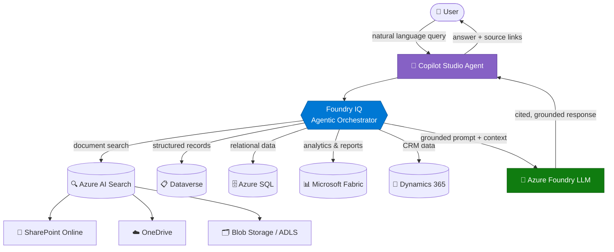

# Enterprise RAG — Architecture

> This document explains **how** the Enterprise RAG pattern is structured technically.
> It covers the system diagram, each component's role, data flow, and key design principles.
>
> ← Back to [Overview.md](./Overview.md) | Next: [Runbook.md](./Runbook.md) →

---

## 🏗️ Architecture Diagram

The diagram below shows the full reference architecture for a production-grade Enterprise RAG deployment.
A user's natural language query flows through Copilot Studio, is orchestrated by Foundry IQ,
retrieves grounded content from multiple data sources, and returns a cited response — all within a
permission-enforced boundary.



---

## 🔩 Component Descriptions

Each component in the architecture has a distinct role. Understanding their responsibilities
helps you configure and troubleshoot the pipeline effectively.

### 🤖 Copilot Studio Agent

The **user-facing interface** of the pattern. It receives natural language input,
delegates retrieval and reasoning to backend services, and renders the final cited response
to the user. It acts as the orchestration entry point and output surface.

### 🔵 Foundry IQ (Agentic Orchestrator)

The **brain of the retrieval pipeline**. Foundry IQ classifies the user's intent,
plans a search strategy across multiple sources, and synthesizes retrieved content
into a single coherent prompt for the LLM. In multi-source deployments, this is
what makes cross-system grounding possible.

### 🔍 Azure AI Search

The **enterprise search engine**. It indexes content from SharePoint, OneDrive,
and Blob Storage using a combination of vector (semantic) and keyword (BM25) search.
It enforces Entra ID permission trimming so each user only sees content they are authorized to access.

### 🧠 Azure Foundry LLM (GPT-4o)

The **language model** responsible for generating the final response.
It receives the retrieved document chunks as grounding context and is instructed
to answer **only** from those sources — eliminating hallucination at the output layer.

### 📋 Dataverse / 🗄️ Azure SQL / 📊 Microsoft Fabric / 💼 Dynamics 365

**Structured data sources** that complement unstructured document retrieval.
Foundry IQ can query these in parallel with AI Search to deliver answers that
combine policy documents with live records (e.g., HR policy + employee record).

---

## 🔄 Data Flow — Step by Step

Understanding the data flow helps you reason about latency, failure points, and where to optimize.

```
1. User submits a natural language query via Copilot Studio
        ↓
2. Foundry IQ classifies intent → determines which sources to query
        ↓
3. Azure AI Search executes hybrid search (vector + keyword)
   → Permission trimming applied via Entra ID group membership
        ↓
4. Structured sources (Dataverse, SQL, Fabric, CRM) queried in parallel
        ↓
5. Retrieved chunks are de-duplicated, re-ranked, and assembled into a grounded prompt
        ↓
6. Azure Foundry LLM generates a response grounded strictly in retrieved content
        ↓
7. Copilot Studio renders the answer with source citations (file name, page, URL)
        ↓
8. User receives a cited, auditable answer
```

---

## 🔑 Key Design Principles

These are the architectural decisions that make Enterprise RAG production-ready —
not just a prototype.

| Principle | How It's Implemented | Why It Matters |
|-----------|----------------------|----------------|
| **Permission Trimming** | Entra ID security filter on every AI Search query | Users only see documents their identity is authorized to access |
| **Hybrid Search** | BM25 keyword + vector (`text-embedding-3-large`) with RRF merging | Combines precision of keyword with semantic depth of embeddings |
| **Citations in Every Response** | `sourcefile`, `sourcepage`, `url` surfaced in adaptive card | Enables auditability and lets users verify AI answers |
| **Strictness Enforcement** | `strictness: 4` in response node + system prompt grounding instruction | Prevents the LLM from generating answers outside retrieved content |
| **Multi-Source Orchestration** | Foundry IQ queries unstructured + structured sources simultaneously | Eliminates the need for users to know which system holds which data |

---

## 🔗 Related Labs & Accelerators

| Resource | Path |
|----------|------|
| Lab 1.4 — Azure AI Search in Copilot Studio | `/labs/lab-1.4` |
| Lab 2.1 — Advanced Azure AI Search | `/labs/lab-2.1` |
| Lab 2.3 — SharePoint AI Search Indexer | `/labs/lab-2.3` |
| Lab 2.4 — Foundry IQ Agentic Retrieval | `/labs/lab-2.4` |
| Content Flow Accelerator | `/accelerators/content-flow` |
| SharePoint Connector Accelerator | `/accelerators/sharepoint-connector` |
