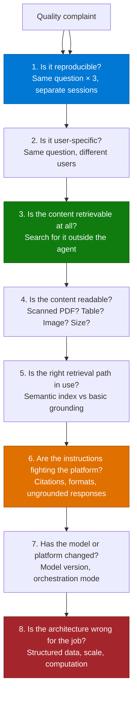

# Grounding & Response Quality Remediation Pattern

> **A diagnostic playbook, not a design pattern.** Use it when an agent is built, the content is
> connected, and the answers are still wrong, inconsistent, or missing.

---

## Why This Pattern

| Signal | Evidence |
|---|---|
| **Industries** | All. Concentrated in policy-heavy sectors: banking, insurance, healthcare, legal, manufacturing, public sector |
| **Where it appears** | After the build, during UAT, and again three months after go-live |
| **Typical trigger** | "The agent answered this correctly yesterday", "it works for me but not for my colleague", "a competitor's product does this better" |
| **Business impact** | This is the failure mode that loses deals. Not missing features — inconsistent answers |

Response quality complaints are the most frequent post-build issue in Copilot agent delivery,
and they are almost never a single root cause. This pattern gives you an ordered diagnostic so
you stop guessing.

---

## The Diagnostic Ladder

Work top to bottom. Do not skip. Each rung eliminates a whole class of cause, and the rungs are
ordered by how often they turn out to be the answer.

---

## Rung 1 — Reproducibility

Ask the same question three times in three separate chat sessions.

| Result | Meaning |
|---|---|
| Fails all three times | Deterministic. Continue down the ladder — this is the easy case |
| Fails one or two of three | Non-deterministic. Jump to Rung 6 first; this is usually the citation-withholding behaviour |
| Passes all three | The original complaint was about a different phrasing. Get the exact wording from the user |

**The "it worked yesterday" complaint is almost always this rung.** An agent that withholds a
correct answer because the model omitted an in-text citation looks, to a user, exactly like an
agent that has lost its knowledge.

---

## Rung 2 — User Specificity

Run the same question as at least two different users, ideally including one with a different
licence type.

| Difference observed | Likely cause |
|---|---|
| Works for maker, fails for user | Permissions, or content the maker can see that the user cannot |
| Works for licensed user, degrades for unlicensed | Different retrieval path; semantic index availability differs by licence |
| Works for one region, fails for another | Content scoping, or a feature not available in that cloud/region |
| Works for one user in the same group as another | Staged rollout of a connector, or a stale identity mapping |

Licence-dependent answer quality is a real and frequently reported effect. Decide the target
population early and test as that population — not as the person who built the agent.

---

## Rung 3 — Retrievability

Take the source document that *should* answer the question and verify it can be found at all,
outside the agent:

1. Search for a distinctive phrase from the document in Microsoft Search or the source system.
2. If it cannot be found, the problem is ingestion, not the agent. Go to the
   [Copilot Connector Knowledge Onboarding runbook](../Copilot-Connector-Knowledge-Onboarding/Copilot-Connector-Knowledge-Onboarding-Runbook.md).
3. If it can be found by search but the agent does not use it, continue to Rung 4.

The "searchable but not usable by the agent" case is common with custom connectors, where
retrieval relevance depends on a limited set of semantic labels rather than on all the custom
properties you defined.

---

## Rung 4 — Content Readability

Most quality problems that survive to this rung are content problems. Check each of these
against the specific document that failed:

| Check | Symptom when it fails | Fix |
|---|---|---|
| Scanned or image-only PDF | Document is indexed but contributes nothing | Re-publish as text. There is no configuration workaround |
| Data in tables inside PDFs | Answers miss or garble tabular values | Restate the table in text, or move it to a structured source |
| Information in embedded images or diagrams | Content is invisible to retrieval | Add text descriptions |
| Very long document | Content past a certain depth is ignored | Split into focused documents |
| Very large file | Exceeds the supported size for the retrieval path in use | Split; check the size limits for your path |
| Filenames with special characters | Queries referencing the filename fail | Normalise naming conventions |
| Domain-specific terminology | "Scan documents" works, "upload documents" returns nothing | Add a synonyms/glossary section to the content or the agent instructions |
| Duplicate and superseded versions | Contradictory answers between sessions | Archive old versions. This is the most under-rated fix on this list |
| Structured lists as knowledge | Only part of the list is used | Consolidate; verify how many list sources the retrieval path actually queries |

> 📌 **Content curation beats prompt engineering.** Teams routinely spend two weeks tuning
> instructions for a problem that a one-day content clean-up would have solved. Check this rung
> before you touch the prompt.

---

## Rung 5 — Retrieval Path

Different agent types use different retrieval mechanisms, and the differences are large enough
to explain most "agent A is better than agent B on the same content" reports.

| Agent type | Typical retrieval | Notes |
|---|---|---|
| SharePoint agent | Semantic index over the site | Often the highest quality for a single site, and the benchmark users compare against |
| Declarative agent (Agent Builder) | Copilot's retrieval stack | Strong for connector and SharePoint content |
| Copilot Studio agent, graph grounding off | Basic grounding | Noticeably weaker on natural-language questions over documents |
| Copilot Studio agent, graph grounding on | Semantic search over the tenant graph | Better retrieval quality and more context; slightly higher latency and 10 credits per message |

**Actions on this rung:**

1. If the agent is a Copilot Studio agent grounded on SharePoint, check whether **tenant graph
   grounding with semantic search** is enabled. Enabling it is the single highest-impact quality
   change available for that configuration. It requires the agent's user authentication to be
   set to authenticate with Microsoft, and it consumes credits.
2. If the customer's benchmark is a SharePoint agent, be honest that you are comparing different
   retrieval stacks and set the target accordingly.
3. If retrieval quality remains insufficient on SharePoint content at scale, consider
   synchronising the content into a purpose-built knowledge store. Moving curated SharePoint
   content into Dataverse has taken agents from roughly 60% to roughly 90% answer accuracy in
   practice. Present the trade-off honestly: better accuracy, but an additional store to
   maintain and an architectural commitment the customer may resist.
4. If none of the above is enough, the requirement has outgrown this pattern — move to
   [Enterprise RAG](../Enterprise-RAG-Pattern/Enterprise-RAG-Pattern.md).

---

## Rung 6 — Instructions vs Platform Behaviour

This rung explains most *intermittent* failures.

### The citation-withholding behaviour

When an agent is configured to disallow ungrounded responses, it only returns a knowledge-based
answer if the response includes an in-text citation to the source. Models do not always emit
one. When that happens the answer is withheld and the user sees "I couldn't find that" — for a
question that worked five minutes earlier.

**Fix:**
- Add an explicit instruction: *"Always include an in-text citation to the source document for
  every statement."*
- Remove any instruction that forces a rigid output format ("respond only in JSON", "do not
  include references"). These suppress the citation markers and cause exactly this failure.
- Keep instructions concise. Long, competing instruction sets degrade compliance.
- If you customise the response rendering (writing the answer out through a variable or an
  adaptive card), citations are not added automatically — you must render them yourself.

### Other instruction-level causes

| Symptom | Cause | Fix |
|---|---|---|
| Answers in the wrong language | Language rule stated as a preference, competing with the knowledge base language | State it as a procedure: detect, then reply in that language, do not default |
| Agent ignores formatting rules | Instruction set too long or contradictory | Cut it down; put format rules last and make them concrete |
| Agent answers from general knowledge | Ungrounded responses allowed | Turn the setting off, **and** instruct the model to say when it cannot find something |
| Agent still uses general knowledge with the setting off | Expected — the setting only blocks turns where no source or tool was used at all | Set the expectation; the setting is not an absolute guarantee |
| Follow-up questions get blocked | The agent answered from conversation history without calling a source, so the response was blocked | Explain the behaviour; consider allowing ungrounded responses if follow-ups matter more than strict grounding |
| Instruction limit reached | Instructions are capped in length | Move detail into knowledge; instructions are for behaviour, not content |

---

## Rung 7 — Model and Platform Change

Quality regressions that appear without any change on your side are usually this.

| Check | Action |
|---|---|
| Has the agent's model been changed? | Model changes alter instruction-following and retrieval behaviour. Switching models has caused agents to stop searching a knowledge base entirely. Re-run the full evaluation set after any model change |
| Are different surfaces on different model versions? | The same prompt in Copilot Chat, Agent Builder, and Copilot Studio can produce different results. Set expectations, and standardise where the platform allows |
| Has orchestration mode changed? | Classic and generative orchestration have different knowledge-source limits and behaviours |
| Is there a service advisory? | Check the Message Center before spending a week on a self-inflicted-fault theory |

> 📌 **Keep a stored evaluation set from day one.** Without it you cannot tell a regression from
> a memory. This is the cheapest insurance in agent delivery.

---

## Rung 8 — Wrong Architecture

If you get here, the problem is not quality. It is fit.

| Requirement | Why an agent over documents struggles | Better approach |
|---|---|---|
| Counts, sums, trends, rates | Retrieval returns passages, not aggregates | BI over a data warehouse; or a Fabric data agent |
| Row lookup in a large spreadsheet | Row limits and weak cell-level semantics | Code interpreter over structured data, or a database action |
| Joins across structured entities ("people with skill X who worked in vertical Y") | This is a query, not a search | Database-backed action or a structured knowledge source |
| Exhaustive lists from a ticketing system | Result-count limits | Use the source system for exhaustive lists |
| Live status of a record | Indexed content is crawl-based | Federated connector or a real-time action |
| Very large document corpora with custom relevance requirements | Limited tuning surface | [Enterprise RAG](../Enterprise-RAG-Pattern/Enterprise-RAG-Pattern.md) with Azure AI Search |

Naming this early saves months. A significant share of "quality" escalations are requirements
that were never going to be met by retrieval over documents.

---

## Evaluation — Build the Safety Net

You cannot remediate what you cannot measure. Every agent that goes to production should have:

1. **An evaluation set** — at least 30 real questions, in real user phrasing, with the expected
   source and expected behaviour.
2. **Negative cases** — questions that should return "I don't know", and permission cases that
   should return nothing.
3. **A consistency protocol** — each question run three times, in separate sessions.
4. **Cross-user runs** — at minimum, one licensed and one unlicensed user if both are in the
   audience.
5. **A stored baseline** — run before and after any model change, instruction change, or content
   migration.

The Copilot Agent Kit (formerly the Copilot Studio Kit) automates most of this: batch testing,
generative-answer scoring against rubrics, conversation analysis, and an agent review tool that
flags anti-patterns. For any agent of consequence, use it rather than testing by hand.

---

## Real-World Scenarios

### Scenario A — Intermittent "no information available"
A defence manufacturer reported an agent answering correctly for one user and incorrectly for
another, and correctly one minute and not the next.

**Diagnosis:** two causes stacked — citation withholding (Rung 6) and cross-language retrieval
(question in one language, knowledge base in another).
**Fix:** explicit citation instruction, plus content available in the question language for the
high-traffic topics.

### Scenario B — Rebuilt agent worse than the original
A bank rebuilt a SharePoint agent as a Copilot Studio agent for wider rollout. Accuracy dropped
from roughly 90% to roughly 60% on the same content.

**Diagnosis:** Rung 5 — different retrieval path.
**Fix:** synchronising the curated content into Dataverse restored accuracy to roughly 90%. The
customer needed to be walked through why the architectural change was necessary, which was as
much of the work as the change itself.

### Scenario C — Wrong document cited
A healthcare provider found that more than half of test interactions surfaced an incorrect
source document, even when the answer text was plausible. In a clinical context this is a safety
issue, not a quality one.

**Diagnosis:** Rung 4 — near-duplicate and superseded documents in the corpus.
**Fix:** content de-duplication and archival, then re-test. Grounding accuracy, not answer
plausibility, was made the acceptance criterion.

### Scenario D — Competitive comparison
A retailer compared an agent over spreadsheets against a competing product and found the
Microsoft agent failed to extract rows reliably, hit row limits, and was slow.

**Diagnosis:** Rung 8 — spreadsheets as a knowledge source for row-level retrieval is the wrong
architecture.
**Fix:** use code interpreter over structured data, or move the data to a queryable store. Be
straightforward with the customer about what document retrieval is and is not for.

---

## When to Use / Avoid

| Use this pattern when... | Do something else when... |
|---|---|
| The agent is built and answers are wrong or inconsistent | The agent has not been built yet — design it properly instead |
| Users report "it worked yesterday" | Content has not been connected — start with the connector pattern |
| Quality differs between users or channels | The requirement is analytics or computation — see Rung 8 |
| A competitive comparison has gone badly | The complaint is about latency or availability, not answer quality |

---

## Related Patterns and Scenarios

- Runbook: [Grounding-and-Response-Quality-Remediation-Runbook.md](Grounding-and-Response-Quality-Remediation-Runbook.md)
- [Copilot Connector Knowledge Onboarding](../Copilot-Connector-Knowledge-Onboarding/Copilot-Connector-Knowledge-Onboarding.md)
- [Enterprise RAG Pattern](../Enterprise-RAG-Pattern/Enterprise-RAG-Pattern.md)
- [Declarative vs Custom Engine Agent](../Declarative-vs-Custom-engine-agent/Declarative-Agents-vs-Copilot-Studio-Custom-Engine-Agents.md)

---

## Reference Documentation

- [Knowledge sources summary (Copilot Studio)](https://learn.microsoft.com/en-us/microsoft-copilot-studio/knowledge-copilot-studio)
- [Tenant graph grounding with semantic search](https://learn.microsoft.com/en-us/microsoft-copilot-studio/knowledge-copilot-studio#tenant-graph-grounding-with-semantic-search)
- [Limits and limitations for unstructured data](https://learn.microsoft.com/en-us/microsoft-copilot-studio/knowledge-unstructured-data)
- [Code interpreter for structured data](https://learn.microsoft.com/en-us/microsoft-copilot-studio/knowledge-code-interpreter-structured-data)
- [Generative orchestration](https://learn.microsoft.com/en-us/microsoft-copilot-studio/advanced-generative-actions)
- [Semantic index for Copilot](https://learn.microsoft.com/en-us/microsoftsearch/semantic-index-for-copilot)
- [Copilot Agent Kit (formerly Copilot Studio Kit)](https://github.com/microsoft/Power-CAT-Copilot-Studio-Kit)
- [Copilot Agent Kit — testing capabilities](https://github.com/microsoft/Power-CAT-Copilot-Studio-Kit/blob/main/TESTING_CAPABILITIES.md)
- [Copilot Agent Kit — SharePoint synchronization](https://github.com/microsoft/Power-CAT-Copilot-Studio-Kit/blob/main/FILE_SYNCHRONIZATION.md)
