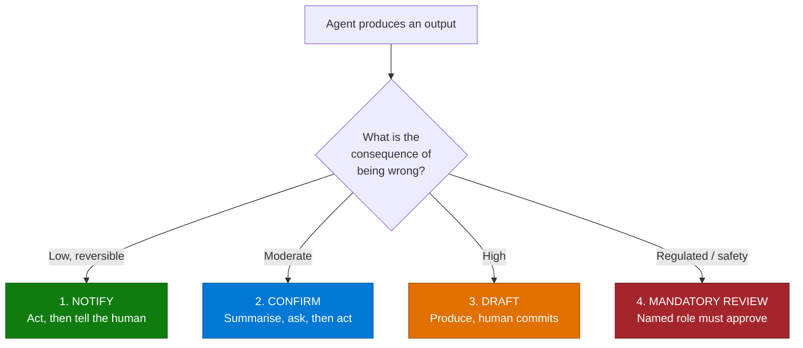

# Human-in-the-Loop Review & Approval Pattern

> **The design choice that gets agents into production in regulated and high-consequence work.**
> Not a limitation to be engineered away — the control that makes the rest of the solution
> acceptable.

---

## Why This Pattern

| Signal | Evidence |
|---|---|
| **Prevalence** | Appears explicitly in ~10 of 138 documented use cases in one CAF portfolio, and implicitly in most of the rest |
| **Recurring language** | "human review for accuracy", "mandatory specialist review before clinical use", "human validation step before final submission", "marked as AI drafts for stakeholder review", "with human intervention in uncertain cases" |
| **Where it matters most** | Clinical, legal, financial, safety, brand, and anything customer-facing |
| **What it buys** | Approval. Solutions with a credible review gate clear governance; those without stall |

The teams that shipped were consistently the ones that designed the human step deliberately, rather
than treating it as a fallback for when the model underperforms.

---

## The Four Gate Types

Pick deliberately per action — not one policy for the whole agent.

| Gate | Human role | Use for | Example from the field |
|---|---|---|---|
| **1. Notify** | Informed after | Reversible, low-value actions | Filing a document to a recommended location |
| **2. Confirm** | Approves before | Moderate consequence, clear right answer | Creating a ticket, booking a room |
| **3. Draft** | Commits the output | Content that carries the organisation's voice or numbers | "Marked as AI drafts for stakeholder review before finalising in Jira" |
| **4. Mandatory review** | Named, qualified role signs off | Clinical, legal, financial, safety | "All agent output is subject to mandatory lab specialist review before clinical use" |

The most common mistake is applying gate 2 to a gate 3 or 4 action — a confirmation click on
something the user cannot actually evaluate in the moment.

---

## Design Rules That Hold Up

### 1. The reviewer must be able to evaluate, not just click

A gate where the human cannot realistically assess correctness is theatre. It transfers liability
without adding control. Requirements:

- Show the **evidence** — the source passage, the document region, the record it came from
- Show **confidence** where you have it
- Make the **change visible** — tracked changes, a diff, a before/after
- Keep the review unit small enough to actually read

One engagement returns a revised document with **tracked changes plus a change-summary table** —
that is a reviewable artefact. A paragraph of prose asking "does this look right?" is not.

### 2. Draft status must be visible in the destination system

If the agent writes to Jira, the CRM, or a document library, the record must carry its draft status
*there* — not only in the conversation. Otherwise downstream consumers treat unreviewed output as
finished work.

### 3. Review must be cheaper than doing it manually

The business case dies if reviewing takes as long as the original task. Measure reviewer time per
item during pilot. If it approaches the manual baseline, the gate is in the wrong place or the
review surface is wrong.

### 4. Capture every correction

Corrections are your accuracy signal and your improvement backlog. Store what was changed, by whom,
and why. Without this you cannot justify relaxing a gate later.

### 5. Earn autonomy; never assume it

The defensible sequence:

1. Review everything, measure accuracy.
2. Relax gates only for categories with demonstrated accuracy over a meaningful period.
3. Keep material fields and high-consequence actions gated permanently unless there is a signed
   business decision.

Going the other way — starting autonomous and adding gates after an incident — costs trust that is
very hard to recover.

### 6. Design the reject path

Approval flows get built; rejection flows get forgotten. Define what happens on reject: does it
route back, queue for a human, notify the requester, or discard? An unhandled reject path is where
work silently disappears.

---

## Anti-Patterns

| Anti-pattern | Why it fails |
|---|---|
| One approval policy for every action | Over-gates trivial actions, under-gates dangerous ones |
| "Are you sure?" with no evidence shown | Liability transfer, not control |
| Batch approval of hundreds of items | Nobody reviews item 200. Cap the batch size |
| Review only in the chat transcript | Downstream systems see unreviewed output as final |
| Gate defined by the delivery team alone | Compliance rejects it at sign-off |
| Reviewer is the same person who asked | No independence where independence is the point |
| No cap on records a single request can change | One mis-parsed instruction, wide blast radius |

---

## Real-World Scenarios

### Scenario A — Genomic variant interpretation at a paediatric hospital
An agent scoped to variant identification, evidence assembly, tier classification and interpretation
text for a slide deck delivered to pathologists — with **all output subject to mandatory lab
specialist review before clinical use**.

**Lesson:** the tightest possible gate, stated in the scope definition itself. The narrow scoping
(explicitly "steps 15–16 only") is what made the review burden tractable.

### Scenario B — Document filing at a real estate group
Automated classification, metadata tagging and filing — with the agent **recommending** the storage
location and a human validation step before final submission.

**Lesson:** "recommend, don't commit" cleared governance where autonomous filing would not have.

### Scenario C — Project breakdown at a software company
Automated decomposition of a project into epics, stories and tasks, **marked as AI drafts** for
stakeholder review and approval before finalising in the target system.

**Lesson:** draft status carried into the destination system, not just the conversation.

### Scenario D — Email classification at a regional government
Incoming email classified, key information extracted, tasks and meetings created — **with human
intervention in uncertain cases**.

**Lesson:** confidence-routed gating. High-confidence items flow; uncertain ones go to a person.
This is the design that makes high volume viable.

### Scenario E — Work instruction validation at an agribusiness
70–140 documents a week validated against templates with compliance gaps identified and structured
reports generated, **maintaining human oversight**.

**Lesson:** at that volume the gate must be exception-based, not universal.

---

## When to Use / Avoid

| Gate heavily when... | Lighter touch when... |
|---|---|
| Output is clinical, legal, financial, or safety-related | Internal, informal, easily reversed |
| Output is customer-facing | Draft-only, never leaves the user |
| The agent writes to a system of record | Read-only retrieval |
| The action is hard to reverse | Trivially undoable |
| A regulator or auditor will ask | No audit interest |
| Accuracy is unproven | Accuracy demonstrated over time |

---

## Metrics to Track

| Metric | Why |
|---|---|
| Straight-through rate | Is the gate placed correctly? |
| Reviewer time per item | Is the business case intact? |
| Correction rate by field or action | Where the agent is weak |
| Rejection rate | Is the agent producing usable output? |
| Time in review queue | Is the gate becoming the bottleneck? |
| Post-approval defects | Is the gate actually catching things? |

The last one matters most and is measured least. If approved output still contains errors, the gate
is not working and you should know that before an auditor tells you.

---

## Related Patterns

- Runbook: [Human-in-the-Loop-Review-and-Approval-Runbook.md](Human-in-the-Loop-Review-and-Approval-Runbook.md)
- [Intelligent Document Processing Pipeline](../Intelligent-Document-Processing-Pipeline/Intelligent-Document-Processing-Pipeline.md)
- [Agent Governance & Rollout Control Plane](../Agent-Governance-and-Rollout-Control-Plane/Agent-Governance-and-Rollout-Control-Plane.md)
- [Branded Office Artifact Generation](../Branded-Office-Artifact-Generation/Branded-Office-Artifact-Generation.md)
- Scenario: [Contract & Legal Intelligence Agent](../../01-scenarios/Contract-and-Legal-Intelligence-Agent/1.Overview.md)

---

## Reference Documentation

- [Power Automate approvals](https://learn.microsoft.com/en-us/power-automate/get-started-approvals)
- [Copilot Studio agent actions and confirmation](https://learn.microsoft.com/en-us/microsoft-copilot-studio/advanced-generative-actions)
- [Confirmation prompts for MCP and API plugins](https://learn.microsoft.com/en-us/microsoft-365/copilot/extensibility/plugin-confirmation-prompts)
- [Microsoft Responsible AI Standard](https://www.microsoft.com/ai/responsible-ai)
- [NIST AI Risk Management Framework](https://www.nist.gov/itl/ai-risk-management-framework) *(non-Microsoft)*
- [EU AI Act — human oversight provisions](https://eur-lex.europa.eu/eli/reg/2024/1689/oj) *(non-Microsoft)*
