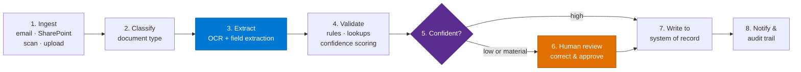

# Intelligent Document Processing Pipeline Pattern

> **Ingest → OCR → extract → validate → human review → system of record.** The pipeline behind
> every "read this pile of documents and do something with it" agent — and the workload Copilot
> Studio cannot do on its own.

---

## Why This Pattern

| Signal | Evidence |
|---|---|
| **Customers** | 8–12 in a single CAF portfolio, across manufacturing, energy, automotive retail, real estate, healthcare and public sector |
| **Document types** | RFQ emails, billing statements, home assessment reports, vendor quotes, engineering drawings, work instructions, contracts, onboarding forms |
| **Typical driver** | A team manually re-keying data from documents into a system of record |
| **Volume** | One engagement processes ~70,000 quotation requests a year; another ~70–140 work instructions a week |

The business case is almost always the same: people are reading documents and typing what they find
into another system. The value is in removing the re-keying, not in the AI.

---

## The Pipeline

| Stage | Where it runs | Notes |
|---|---|---|
| 1. Ingest | Copilot Studio, Power Automate, or a scheduled job | Email is the most common entry point |
| 2. Classify | Foundry / Document Intelligence | Drives which extraction schema applies |
| 3. Extract | **Foundry / Document Intelligence** | Copilot Studio cannot do this reliably |
| 4. Validate | Foundry or Power Platform | Business rules, master-data lookups, confidence scores |
| 5. Confidence gate | Pipeline logic | The design decision that makes or breaks trust |
| 6. Human review | **Copilot Studio / Power Apps** | The conversation or app is where the human is |
| 7. Write | Connector, MCP tool, or API | Often the hardest integration |
| 8. Notify & audit | Copilot Studio + storage | The audit trail is usually a compliance requirement |

> 📌 Stages 3 and 6 sit on opposite sides of the platform boundary. See
> [Copilot Studio & Foundry Split Architecture](../Copilot-Studio-and-Foundry-Split-Architecture/Copilot-Studio-and-Foundry-Split-Architecture.md).

---

## The Five Design Decisions

### 1. What is the confidence gate?

Every field needs a rule for when the machine may proceed alone. Options, in increasing
sophistication:

| Gate | When it fits |
|---|---|
| Always review | Regulated, low volume, or early pilot |
| Review below a confidence threshold | The common answer |
| Review only material fields (amounts, dates, parties) | High volume with mixed risk |
| Review by exception (missing data, rule violation, anomaly) | Mature pipelines |

Start at "always review" and earn your way down with measured accuracy. Going the other way — 
relaxing first and tightening after an incident — costs trust you do not get back.

### 2. What happens when extraction fails?

Not "if". Documents arrive rotated, handwritten, in unexpected languages, or as photographs of
screens. Define the failure path: route to a human queue with the document attached, never silently
drop, and never guess.

### 3. Where does the human do the review?

The review surface has to show the extracted value **next to the source** — the page, the region,
the sentence it came from. A review UI that shows only the extracted values forces the reviewer to
open the document separately, which removes most of the time saving.

### 4. Is write-back autonomous?

A recurring and defensible design choice: keep the **output boundary file-based**. One engagement
explicitly generates an approved export for upload into the ERP rather than writing back
autonomously, keeping the ERP as the system of record and the human as the commit point.

### 5. What is the audit trail?

For most of these use cases the audit trail is the point — invoicing evidence, transfer pricing,
regulatory compliance. Capture: source document, extracted values, confidence, who reviewed, what
they changed, when it was written.

---

## What Actually Goes Wrong

| Symptom | Cause | Response |
|---|---|---|
| Agent "can't read" the documents | Scanned or image-based source, attempted in Copilot Studio | Move extraction to Foundry / Document Intelligence |
| Values wrong but plausible | Tables, multi-column layouts, or merged cells | Layout-aware extraction; validate against master data |
| Works on samples, fails in production | Samples were clean; reality is rotated phone photos | Test on **real** intake, unfiltered |
| Reviewers stop reviewing | Review UI does not show the source | Redesign the review surface |
| Wrong document type processed | No classification step | Add stage 2 |
| Duplicate records created | Retries without idempotency | Idempotency key on write |
| Volume never materialises | Only one of several document variants handled | Inventory variants before scoping |
| Extraction good, integration blocked | No API into the target system | Discover the write path in week one, not week six |

The last one is worth emphasising: one payroll engagement documented that **no APIs existed between
the source systems at all**. The extraction was never the hard part.

---

## Real-World Scenarios

### Scenario A — Quotation intake at an industrial services company
~70,000 RFQs a year arriving as unstructured email in multiple languages. Coordinators manually
interpreted each request, identified the installation and equipment, cross-referenced catalogues and
scattered documentation, and built the quotation.

**Lesson:** the extraction is only half the problem — the cross-reference against master data is the
other half, and it is where accuracy is won.

### Scenario B — Billing reconciliation at an automotive retail group
Vendor billing statement PDFs extracted, classified and formatted into reconciliation-ready output,
replacing a manual and semi-automated process.

**Lesson:** "reconciliation-ready" is a precise output contract. Define the target schema before
building the extractor.

### Scenario C — Retrofit cost estimation at an energy provider
Property and measure data extracted from long assessment PDFs and DOCX files, with pricing schedules
applied to generate customer-facing cost estimates.

**Lesson:** where the output is customer-facing, the human review gate is not optional.

### Scenario D — Document filing at a real estate group
Classification, metadata tagging and filing into SharePoint using OCR at ingestion, with a
recommended storage location and a human validation step before final submission.

**Lesson:** a "recommend, don't file" design got this into production. Full autonomy would not have
cleared review.

### Scenario E — Clinical documents at a paediatric hospital
Document interpretation and OCR that could not be achieved in Copilot Studio, moved to Foundry, with
mandatory specialist review before any clinical use.

**Lesson:** in clinical and regulated contexts the human gate is a control, not a UX preference.

---

## When to Use / Avoid

| Use when... | Avoid when... |
|---|---|
| People re-key data from documents into a system | Content is already structured and queryable |
| Documents are scanned, image-based, or complex | Documents are clean text Copilot Studio can ground on |
| Volume is high and the format is repeatable | Every document is unique and low volume |
| An audit trail is required | Nobody needs to know how a value was derived |
| A human can be in the loop | Straight-through processing with no review is mandatory |

---

## Related Patterns

- Runbook: [Intelligent-Document-Processing-Pipeline-Runbook.md](Intelligent-Document-Processing-Pipeline-Runbook.md)
- [Copilot Studio & Foundry Split Architecture](../Copilot-Studio-and-Foundry-Split-Architecture/Copilot-Studio-and-Foundry-Split-Architecture.md)
- [Human-in-the-Loop Review & Approval](../Human-in-the-Loop-Review-and-Approval/Human-in-the-Loop-Review-and-Approval.md)
- [Grounding & Response Quality Remediation](../Grounding-and-Response-Quality-Remediation/Grounding-and-Response-Quality-Remediation.md) — rung 4 covers document readability
- Scenario: [Document Processing & Extraction Agent](../../01-scenarios/Document-Processing-and-Extraction-Agent/1.Overview.md)

---

## Reference Documentation

- [Azure AI Document Intelligence](https://learn.microsoft.com/en-us/azure/ai-services/document-intelligence/)
- [Document Intelligence custom extraction models](https://learn.microsoft.com/en-us/azure/ai-services/document-intelligence/train/custom-model)
- [Document Intelligence layout model](https://learn.microsoft.com/en-us/azure/ai-services/document-intelligence/prebuilt/layout)
- [Content understanding in Microsoft Foundry](https://learn.microsoft.com/en-us/azure/ai-services/content-understanding/)
- [AI Builder document processing](https://learn.microsoft.com/en-us/ai-builder/form-processing-model-overview)
- [Power Automate approvals](https://learn.microsoft.com/en-us/power-automate/get-started-approvals)
- [Code interpreter for structured data (Copilot Studio)](https://learn.microsoft.com/en-us/microsoft-copilot-studio/knowledge-code-interpreter-structured-data)
